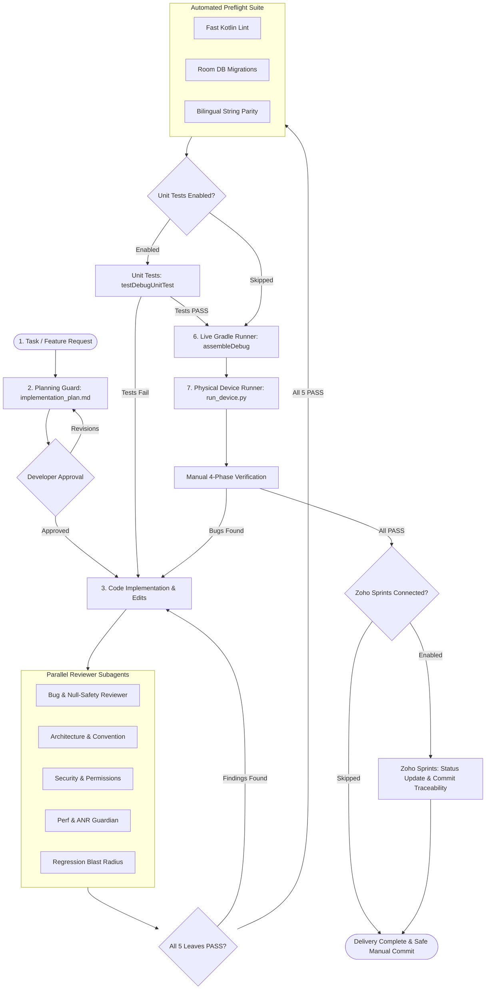
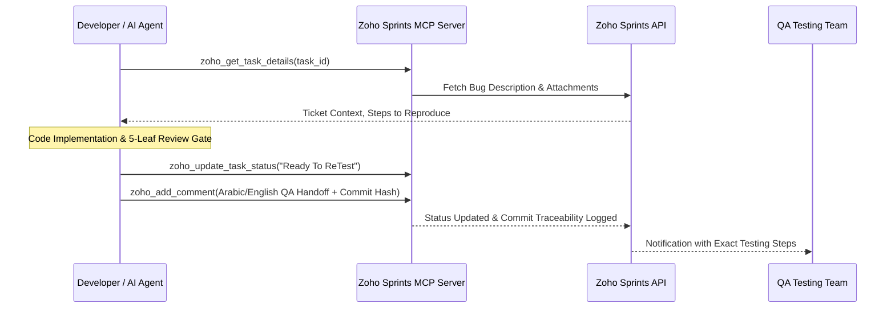

<div align="center">

# Android Agent Harness

**Architecture governance, five-leaf parallel review gate, and execution safety harness for Android & Kotlin Multiplatform.**

[](https://github.com/rabee-elkholy/android-harness-kit/actions/workflows/ci.yml)
[](https://github.com/rabee-elkholy/android-harness-kit/releases)
[](LICENSE)
[](https://android.com)
[](https://python.org)
[](docs/architecture.md)
[](docs/tool-support.md)
[](CONTRIBUTING.md)

<br/>

<p align="center">
  <strong>Transform AI coding assistants into disciplined, architecture-compliant engineering teammates.</strong>
</p>

</div>

---

## Table of Contents

- [Overview](#overview)
- [The Problem We Solve](#the-problem-we-solve)
- [Quickstart in 2 Minutes](#quickstart-in-2-minutes)
- [Architecture Workflow](#architecture-workflow)
- [The Five-Leaf Review Gate](#the-five-leaf-review-gate)
  - [1. Bug Reviewer Agent](#1-bug-reviewer-agent)
  - [2. Convention & Architecture Reviewer](#2-convention--architecture-reviewer)
  - [3. Security & Privacy Reviewer](#3-security--privacy-reviewer)
  - [4. Performance & ANR Guardian](#4-performance--anr-guardian)
  - [5. Regression Blast Radius Reviewer](#5-regression-blast-radius-reviewer)
- [Safety Hooks & Execution Governance](#safety-hooks--execution-governance)
  - [Strict Git Mutation Protection](#strict-git-mutation-protection)
  - [Anti-Polling Guardrails](#anti-polling-guardrails)
  - [Ephemeral State Machine](#ephemeral-state-machine)
- [Preflight Verification Pipeline](#preflight-verification-pipeline)
  - [Fast Kotlin Lint](#fast-kotlin-lint)
  - [Room Database Migration Guard](#room-database-migration-guard)
  - [Bilingual String Parity Check](#bilingual-string-parity-check)
- [Live Gradle Streaming Runner](#live-gradle-streaming-runner)
- [Physical Device Runner & Logcat Doctor](#physical-device-runner--logcat-doctor)
- [Zoho Sprints MCP Integration](#zoho-sprints-mcp-integration)
- [Supported AI Tools & Adapters Matrix](#supported-ai-tools--adapters-matrix)
- [Installation & Setup Modes](#installation--setup-modes)
  - [Mode A: Existing Android / KMP App](#mode-a-existing-android--kmp-app)
  - [Mode B: Greenfield / Blank Project](#mode-b-greenfield--blank-project)
  - [Upgrades & Rollbacks](#upgrades--rollbacks)
- [Setup Wizard & Configuration Reference](#setup-wizard--configuration-reference)
- [Self-Tests & CI/CD Pipeline](#self-tests--cicd-pipeline)
- [Contributing & Community](#contributing--community)
- [License](#license)

---

## Overview

**Android Agent Harness** is an enterprise-grade delivery gate, safety framework, and architecture governance engine for **Android** and **Kotlin Multiplatform (KMP)** development.

When AI coding assistants like **Cursor**, **Google Antigravity**, **Claude Code**, or **GitHub Copilot** work on production Android codebases, they operate without awareness of architectural guardrails, lifecycle boundaries, or physical device constraints. 

**Android Agent Harness** solves this by installing an active **Five-Leaf Review Gate**, deterministic safety hooks, live Gradle execution monitors, Room database validation, bilingual string parity, and physical device test runners directly into your repository.

---

## The Problem We Solve

| Without Android Harness | With Android Agent Harness |
| :--- | :--- |
| **Casual "LGTM"**: AI writes code and declares completion without compiling or verifying. | **Mandatory Review Gate**: AI is locked out of assembly until 5 specialized subagents sign off (`BUG_PASS`, `CONVENTION_PASS`, `SECURITY_PASS`, `PERF_PASS`, `REGRESSION_PASS`). |
| **Silent Regressions**: Modifying one ViewModel or UI component breaks dependent flows. | **Regression Blast Radius**: Maps every caller, navigation route, and data model to verify impact. |
| **Missing Translations & Broken RTL**: Adding a string in English without adding Arabic or vice versa. | **Bilingual String Parity**: Automated validation enforcing 1-to-1 string parity and Jetpack Compose `@Preview` tags. |
| **UI Freezes & ANRs**: Heavy operations placed on Dispatchers.Main or unnecessary recompositions. | **ANR Guardian**: Static heuristics flag main-thread disk/network I/O, heavy canvas draws, and recomposition loops. |
| **Database Crashes**: Altering `@Entity` schemas without writing Room migrations causes runtime crashes. | **Room Guard**: Validates database schema versions, migration objects, and test coverage before building. |
| **Accidental Git Mutations**: AI commits incomplete code, overwrites branches, or pushes dirty state. | **Git Mutation Guard**: Hard interception blocks all autonomous `git commit` and `git push` commands. |

---

## Quickstart in 2 Minutes

To install the harness in your Android app:

1. Open your AI assistant (Antigravity, Cursor, Claude Code, etc.) in your **Android project root directory**.
2. Select a deep reasoning model (e.g. `Claude Opus 4.6 / Sonnet 4.6 (Thinking)`, `Gemini 3.1 Pro / 3.7 Flash`, or `OpenAI o3`).
3. Copy and paste the installer prompt:

```markdown
Read and execute the Android Harness Kit installer:
https://raw.githubusercontent.com/rabee-elkholy/android-harness-kit/main/docs/install-prompt.md
```

4. Follow the interactive questionnaire to configure your project. Once verified with `Total test failures: 0`, your repository is fully protected.

For step-by-step guidance, see the [Quickstart Guide](docs/quickstart.md).

---

## Architecture Workflow

The harness enforces a deterministic, 7-stage quality delivery lifecycle:



---

## The Five-Leaf Review Gate

Before any Gradle build or device installation can proceed, the AI assistant must dispatch **5 specialized reviewer subagents** in parallel. Every subagent inspects the exact package diff and outputs a structured pass token:

```
[BUG_PASS]         -- Verified by Bug Reviewer
[CONVENTION_PASS]  -- Verified by Architecture & Convention Reviewer
[SECURITY_PASS]    -- Verified by Security & Privacy Reviewer
[PERF_PASS]        -- Verified by Performance & ANR Guardian
[REGRESSION_PASS]  -- Verified by Regression Blast Radius Reviewer
```

### 1. Bug Reviewer Agent
- **Focus**: Logical correctness, memory safety, and lifecycle awareness.
- **Catches**: Unhandled `NullPointerException` risks, uncaught coroutine cancellations, improper `StateFlow` collection without `repeatOnLifecycle`, and memory leaks in static singletons.

### 2. Convention & Architecture Reviewer
- **Focus**: Structural cleanliness, MVI/Clean Architecture, and design patterns.
- **Catches**: Mutable state exposed outside ViewModels, business logic in Composables/Fragments, improper dependency injection (Hilt/Koin), and missing `@Preview` annotations for light/dark themes.

### 3. Security & Privacy Reviewer
- **Focus**: Android component security, permission boundaries, and data storage.
- **Catches**: Exported Activities/Receivers without explicit intent filters or permissions, plaintext credentials/API keys, SQL injection in raw Room queries, and sensitive data printed to production Logcat.

### 4. Performance & ANR Guardian
- **Focus**: UI fluidity (60/120 FPS), main thread responsiveness, and memory footprint.
- **Catches**: Disk or network I/O executed on `Dispatchers.Main`, heavy allocations during Jetpack Compose recomposition phases, unoptimized Canvas drawings, and unbounded recursive loops.

### 5. Regression Blast Radius Reviewer
- **Focus**: Cross-feature dependency graphs and change impact radius.
- **Catches**: Renamed ViewModel functions breaking secondary screens, altered data models breaking JSON serialization, modified navigation arguments breaking deep links, and shared database migrations.

---

## Safety Hooks & Execution Governance

The harness incorporates a Python-driven safety interception layer (`pre_tool_safety.py` and `hooks.json`) that monitors all AI tool invocations in real time.

### Strict Git Mutation Protection
AI models frequently attempt to cover mistakes by making unauthorized commits or force-pushing branches. The harness intercepts:
- `git commit` / `git push` / `git reset --hard`
- PowerShell and bash subshell bypasses (`sh -c "git commit"`, `cmd.exe /c git commit`)
- Executable paths (`git.exe commit`)

Developers retain sole authority over repository history.

### Anti-Polling Guardrails
To prevent models from getting stuck in infinite polling loops (>2 calls to `manage_task` or `manage_subagents`), the hook enforces event-driven reactive wakeups and denies redundant poll requests.

### Ephemeral State Machine
`_hook_state.py` tracks the review lifecycle per conversation:
- Packages are hashed to ensure reviewers inspect the exact active changes.
- Automatically unlocks re-dispatching if missing subagent templates are defined (`re_dispatch_allowed`).
- Clears review tokens when new code modifications are detected.

---

## Preflight Verification Pipeline

Before compiling the application with Gradle, `preflight_check.py` runs three rapid static verification checks in under 2 seconds:

### Fast Kotlin Lint (`fast_kt_lint.py`)
- Verifies package declarations, import hygiene, and Kotlin syntax.
- Enforces Jetpack Compose `@Preview` tags for both LTR (English) and RTL (Arabic) locales.

### Room Database Migration Guard (`room_guard.py`)
- Scans `@Database` and `@Entity` declarations for schema changes.
- Requires explicit `Migration(from, to)` classes and schema version bumps whenever database fields are added or modified.

### Bilingual String Parity Check (`check_strings.py`)
- Analyzes `res/values/strings.xml` and `res/values-ar/strings.xml`.
- Flags missing translations, mismatched placeholder arguments (`%1$s`), and ignores `translatable="false"` system strings.

---

## Live Gradle Streaming Runner

Executing Gradle builds directly through AI tool interfaces often causes timeouts, silent freezes, or lost output.

`run_gradle_task.py` provides:
- **10-Second Live Heartbeat**: Continuously streams stdout/stderr to prevent assistant timeout.
- **Intelligent Error Parser (`gradle_error_parser.py`)**: Filters thousands of lines of Gradle output to extract the exact compiler error, file path, and line number.
- **Build Isolation**: Executes safely with project-specific daemon configurations.

```bash
python .agents/scripts/run_gradle_task.py :app:assembleDebug
```

---

## Physical Device Runner & Logcat Doctor

The harness prioritizes **real-world physical hardware testing** over emulators:

```bash
python .agents/scripts/run_device.py --package com.example.app --activity .MainActivity
```

- **Auto-Discovery**: Automatically identifies connected physical Android devices over ADB USB / Wi-Fi.
- **Logcat Doctor (`logcat_doctor.py`)**: Captures real-time stack traces, uncaught exceptions, and ANR traces specifically filtered to your application ID.
- **Screen Capture (`capture_screen.py`)**: Automatically captures UI screenshots for visual sign-off.

---

## Zoho Sprints MCP Integration

The harness includes a built-in **Model Context Protocol (MCP) server** for Zoho Sprints:



- **Bi-Directional Sync**: Reads tasks, subtasks, bug reports, and attachments directly.
- **QA Handoff**: Generates structured Arabic and English testing handoff notes with the exact **Git Commit SHA** for complete audit traceability.

---

## Supported AI Tools & Adapters Matrix

The harness supports **14+ AI coding assistants and IDEs**, automatically generating native configuration adapters:

| Assistant / IDE | Generated Adapter | Integration Features |
| :--- | :--- | :--- |
| **Google Antigravity** | `agents/rules/`, `agents/hooks.json` | Subagent dispatch, hook blockers, ephemeral reminders |
| **Cursor** | `.cursorrules` | Architecture constraints, review protocol, terminal execution gates |
| **Claude Code** | `CLAUDE.md` | Slash command protocols, terminal safety guards |
| **GitHub Copilot** | `.github/copilot-instructions.md` | Workspace instructions, domain conventions |
| **OpenAI Codex CLI** | `AGENTS.md` | Universal agent instructions, execution limits |
| **Windsurf** | `.windsurfrules` | Cascade AI rules and architectural constraints |
| **Cline & Roo Code** | `.clinerules`, `.roomodes` | System prompts, mode definitions, tool permissions |
| **Amazon Q / Continue / Junie / Kilo / Goose** | Native Adapter Files | Full rule compliance across all supported environments |

---

## Installation & Setup Modes

### Mode A: Existing Android / KMP App
Run the installer in an established codebase. The setup wizard inspects your `libs.versions.toml`, Gradle dependencies, and existing architecture (MVI/MVVM, Compose, Room, Koin/Hilt) and generates custom domain reference skills tailored to your app.

### Mode B: Greenfield / Blank Project
For brand-new or blank projects, the wizard guides you through an **8-question Architecture Foundation Questionnaire**:
1. **Target Platform**: Android Native vs Kotlin Multiplatform (KMP).
2. **Architecture**: MVI (Unidirectional) vs MVVM.
3. **Dependency Injection**: Koin vs Hilt vs Manual.
4. **Navigation**: Voyager vs AndroidX Navigation Compose.
5. **UI Framework**: Jetpack Compose vs XML Views.
6. **Local Database**: Room vs SQLDelight vs Realm.
7. **Networking**: Ktor Client vs Retrofit + OkHttp.
8. **Localization**: Bilingual Arabic (RTL) + English (LTR) vs Single Locale.

### Upgrades & Rollbacks
- **Upgrade**: Paste [`docs/update-prompt.md`](docs/update-prompt.md) into your chat. Upgrades preserve custom domain references and product configurations while updating core scripts and hooks.
- **Rollback**: Paste [`docs/rollback-prompt.md`](docs/rollback-prompt.md) into your chat to cleanly restore previous backups.

---

## Setup Wizard & Configuration Reference

The setup wizard configures 18 parameters (`I.1` to `I.18`) stored in `_product.py`:

| Parameter | Name | Default | Options / Description |
| :--- | :--- | :--- | :--- |
| `I.1` | **Backup Creation** | `Yes` | Create timestamped backup in `.harness-backup/` before install. |
| `I.2` | **Product Name** | *Auto-detected* | Clean product display name (e.g. `Rashaqa`). |
| `I.3` | **Git Commit Policy** | `Manual in IDE` | `Manual in IDE` *(Recommended)* vs `Agent upon explicit chat request`. |
| `I.4` | **Device Target Policy** | `Physical Only` | `Physical Only` *(Recommended)* vs `Physical + Emulator`. |
| `I.5` | **Install Confirmation** | `Yes` | Require explicit confirmation before `adb install`. |
| `I.6` | **Assemble Task** | `:app:assembleDebug` | Gradle assemble task path. |
| `I.7` | **Launcher Activity** | *Auto-detected* | Target Activity for physical device launch. |
| `I.8` | **Bilingual Parity** | `Arabic + English` | Dual Arabic/English string and preview parity. |
| `I.9` | **Compose Rules** | `Yes` | Enforce Jetpack Compose state & recomposition rules. |
| `I.10` | **Room DB Migrations**| `Yes` | Enforce Room database migration verification. |
| `I.11` | **Logcat Doctor** | `Yes` | Enable automated Logcat stack trace diagnostics. |
| `I.12` | **Python Executable** | `python` | Python executable name (`python` or `python3`). |
| `I.13` | **Custom Heuristics**| `Yes` | Discover and generate domain reference skill guides. |
| `I.14` | **AI Tool Adapters** | *Multi-select* | Select target IDEs (Antigravity, Cursor, Claude, etc.). |
| `I.15` | **Unit Tests Gate** | `Yes` | Run `testDebugUnitTest` before assemble. |
| `I.16` | **Zoho Sprints MCP** | `Yes` | Configure Zoho Sprints project management integration. |
| `I.17` | **Chat Language** | `Strict English` | English documentation, commit messages, and reviews. |
| `I.18` | **Zoho Language** | `En Title + Ar Note` | English task titles with Arabic QA testing notes. |

---

## Self-Tests & CI/CD Pipeline

The harness includes a comprehensive self-test suite (`_hook_selftest.py`) validating:
- Hook blocking rules (`git commit`, `adb monkey`, `pm clear`).
- 5-Leaf Review Gate verification tokens and hash lockout recovery.
- Python syntax, fast linting, and Room migration parsers.
- Zero credential leaks in MCP configurations.

### Run Local Self-Tests:
```bash
python agents/scripts/_hook_selftest.py
python agents/scripts/preflight_check.py
```

### GitHub Actions CI Matrix:
Every push and pull request is automatically tested across:
- **Operating Systems**: `ubuntu-latest`, `windows-latest`
- **Python Versions**: `3.10`, `3.11`, `3.12`, `3.13`

---

## Contributing & Community

Contributions from the Android and Kotlin Multiplatform development community are welcome.

- **Report Bugs**: Use our [Bug Report Form](.github/ISSUE_TEMPLATE/bug_report.yml).
- **Suggest Features**: Propose new reviewer subagents or tool adapters via our [Feature Request Form](.github/ISSUE_TEMPLATE/feature_request.yml).
- **Contributing Guide**: Read [CONTRIBUTING.md](CONTRIBUTING.md) for local setup and commit standards.
- **Discussions**: Connect on [GitHub Discussions](https://github.com/rabee-elkholy/android-harness-kit/discussions).

---

## License

Distributed under the **MIT License**. See [`LICENSE`](LICENSE) for complete terms.

<div align="center">

<br/>

[Back to Top](#android-agent-harness)

</div>\n