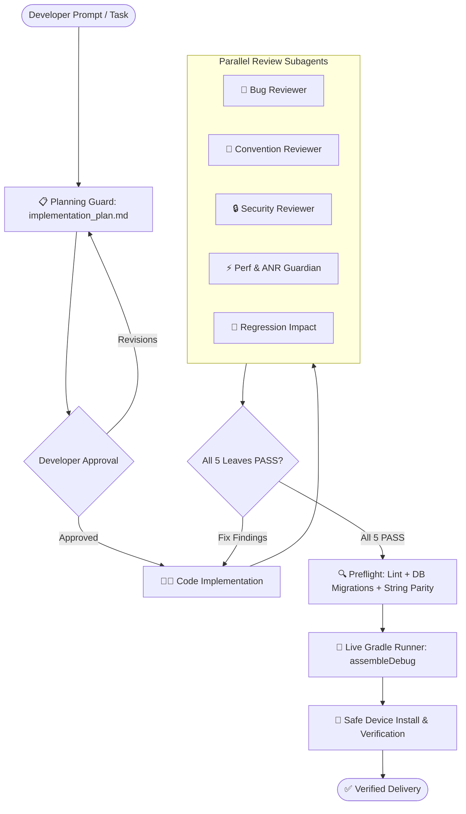

<div align="center">

# 🛡️ Android AI Agent Harness Kit

**Production-grade AI Architecture Governance, Quality Delivery Gate & Security Harness for Android & Kotlin Multiplatform (KMP).**

[](https://github.com/rabee-elkholy/android-harness-kit/releases)
[](LICENSE)
[](https://android.com)
[](https://python.org)
[](https://github.com/rabee-elkholy/android-harness-kit)
[](docs/tool-support.md)

<p align="center">
  <a href="#-key-features">Key Features</a> •
  <a href="#-workflow-architecture">Architecture</a> •
  <a href="#-supported-ai-assistants">Supported Tools</a> •
  <a href="#-installation-step-by-step">Installation</a> •
  <a href="#-greenfield--established-codebases">Project Modes</a> •
  <a href="CHANGELOG.md">Changelog</a>
</p>

---

</div>

## 💡 What is Android Harness Kit?

**Android Harness Kit** is not a sample app or a passive style guide. It is an **autonomous AI engineering and delivery harness** that transforms your favorite AI coding assistant into a disciplined senior Android architect.

After installation, the AI assistant **cannot** declare work finished with a generic *"LGTM"* or *"looks good to me"*. Every feature, refactor, or bug fix must pass through a strict **Five-Leaf Review Gate**, preflight verification, live Gradle streaming, and safe device deployment.

---

## 🚀 Key Features

<table>
  <tr>
    <td width="50%">
      <h3>🌿 Five-Leaf Review Gate</h3>
      Mandatory parallel dispatch of 5 specialized reviewer subagents (<code>BUG_PASS</code>, <code>CONVENTION_PASS</code>, <code>SECURITY_PASS</code>, <code>PERF_PASS</code>, <code>REGRESSION_PASS</code>) before any assemble or release.
    </td>
    <td width="50%">
      <h3>🏗️ Dual Project Engine</h3>
      Seamlessly supports both <b>established active codebases</b> (auto-discovering DI, ViewModels, and UI) and <b>brand-new greenfield projects</b> (interactive architecture questionnaire).
    </td>
  </tr>
  <tr>
    <td width="50%">
      <h3>🔒 Hard Safety Hooks & Git Guard</h3>
      Blocks unauthorized <code>git commit</code>, worktree mutations, <code>adb monkey</code>, and destructive package clearing. Keeps Git commits firmly in the developer's hands.
    </td>
    <td width="50%">
      <h3>⚡ Live Gradle Task Streaming</h3>
      <code>run_gradle_task.py</code> streams real-time build logs with a 10-second heartbeat, preventing silent hangs and long unmonitored builds.
    </td>
  </tr>
  <tr>
    <td width="50%">
      <h3>🔔 Interactive Update Notifier</h3>
      Built-in smart version checker that detects new kit releases at the start of each chat session with snooze (<code>--snooze 1</code>) and in-chat changelog viewing (<code>--show-changes</code>).
    </td>
    <td width="50%">
      <h3>🧩 14+ AI Assistant Adapters</h3>
      Generates tailored configuration files for <b>Google Antigravity</b>, <b>Cursor</b>, <b>Claude Code</b>, <b>GitHub Copilot</b>, <b>Codex</b>, <b>Windsurf</b>, and more.
    </td>
  </tr>
</table>

---

## 📊 Workflow Architecture



---

## 🤖 Supported AI Assistants

The harness installer automatically generates the exact configuration files required by your AI tool:

| AI Assistant | Adapter File | Capabilities |
| :--- | :--- | :--- |
| **Google Antigravity** | `agents/rules/`, `agents/hooks.json` | Full hook blocking, subagents, ephemeral reminders, reactive wakeup |
| **Cursor** | `.cursorrules` | Architectural rules, review protocol, terminal execution gates |
| **Claude Code** | `CLAUDE.md` | Slash command protocols, strict terminal & review guard |
| **GitHub Copilot** | `.github/copilot-instructions.md` | Workspace instructions, Android domain rules |
| **OpenAI Codex CLI** | `AGENTS.md` | Universal agent instructions, tool gating |
| **Windsurf** | `.windsurfrules` | Cascade AI rules & architectural constraints |
| **Cline & Roo Code** | `.clinerules`, `.roomodes` | Custom system prompts, tool policies |
| **Amazon Q / Continue / Junie / Kilo / Goose** | Tool-specific rule adapters | Complete rule compliance across all 14+ tools |

---

## 🎯 Greenfield vs Established Codebases

> [!TIP]
> **1. Established Codebases**: The installer scans `libs.versions.toml`, Gradle scripts, ViewModels, and Compose UI to automatically discover your architecture (MVI/MVVM, Koin/Hilt, Voyager/Compose Navigation, Room, etc.).
> 
> **2. Brand-New / Blank Projects (Greenfield Bootstrap)**: The installer launches an interactive questionnaire to establish your desired architecture, DI, Navigation, UI, Database, Networking, and Locales from Day 1.

---

## 🚀 Installation (Step-by-Step)

Installation is an automated structural port that tailors the 5-reviewer governance engine to your app's exact architecture.

### Step 1: Open a New Chat in Your Android Project
Open your IDE or terminal AI assistant in your **Android project's root folder** (⚠️ *never run setup inside `android-harness-kit` itself*).

### Step 2: Use a Strong Reasoning Model
For setup, use a flagship reasoning model from your AI provider (lightweight models tend to skip architectural porting steps):
- **Anthropic**: `Claude 3.7 Sonnet (Thinking)` / `Claude Sonnet 4.6 (Thinking)`
- **Google**: `Gemini 3.1 Pro` / `Gemini 2.5 Pro`
- **OpenAI**: `OpenAI o1` / `o3-mini` / `GPT-4o`
- **DeepSeek**: `DeepSeek-R1`

### Step 3: Paste the Install Prompt
Copy the entire contents of [`docs/install-prompt.md`](docs/install-prompt.md) and paste it as your first message in the chat:
```markdown
[Paste the full contents of docs/install-prompt.md here]
```

### Step 4: Answer the Setup Wizard Questions
The agent will run the interactive setup wizard (`setup_wizard.py`):
1. **Backup**: Create a timestamped backup before touching `.agents/` *(Recommended)*.
2. **App Name**: Confirm detected application name.
3. **Git Policy**: Commit manually in IDE *(Recommended)* or allow agent on request.
4. **Testing Target**: Physical device only, or both device and emulator.
5. **Install Confirmation**: Ask before `adb install` or install unattended.
6. **Unit Tests**: Keep or skip unit-test verification gates.
7. **AI Tools**: Select which tools you use (Cursor, Antigravity, Claude Code, Copilot, Windsurf, etc.).
8. **Zoho Sprints**: Optional project management integration.
9. *(If Greenfield Project)*: Answer the 8-question architecture foundation questionnaire.

---

## 📂 Repository Layout

```
android-harness-kit/
├── README.md                ← Project documentation
├── CHANGELOG.md             ← Version release history
├── docs/
│   ├── install-prompt.md    ← Paste this in a new chat on the Android app
│   ├── update-prompt.md     ← Paste this to pull a newer kit into an existing install
│   ├── setup-prompt.md      ← Agent execution blueprint
│   ├── rollback-prompt.md   ← Clean uninstallation / rollback
│   └── tool-support.md      ← Matrix of all 14 supported AI tools
├── agents/                  ← Deployed to <your-app>/.agents
│   ├── rules/               ← Core harness rules & five-leaf review guidelines
│   ├── scripts/             ← Python runners (setup_wizard, run_gradle_task, preflight, etc.)
│   ├── skills/              ← Android skills (Compose theme, MVI, ANR, Room, etc.)
│   ├── subagents/           ← Specialized reviewer subagent definitions
│   └── tool-adapters/       ← Template adapters for Cursor, Claude, Antigravity, etc.
└── templates/               ← Optional runtime and tool templates
```

---

## 📄 License

Distributed under the **MIT License**. See [`LICENSE`](LICENSE) for more information.

---

<div align="center">

**Built for Android & KMP Developers who demand uncompromising AI code quality.**

[⬆ Back to Top](#-android-ai-agent-harness-kit)

</div>
