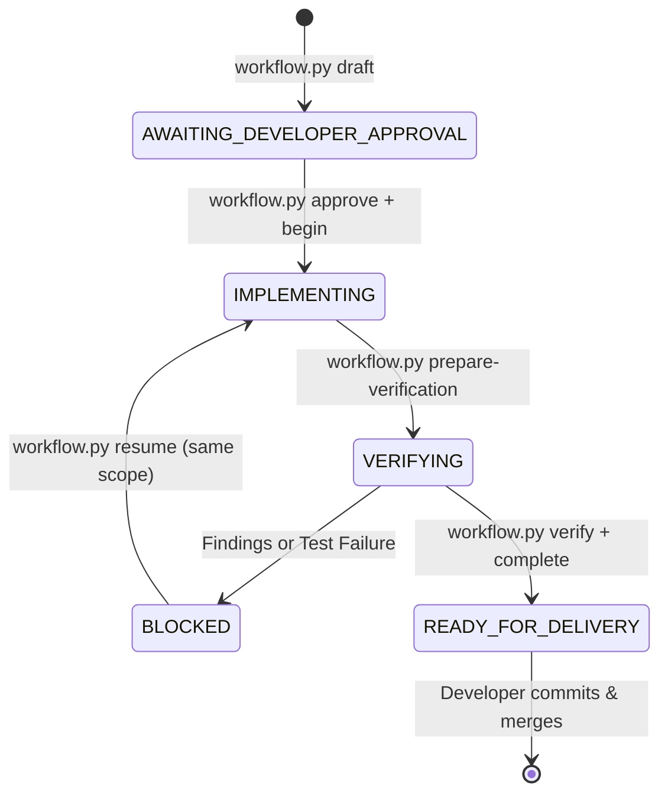

<div align="center">

# Android Agent Harness

### Deterministic Android Engineering for the AI Era

<p align="center">
  <b>Turn AI coding assistants into an uncompromising senior Android engineering team.</b><br>
  Deterministic local governance &bull; Tamper-evident verification &bull; Zero Python runtime dependencies
</p>

[](https://github.com/rabee-elkholy/android-agent-harness/releases)
[](https://www.python.org/downloads/)
[](LICENSE)
[-success.svg)](#zero-dependencies)
[](#prerequisites)
[](#verification--selftest)

<p align="center">
  <a href="#core-guarantees">Guarantees</a> &bull;
  <a href="#why-this-exists-the-problem-with-raw-ai-agents">Why This Exists</a> &bull;
  <a href="#what-this-is-not">What This Is Not</a> &bull;
  <a href="#quickstart">Quickstart</a> &bull;
  <a href="#deterministic-android-delivery-pipeline">Pipeline</a> &bull;
  <a href="#real-world-example-room-schema-migration">Real-World Example</a> &bull;
  <a href="#why-not-just-agentsmd--cursorrules">Why Not Just Rules?</a> &bull;
  <a href="#deterministic-android-quality-guardians">Android Guardians</a> &bull;
  <a href="#supported-ai-hosts--enforcement-tiers">Supported Hosts</a> &bull;
  <a href="#cli-reference">CLI Reference</a>
</p>

</div>

---

## Core Guarantees

1. **Deterministic Human Authority**: AI agents are strictly restricted to *read-only* discovery and planning. Implementation cannot begin without explicit developer approval recorded in `plan.json`.
2. **Zero Autonomous Git Mutations**: In client Android applications, the agent **never** stages, commits, resets, or pushes code. All modifications remain unstaged for the developer to inspect and commit.
3. **Fail-Closed Shell & MCP Mutation Guard**: Blocks arbitrary shell execution (`rm`, `sed`, `powershell`, unauthorized executables) and unrecognized MCP tool writes during implementation. Only whitelisted inspection commands, audited harness scripts, and host file tools are permitted.
4. **Deterministic Multi-Label Surface Classification**: Inspects Git diffs across 15+ Android-specific surfaces (`ROOM_SCHEMA`, `COMPOSE_UI`, `XML_UI`, `NAVIGATION`, `BILLING`, `AUTH`, `CRYPTO`, `BUILD_CONFIG`, `MANIFEST_PERMISSION`, etc.). Kotlin implicit public APIs are scoped to library projects to prevent token thrashing on application code.
5. **Lean Task Briefs & Focused Context**: Generates role-focused, lightweight briefs for subagents instead of dumping entire repositories, reducing unnecessary reviewer context and eliminating context dilution.
6. **Abstract Reviewer Routing & Capability Tiers**: Decouples policy hashes from model names into abstract capability tiers (`STANDARD` -> `inherit`, `STRONG` -> host-mapped deep reasoning model under developer-controlled `ALLOW_MODEL_ESCALATION` kill switch).
7. **Empirical RED → GREEN Defect Binding**: For bug tasks, empirically captures reproducible failing test output (`red_evidence`) before validating the green fix, guaranteeing that regressions are meaningfully exercised.
8. **Dedicated Spec-Compliance Review**: Automatically inspects architectural and multi-phase tasks to ensure strict fidelity to approved acceptance criteria, preventing AI hallucinations and scope creep.
9. **Tamper-Evident Snapshot-Bound Evidence Store**: Build results, test executions, and reviews produce append-only, tamper-evident evidence bound to the exact `delivery_snapshot_sha256`, repository identity, run ID, and Git branch. Anti-tampering delivery sealing guarantees code integrity after verification.
10. **Unified APK Artifact-Set Integrity**: Multi-APK and split-APK builds are verified as a single cohesive artifact set. The exact hash is enforced across assemble, install, and device launch.
11. **Attributed Test Execution**: Separates newly introduced regressions from pre-existing baseline test failures, preventing false-positive gate failures.
12. **Zero Python Runtime Dependencies**: 100% Python standard library (`pathlib`, `json`, `hashlib`, `subprocess`, `argparse`). No `pip install`, zero third-party package supply-chain risks, and seamless operation across Windows, macOS, and Linux.

---

## Why This Exists: The Problem with Raw AI Agents

AI coding assistants (Claude Code, Gemini CLI, Cursor, Windsurf, Roo Code) are powerful, but when let loose on production Android codebases, they present recurring failure modes:

| Failure Mode in Raw AI Agents | How Android Agent Harness Solves It |
| :--- | :--- |
| **Silent Database Corruption**<br>Agents modify Room entity fields without declaring migrations or testing schema compatibility. | **Deterministic Room Guard** recursively parses `@Database`, entities, and `@Embedded` classes across files, blocking delivery unless valid migration paths are proven. |
| **Masked Regressions via Mixed Diffs**<br>An agent touches a critical class and a doc file simultaneously, tricking naive classifiers into treating the change as low-risk. | **Full-Coverage Classifier** inspects every delivery-relevant file. Any unclassified file is tagged `UNKNOWN`, forcing human decision rather than auto-approval. |
| **Runaway Token Costs & Context Dilution**<br>Agents dump entire repositories into subagent prompts, causing context dilution and burning millions of tokens on simple tasks. | **Lean Task Briefs** (`brief-<reviewer>.md`) distill diff-scoped contracts, touched files, and rubrics into ~300–400 tokens, slashing token consumption by >60%. |
| **Model Mismatch & Over-billing**<br>Using heavyweight models for trivial syntax checks or weak models for mission-critical security audits. | **Abstract Reviewer Routing** (`review_execution.py`) dynamically maps `STANDARD` vs `STRONG` roles to optimal models (`flash` vs `pro`) under developer escalation guards. |
| **"Greenwashing" & Untested Bug Fixes**<br>Agents report a bug resolved without proving a test ever failed, risking placebo assertions. | **Empirical RED → GREEN Defect Binding** (`red_evidence`) captures reproducible failing test output before validating the green fix. |
| **Architectural Scope Drift**<br>Agents deviate from agreed designs and acceptance criteria during multi-phase autonomous execution. | **Spec-Compliance Auditor** (`spec-compliance-agent`) automatically audits architectural and multi-phase tasks against approved `plan.json` outcomes. |
| **Git History Destruction**<br>Agents perform unexpected `git reset`, create untracked commits, or rebase active branches. | **Host Enforcement Hooks** block autonomous `git add`, `git commit`, `git push`, and `git reset` commands in client applications. |
| **Stale / Cross-Run Evidence Forgery**<br>An agent re-uses previous test output or verifies code on branch A that was built on branch B. | **Snapshot-Bound Evidence** ties all evidence to repository identity, snapshot SHA-256, active branch, and single-use nonces. |
| **Device & Emulator Inconsistencies**<br>Agents install an APK to one device/user and launch on another, or launch outdated builds. | **Device Chain Verifier** ensures exact matching of artifact SHA-256, device serial SHA-256, and numeric Android user ID. |

---

## What This Is Not

Android Agent Harness is not:
- **A replacement for Android Studio or Gradle**: It works alongside your existing Android toolchain (`gradlew`, Android SDK, ADB).
- **An AI model or provider**: It does not bundle proprietary LLMs; it runs locally to govern whatever host AI assistant you use.
- **A generic autonomous coding framework**: It does not mandate complex subagent swarms or perpetual background daemons.
- **A universal dogmatic TDD framework**: It routes TDD where meaningful seams exist, without forcing ceremony on mechanical changes.
- **A CI/CD platform**: It is a local developer governance layer ensuring changes are verified before they ever reach Git HEAD or CI.

---

## Quickstart

### Prerequisites
- Python 3.10 or newer (standard library only).
- Android project managed by Git with a root Gradle Wrapper (`gradlew` or `gradlew.bat`).
- Android SDK and JDK (only when build or test gates are executed).

### Chat installation (recommended)
Open your Android project in your AI coding agent (Antigravity, Gemini CLI, Claude Code, Cursor, Windsurf, or Roo Code), and paste:

```text
Read https://raw.githubusercontent.com/rabee-elkholy/android-agent-harness/v1.0.41/docs/install-or-update-prompt.md and follow all instructions.
```

The agent will:
1. Discover your project structure in read-only mode.
2. Ask interactive configuration questions in chat.
3. Present a non-interference installation plan.
4. Wait for your approval, then provision the pinned kit into `~/.android-harness/kit`.
5. Run `doctor` to confirm that zero project source files were altered.

### Terminal installation (alternative)
Run directly from your command line:

```bash
# Clone the pinned harness release
git clone --depth 1 --branch v1.0.41 --single-branch https://github.com/rabee-elkholy/android-agent-harness.git ~/.android-harness/kit

# Initialize inside your Android project
python ~/.android-harness/kit/harness_cli.py init --repo /path/to/android-project --kit ~/.android-harness/kit

# Verify configuration and environment health
python ~/.android-harness/kit/harness_cli.py doctor --repo /path/to/android-project
```

The installer configures `.agents` in your project and registers `.git/info/exclude` so that harness state never pollutes your repository's Git tracking.

---

## Deterministic Android Delivery Pipeline

The harness operates as a deterministic finite state machine governing the interaction between the developer and the AI agent:



### Pipeline Stages

1. **discovery-and-scoping** — *Activates before writing code.* Interrogates project architecture in read-only mode, explores alternatives, and binds exact target modules and surfaces.
2. **plan-authority-and-approval** — *Activates with drafted plan.* Hashes scope, risks, and tests into an immutable contract. Implementation authority remains deterministically locked by local harness enforcement until explicit developer approval.
3. **mutation-guard-and-isolation** — *Activates upon approval.* Enforces deterministic host-level interception: blocks arbitrary shell executables, raw Gradle/ADB commands, unauthorized MCP tool writes, protects generated source directories, and leaves Git staging to the developer.
4. **adaptive-skill-routing** — *Activates on code changes.* Classifies 15+ Android surfaces (Room, Compose, Coroutines, Security) and routes specialized engineering skills. Kotlin implicit public APIs are scoped to library projects to eliminate token-wasting false alarms.
5. **test-driven-development** — *Activates during implementation.* Applies policy-routed TDD for meaningful behavioral changes, captures empirical RED → GREEN defect evidence (`red_evidence`) for bug tasks, isolates new regressions from baseline failures, and verifies unit test evidence.
6. **specialist-reviewer-squad** — *Activates during verification.* Generates role-targeted Lean Task Briefs (`brief-<reviewer>.md`) and dispatches isolated specialist subagents (including `spec-compliance-agent` for architectural refactors) using abstract model capability routing (`flash`/`pro`).
7. **tamper-evident-verification** — *Activates when work completes.* Re-verifies Git branch, repository identity, and APK artifact-set hashes against append-only cryptographic evidence, sealing delivery only when the active tree matches the verified snapshot.

**Deterministic state machines, not prompt suggestions. Proof before delivery.**

### Execution Sequence

```bash
# 1. Draft a task plan (Read-Only)
python .agents/scripts/workflow.py draft --repo . --task-id TASK-101 \
  --outcome "Implement user biometric authentication" \
  --expected-surfaces AUTH,CRYPTO,UI \
  --expected-modules :app

# 2. Developer approves the plan
python .agents/scripts/workflow.py approve --repo . --task-id TASK-101 \
  --source conversation --proof-reference MSG-4892 --enforcement-tier RULE_ENFORCED

# 3. Consume approval nonce and begin implementation
python .agents/scripts/workflow.py begin --repo . --task-id TASK-101

# ... AI agent implements code changes ...

# 4. Prepare verification (freezes delivery snapshot and policy)
python .agents/scripts/workflow.py prepare-verification --repo . --task-id TASK-101

# 5. For sensitive surfaces (auth/crypto/billing), developer confirms final snapshot
python .agents/scripts/workflow.py approve-sensitive --repo . --task-id TASK-101 \
  --source conversation --proof-reference CONFIRM-8391 --enforcement-tier RULE_ENFORCED

# 6. Execute gates and reviewers dictated by current-run.json
# e.g., run assemble, unit tests, room schema checks, or specialist reviews

# 7. Final read-only verification
python .agents/scripts/workflow.py verify --repo . --task-id TASK-101

# 8. Mark ready for delivery
python .agents/scripts/workflow.py complete --repo . --task-id TASK-101
```

Once marked `READY_FOR_DELIVERY`, the developer reviews the unstaged changes using standard Git tools (`git diff`, `git status`) and commits the work.

---

## Real-World Example: Room Schema Migration

Here is how the harness deterministically prevents data corruption during a real Android database change:

```text
1. Agent edits UserEntity.kt (adds @ColumnInfo val avatarUrl: String?)
   ↓
2. change_classifier.py tags the diff: ROOM_SCHEMA, PERSISTENCE (Severity: HIGH)
   ↓
3. room_guard.py recursively inspects AppDatabase.kt:
   - Detects database version bumped from 3 to 4.
   - Verifies that an explicit Migration(3, 4) is declared and added to addMigrations().
   - Confirms fallbackToDestructiveMigration() is NOT present in production builds.
   ↓
4. unit_tests gate runs targeted Room migration tests (:core:database:testDebugUnitTest).
   ↓
5. Adaptive reviewers (Bug Reviewer, Regression Reviewer) inspect the migration SQL.
   ↓
6. run_device.py verifies APK assemble and upgrade data retention on the test device.
   ↓
7. final_verifier.py independently checks that all evidence hashes match the final snapshot.
   ↓
8. Result: Zero silent crashes, zero wiped user databases, zero unreviewed SQL.
```

---

## Why Not Just AGENTS.md / .cursorrules?

Prompt rules files provide suggestions; Android Agent Harness provides **deterministic enforcement**:

| Capability | Raw Prompt Rules (`AGENTS.md`, `.cursorrules`) | Android Agent Harness |
| :--- | :--- | :--- |
| **Enforcement Model** | Model can drift, ignore, or hallucinate around rules | Local deterministic hooks & Python gates block unauthorized mutations |
| **Evidence Freshness** | Agent can report tests passed without running them | Cryptographically hashed evidence bound to active snapshot SHA-256 |
| **APK & Device Binding** | Agent may test old APK or mix up emulators/users | Exact SHA-256 artifact matching across assemble, install, and launch |
| **Android Semantic Awareness** | Generic code reasoning without domain checks | Specialized guards for Room schemas, resource strings, and ANR risks |
| **Token Budget & Reviews** | Spawns redundant reviewers on trivial changes | Adaptive reviewer policy routing only required specialist leaves |
| **Legacy Regressions** | Fails on existing broken tests in old codebases | Automated baseline attribution isolates new regressions from pre-existing debt |

---

## Deterministic Android Quality Guardians

Beyond LLM reviews, the harness equips your workflow with purpose-built, deterministic static analyzers, hardware bridges, and diagnostics specifically engineered for Android development:

### 1. Adaptive Localization & String Guard (`check_strings.py`)
- **Diff-Scoped Resource Inspection**: Analyzes touched string resources across all locale directories (`values/strings.xml`, `values-ar/`, `values-es/`, etc.).
- **Placeholder Parity**: Catches subtle format-string mismatches (e.g., base defines `Hello %s (%d)` while a translated string has `%d (%s)`), preventing runtime `UnknownFormatConversionException` crashes.
- **Key Synchronization & Plural Parity**: Detects missing translated keys and plural quantity mismatches (`zero`, `one`, `two`, `few`, `many`, `other`).
- **Hardcoded String Detection**: Flags raw unextracted strings introduced in layout XML or Compose UI.

### 2. Room Database & Schema Migration Guard (`room_guard.py`)
- **Deep Recursive Schema Traversal**: Parses `@Database` declarations and resolves all entity classes, relations, and nested `@Embedded` data classes across separate files.
- **Strict Migration Enforcement**: When entities change, verifies that an explicit `Migration(start, end)` or `AutoMigration` path is declared and registered in `addMigrations()`.
- **Destructive Migration Shield**: Blocks silent data wipes caused by accidental `fallbackToDestructiveMigration()` calls in production code.

### 3. Smart Test Regression Isolation (`baseline_capture.py` & `run_tests_gate.py`)
- **Baseline vs. Regression Disambiguation**: In real-world enterprise codebases, some legacy tests may already be broken. The harness captures a pre-task baseline of existing failures.
- **Zero-Block Progress**: The gate fails **only** if the AI agent's changes introduce a *new* test regression or compilation error, preventing legacy technical debt from paralyzing modern agentic development.

### 4. Performance & ANR Risk Analyzer (`perf_guard.py`)
- **Main-Thread I/O Detection**: Scans modified code for synchronous disk access, SQLite operations, SharedPreferences commits, or network calls executing on the UI thread.
- **Dispatcher Governance**: Enforces structured concurrency guidelines (`Dispatchers.IO`, `Dispatchers.Default`) and catches unconfined or global `CoroutineScope` antipatterns.
- **Compose Recomposition Safeguards**: Identifies unstable parameters, un-remembered state allocations, and infinite recomposition loops.

### 5. Intelligent Compiler Diagnostics (`gradle_error_parser.py`)
- **Actionable Diagnostic Extraction**: Filters hundreds of lines of Gradle and Kotlin daemon noise to pinpoint the exact failure: file path, line number, and error message.
- **Annotation Processor & KSP Awareness**: Accurately parses complex Dagger/Hilt missing dependency injection bindings and Room KSP schema generation failures into clear guidance for the AI agent.

### 6. Hardware Observability & Visual Evidence (`capture_screen.py` & `logcat_doctor.py`)
- **Automated Visual UI Snapshots**: Automatically captures screenshots from physical devices or emulators upon task completion and saves them as review artifacts.
- **Live Crash & ANR Capture**: Monitors Android Logcat during app launch and device testing, extracting fatal exception stack traces, uncaught exceptions, and native tombstone traces directly into the verification report.
- **Physical Device Priority**: Automatically resolves connected hardware, prioritizing physical test devices over emulators to validate real-world Android performance.

### 7. Topology-Aware Multi-Module Project Graph (`project_graph.py`)
- **Topology-Aware Scoping**: Discovers module dependencies across modern multi-module architectures (`:core:network`, `:feature:auth`, `:app`).
- **Targeted Build Execution**: Directs Gradle to compile and test only the modules affected by the current change, saving minutes of build time on large projects.

### 8. Native Slash Command Packs (`.agents/command-packs/`)
- Pre-installed prompt commands for all major AI coding hosts (Claude Code, OpenAI Codex, GitHub Copilot, and Gemini CLI):
  - `/deliver` — End-to-end implementation with verification.
  - `/debug` — Hypothesis-driven defect reproduction and fix.
  - `/doctor` — Instant environment and toolchain diagnosis.
  - `/preflight` — Rapid static lint, strings, and Room check.
  - `/perf-audit` — Dedicated ANR and memory leak inspection.

### 9. Project Management & Issue Tracker Governance (`pm_policy.py`)
- **Zoho Sprints & GitHub Projects Integration**: Provides agents with structured, read-only context on active tasks and sprints.
- **Zero Rogue Mutations**: Ticket status updates, comments, and time-logging mutations are locked behind explicit `--external-write` authorization and human confirmation.

### 10. Lean Task Briefs & Token Economy (`review_package.py`)
- **Diff-Scoped Brief Generation**: Replaces full-repository context dumps with role-specific `brief-<reviewer>.md` files (~300–400 tokens) detailing touched files, API contracts, and evaluation rubrics.
- **Token Reduction**: Slashes prompt token consumption for subagents by >60%, preventing context dilution and model distraction.

### 11. Abstract Reviewer Model Router (`review_execution.py`)
- **Capability Tiers**: Maps reviewer roles to abstract requirements (`STANDARD` vs `STRONG`), decoupling policy hashes from specific provider model identifiers.
- **Targeted Model Assignment**: Routes fast subagents (e.g., fast linter, bug, regression) to high-speed models (`flash`), while routing critical security checks to deep models (`pro`) under developer-controlled escalation guards (`ALLOW_MODEL_ESCALATION`).

### 12. Spec-Compliance Auditor (`spec-compliance-agent`)
- **Plan Fidelity Verification**: Automatically selected by policy for architectural refactors and multi-phase tasks.
- **Drift Prevention**: Compares the final implementation against approved acceptance criteria and planned outcomes in `plan.json`, blocking delivery on unauthorized scope creep.

### 13. Empirical Defect Evidence Binder (`final_verifier.py` & `run_tests_gate.py`)
- **RED → GREEN Proof Chain**: For bug tasks, empirically captures reproducible failing test execution evidence (`red_evidence`) before validating the green fix.
- **Anti-Greenwashing**: Guarantees that regression tests meaningfully reproduce the defect, preventing cosmetic assertions that pass regardless of actual behavior.

---

## Supported AI Hosts & Enforcement Tiers

The harness is host-agnostic and adapts to the security model of your coding environment:

| AI Host | Integration Mechanism | Enforcement Level | Protection Capabilities |
| :--- | :--- | :---: | :--- |
| **Google Antigravity / Gemini CLI** | Native `agents/hooks.json` | **Hard Enforced** | Pre-command & pre-tool execution interceptors block unauthorized shell commands, raw Gradle/ADB, Git mutations, generic MCP write tools, and enforce subagent model routing. |
| **Claude Code** | Custom Tool Hooks & Settings | **Hard Enforced** | Native pre-tool execution hooks intercept file modifications and bash commands before execution. |
| **GitHub Copilot** | `.github/prompts` & PreToolUse bridge | **Hard Enforced** (where hook supported) | Native prompt command packs with pre-tool mutation guards. |
| **OpenAI Codex** | `AGENTS.md`, `CODEX.md`, `.codex/prompts` | **Rule Enforced** | Native slash-command prompt packs and instruction-enforced boundaries blocking unauthorized mutations and raw Gradle. |
| **Cursor & Windsurf** | System Rules (`.cursorrules` / `.windsurfrules`) | **Rule Enforced** | Behavioral policy constraints prevent unauthorized mutations; verified at final delivery gate. |
| **Roo Code / Cline** | Custom Modes & Instructions | **Rule Enforced** | Constrained persona workflows with policy gate enforcement. |
| **Terminal / CI** | Native Python CLI | **Deterministic** | Full deterministic command-line validation and policy verification. |

---

## CLI Reference

`harness_cli.py` manages the harness engine lifecycle across target repositories:

```bash
# Initialize harness into an Android project
python harness_cli.py init --repo /path/to/project --kit /path/to/kit

# Atomically upgrade an existing project to a newer kit version
python harness_cli.py update --repo /path/to/project --kit /path/to/new-kit

# Run diagnostic health check
python harness_cli.py doctor --repo /path/to/project --json

# Dry-run harness uninstallation
python harness_cli.py uninstall --repo /path/to/project

# Apply clean uninstallation (restores pre-install files safely)
python harness_cli.py uninstall --repo /path/to/project --apply

# Run the complete deterministic selftest suite
python harness_cli.py selftest --kit .
```

---

## Project Philosophy

> **Stricter proof, not heavier workflow.**
>
> Real Android production value > complexity + token cost + workflow friction + regression risk.
>
> **Stability first.**

- **No Vanity Metrics**: We do not assign arbitrary scores or bloat workflows with bureaucratic checkpoints.
- **Fail-Closed Safety**: If a device serial cannot be confirmed, a migration path cannot be verified, or an unknown surface is touched, the system halts and asks the developer.
- **Respect the Repository**: Your application code and Git tree belong to you. The harness never commits without permission and never touches files outside its designated boundaries.

---

## Verification & Selftest

Every commit and release is validated by a 150+ test deterministic suite running on pure Python standard library:

```bash
# Run full deterministic test suite
python harness_cli.py selftest

# Run critical safety selftest suite
python agents/scripts/_critical_safety_selftest.py

# Validate release checksums and metadata
python scripts_dev/validate_release.py
```

---

## Contributing & Community

Contributions that preserve the stability-first principles, zero-dependency runtime, and deterministic verification model are welcome.

1. Review [Architecture Guidelines](docs/architecture.md) and [Threat Model](docs/threat-model.md).
2. Ensure runtime code remains **Python standard-library only**.
3. Verify that all 150+ tests pass via `python harness_cli.py selftest`.
4. Open a pull request with clear rationale and regression coverage.

---

## License

This project is licensed under the [MIT License](LICENSE).
Copyright © 2026 Rabee Elkholy.
