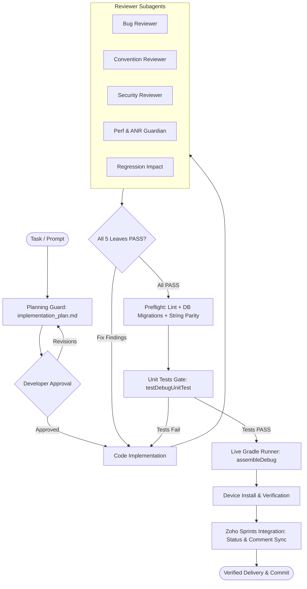

<div align="center">

# Android Agent Harness

**Architecture governance, quality delivery gate, and safety harness for Android & Kotlin Multiplatform.**

[](https://github.com/rabee-elkholy/android-harness-kit/releases)
[](LICENSE)
[](https://android.com)
[](https://python.org)
[](https://github.com/rabee-elkholy/android-harness-kit)
[](docs/tool-support.md)

<p align="center">
  <a href="#overview">Overview</a> •
  <a href="#architecture-workflow">Workflow</a> •
  <a href="#key-capabilities">Key Capabilities</a> •
  <a href="#supported-ai-tools">Supported Tools</a> •
  <a href="#installation">Installation</a> •
  <a href="#contributing">Contributing</a> •
  <a href="CHANGELOG.md">Changelog</a>
</p>

---

</div>

## Overview

**Android Agent Harness** is a production delivery gate and architecture governance engine for Android and Kotlin Multiplatform (KMP) development. It installs rules, specialized reviewer subagents, and Python safety runners into your codebase.

Once installed, coding assistants cannot declare tasks complete with a casual "LGTM". Every code modification must pass a parallel **Five-Leaf Review Gate**, preflight sanity checks, real-time Gradle execution, and physical device verification before delivery.

---

## Architecture Workflow



---

## Key Capabilities

<table>
  <tr>
    <td width="50%">
      <h3>Five-Leaf Review Gate</h3>
      Mandatory parallel dispatch of 5 specialized reviewer subagents (<code>BUG_PASS</code>, <code>CONVENTION_PASS</code>, <code>SECURITY_PASS</code>, <code>PERF_PASS</code>, <code>REGRESSION_PASS</code>) before any APK assembly or task completion.
    </td>
    <td width="50%">
      <h3>Unit Tests Verification Gate</h3>
      Automated execution of <code>testDebugUnitTest</code> via the live task runner. Enforces unit test passing as a strict pre-condition for APK builds and delivery.
    </td>
  </tr>
  <tr>
    <td width="50%">
      <h3>Dual Project Engine</h3>
      Supports <b>established active codebases</b> (auto-discovering DI, ViewModels, and UI from disk) and <b>brand-new greenfield projects</b> (interactive architecture questionnaire).
    </td>
    <td width="50%">
      <h3>Zoho Sprints MCP Integration</h3>
      Native project management integration that updates sprint task status (<code>In progress</code> &rarr; <code>Ready To ReTest</code>) and posts structured comments without leaking tokens into the repo.
    </td>
  </tr>
  <tr>
    <td width="50%">
      <h3>Safety Hooks & Git Guard</h3>
      Blocks unauthorized <code>git commit</code>, worktree mutations, <code>adb monkey</code>, and destructive package clears. Keeps version control firmly in the developer's hands.
    </td>
    <td width="50%">
      <h3>Live Gradle Task Streaming</h3>
      <code>run_gradle_task.py</code> streams real-time build logs with a 10-second heartbeat, preventing silent hangs and unmonitored builds.
    </td>
  </tr>
  <tr>
    <td width="50%">
      <h3>In-Harness Update Checker</h3>
      Lightweight, non-blocking version checker that notifies you when a newer kit release is available, with support for 24h snoozing (<code>--snooze 1</code>) and in-chat release notes (<code>--show-changes</code>).
    </td>
    <td width="50%">
      <h3>14+ AI Assistant Adapters</h3>
      Generates tailored configuration files for <b>Google Antigravity</b>, <b>Cursor</b>, <b>Claude Code</b>, <b>GitHub Copilot</b>, <b>Codex</b>, <b>Windsurf</b>, and more.
    </td>
  </tr>
</table>

---

## Supported AI Tools

The installer generates native adapter files for your chosen toolchain:

| AI Assistant / IDE | Generated Adapter | Integration Level |
| :--- | :--- | :--- |
| **Google Antigravity** | `agents/rules/`, `agents/hooks.json` | Hook blocking, subagent definitions, ephemeral reminders |
| **Cursor** | `.cursorrules` | Architectural rules, review protocol, terminal execution gates |
| **Claude Code** | `CLAUDE.md` | Slash command protocols, terminal safety guards |
| **GitHub Copilot** | `.github/copilot-instructions.md` | Workspace instructions, domain conventions |
| **OpenAI Codex CLI** | `AGENTS.md` | Universal agent instructions, execution policies |
| **Windsurf** | `.windsurfrules` | Cascade AI rules and architectural constraints |
| **Cline & Roo Code** | `.clinerules`, `.roomodes` | System prompts, mode definitions, tool permissions |
| **Amazon Q / Continue / Junie / Kilo / Goose** | Tool-specific rule files | Full rule compliance across 14+ supported environments |

---

## Project Modes

> [!NOTE]
> **Established Codebases**: The installer inspects `libs.versions.toml`, Gradle build files, ViewModels, and Compose UI to port your existing stack (MVI/MVVM, Koin/Hilt, Voyager/Compose Navigation, Room, etc.).
> 
> **Brand-New / Blank Projects**: The installer launches an interactive questionnaire to define your target platform (Native vs KMP), architecture, DI, navigation, UI toolkit, database, networking, and localization from day one.

---

## Installation

Installation is an automated structural port that tailors the 5-reviewer governance engine to your app's exact package and architecture.

### Step 1: Open Chat in Target Android Root
Open your IDE or terminal assistant in your **Android project root directory** (do not run setup inside `android-harness-kit`).

### Step 2: Select a Reasoning Model
Use a strong reasoning model for the setup chat (fast/lightweight models without deep reasoning tend to skip structural porting steps):
- **Anthropic**: `Claude Opus 4.6 / 5 (Thinking)` / `Claude Sonnet 4.6 / 5 (Thinking)`
- **Google**: `Gemini 3.1 Pro (Deep Think)` / `Gemini 3.7 Flash`
- **OpenAI**: `GPT-5.6 Sol` / `OpenAI o3` / `gpt-oss-120b`
- **DeepSeek**: `DeepSeek-V4 (Thinking)` / `DeepSeek-R1`

### Step 3: Paste the Install Prompt
Open [`docs/install-prompt.md`](docs/install-prompt.md), copy its entire contents, and paste it as your first message in the chat.

The AI assistant will automatically:
1. Verify that your project is a valid Android or Kotlin Multiplatform (KMP) repository.
2. Clone or locate the harness kit.
3. Guide you through the interactive setup questionnaire.
4. Structurally port the architecture rules, domain skills, and the 5 reviewer subagents to your app.
5. Generate native configuration adapters for your selected AI tools and run self-tests until `Total test failures: 0`.

### Step 4: Answer the Setup Wizard Questions
During installation, the wizard will ask you to confirm:
1. **Backup**: Create a timestamped backup before modifying `.agents/` *(Recommended)*.
2. **App Name**: Application identifier and display name.
3. **Git Policy**: Manual commits in IDE *(Recommended)* vs agent commits on request.
4. **Testing Target**: Physical device only vs physical + emulator.
5. **Install Confirmation**: Require confirmation before `adb install`.
6. **Unit Tests**: Retain or bypass unit-test verification gates.
7. **AI Tools**: Select which tools you use to generate matching adapter files.
8. **Zoho Sprints**: Optional project management integration.
9. *(If Greenfield Project)*: Complete the 8-question architecture foundation questionnaire.

---

## Repository Structure

```
android-harness-kit/
├── README.md                ← Project documentation
├── CHANGELOG.md             ← Version release history
├── LICENSE                  ← MIT License
├── docs/
│   ├── install-prompt.md    ← Setup instructions for new installs
│   ├── update-prompt.md     ← Upgrade instructions for existing installs
│   ├── setup-prompt.md      ← Installer agent execution protocol
│   ├── rollback-prompt.md   ← Uninstallation and restore instructions
│   └── tool-support.md      ← Supported tool specifications
├── agents/                  ← Deployed to <your-app>/.agents
│   ├── rules/               ← Core harness rules & five-leaf review guidelines
│   ├── scripts/             ← Python runners (setup_wizard, run_gradle_task, preflight, etc.)
│   ├── skills/              ← Android skills (Compose theme, MVI, ANR, Room, etc.)
│   ├── subagents/           ← Specialized reviewer subagent definitions
│   └── tool-adapters/       ← Template adapters for Cursor, Claude, Antigravity, etc.
└── templates/               ← Optional runtime and tool templates
```

## Contributing

Contributions from the Android and Kotlin Multiplatform development community are welcome!

Whether you want to:
- Add support or adapters for new AI coding tools and IDEs
- Improve prompt heuristics and domain guidelines for the reviewer subagents
- Enhance test coverage, safety guards, or Python automation runners
- Report edge-case bugs or suggest architectural improvements

### Getting Started:
1. **Fork the Repository** and create your branch from `main`:
   ```bash
   git checkout -b feature/your-improvement
   ```
2. **Make Your Changes** and verify all safety checks and selftests pass:
   ```bash
   python agents/scripts/_hook_selftest.py
   python agents/scripts/preflight_check.py
   ```
3. **Commit Your Changes** with clear, conventional commit messages (`feat: ...`, `fix: ...`, `docs: ...`).
4. **Open a Pull Request** explaining the motivation and detailed summary of changes.

For major architectural proposals, please open an **Issue** or start a **Discussion** first to align on design.

---

## License

Distributed under the **MIT License**. See [`LICENSE`](LICENSE) for details.

---

<div align="center">

[Back to Top](#android-agent-harness)

</div>
