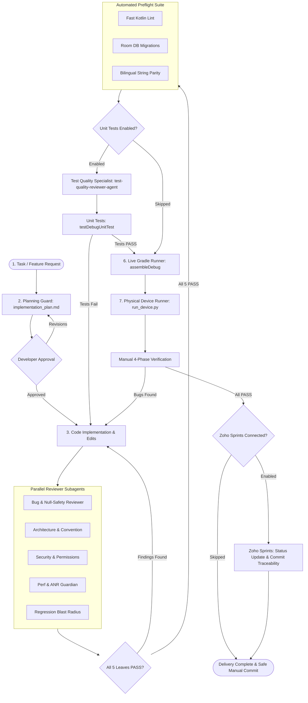
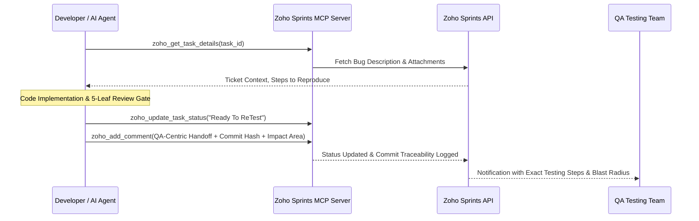

<div align="center">

# Android Agent Harness

**Architecture governance, five-leaf parallel review gate, and execution safety harness for Android & Kotlin Multiplatform.**

[](https://github.com/rabee-elkholy/android-harness-kit/actions/workflows/ci.yml)
[](https://github.com/rabee-elkholy/android-harness-kit/releases)
[](LICENSE)
[](https://android.com)
[](https://python.org)
[](docs/architecture.md)
[](docs/tool-support.md)
[](CONTRIBUTING.md)

<br/>

<p align="center">
  <strong>Transform AI coding assistants into disciplined, architecture-compliant engineering teammates.</strong>
</p>

</div>

---

## Table of Contents

- [Overview](#overview)
- [The Problem We Solve](#the-problem-we-solve)
- [Quickstart & CLI](#quickstart--cli)
- [One-Click Lifecycle Prompts](#one-click-lifecycle-prompts)
- [Architecture Workflow](#architecture-workflow)
- [Shift-Left Proactive Quality Invariants](#shift-left-proactive-quality-invariants)
- [The Five-Leaf Review Gate](#the-five-leaf-review-gate)
  - [1. Bug & Network Resiliency Reviewer](#1-bug--network-resiliency-reviewer-bug-reviewer-agent)
  - [2. Convention, Accessibility & KMP Reviewer](#2-convention-accessibility--kmp-reviewer-convention-reviewer-agent)
  - [3. Security & Privacy Reviewer](#3-security--privacy-reviewer-security-reviewer-agent)
  - [4. Performance, Battery & ANR Guardian](#4-performance-battery--anr-guardian-perf-anr-guardian-agent)
  - [5. Regression Blast Radius Reviewer](#5-regression-blast-radius-reviewer-regression-impact-reviewer-agent)
- [Dedicated On-Demand Specialists](#dedicated-on-demand-specialists)
- [Safety Hooks & Execution Governance](#safety-hooks--execution-governance)
  - [Strict Git Mutation Protection](#strict-git-mutation-protection)
  - [Deterministic Staged Pre-Commit Quality Gate](#deterministic-staged-pre-commit-quality-gate)
  - [Claude Code PreToolUse Safety Bridge](#claude-code-pretooluse-safety-bridge)
  - [GitHub Copilot preToolUse Safety Bridge](#github-copilot-pretooluse-safety-bridge)
  - [Anti-Polling Guardrails](#anti-polling-guardrails)
  - [Ephemeral State Machine](#ephemeral-state-machine)
- [Preflight Verification Pipeline](#preflight-verification-pipeline)
  - [Fast Kotlin Lint](#fast-kotlin-lint-fast_kt_lintpy)
  - [Room Database Migration Guard](#room-database-migration-guard-room_guardpy)
  - [Bilingual String Parity Check](#bilingual-string-parity-check-check_stringspy)
- [12-Dimension System Doctor & Diagnostics](#12-dimension-system-doctor--diagnostics)
- [Live Gradle Streaming Runner](#live-gradle-streaming-runner)
- [Physical Device Runner & Logcat Doctor](#physical-device-runner--logcat-doctor)
- [Project Tracker Integrations](#project-tracker-integrations-zoho-sprints-github-jira-linear)
- [Supported AI Tools, Slash Commands & Adapters](#supported-ai-tools-slash-commands--adapters)
- [Installation & Setup Modes](#installation--setup-modes)
  - [Mode A: Existing Android / KMP App](#mode-a-existing-android--kmp-app)
  - [Mode B: Greenfield / Blank Project](#mode-b-greenfield--blank-project)
  - [Upgrades, Diagnostics & Rollbacks](#upgrades-diagnostics--rollbacks)
- [Setup Wizard & Configuration Reference](#setup-wizard--configuration-reference)
- [Self-Tests & CI/CD Pipeline](#self-tests--cicd-pipeline)
- [Contributing & Community](#contributing--community)
- [License](#license)

---

## Overview

**Android Agent Harness** is an enterprise-grade delivery gate, safety framework, and architecture governance engine for **Android** and **Kotlin Multiplatform (KMP)** development.

When AI coding assistants like **Cursor**, **Google Antigravity**, **Claude Code**, or **GitHub Copilot** work on production Android codebases, they operate without awareness of architectural guardrails, lifecycle boundaries, or physical device constraints. 

**Android Agent Harness** solves this by installing an active **Five-Leaf Review Gate**, deterministic safety hooks, live Gradle execution monitors, Room database validation, bilingual string parity, and physical device test runners directly into your repository.

---

## The Problem We Solve

| Without Android Harness | With Android Agent Harness |
| :--- | :--- |
| **Casual "LGTM"**: AI writes code and declares completion without compiling or verifying. | **Mandatory Review Gate**: AI is locked out of assembly until 5 specialized subagents sign off with matching evidence footers (`BUG_PASS`, `CONVENTION_PASS`, `SECURITY_PASS`, `PERF_PASS`, `REGRESSION_PASS`). |
| **Silent Regressions**: Modifying one ViewModel or UI component breaks dependent flows. | **Regression Blast Radius**: Maps every caller, navigation route, and data model to verify impact. |
| **Missing Translations & Broken RTL**: Adding a string in English without adding Arabic or vice versa. | **Bilingual String Parity**: Automated validation enforcing 1-to-1 string parity and Jetpack Compose `@Preview` tags. |
| **UI Freezes & ANRs**: Heavy operations placed on Dispatchers.Main or unnecessary recompositions. | **ANR Guardian**: Static heuristics flag main-thread disk/network I/O, heavy canvas draws, and recomposition loops. |
| **Database Crashes**: Altering `@Entity` schemas without writing Room migrations causes runtime crashes. | **Room Guard**: Validates database schema versions, migration objects, and test coverage before building. |
| **Accidental Git Mutations**: AI commits incomplete code, overwrites branches, or pushes dirty state. | **Git Mutation Guard**: Hard interception blocks all autonomous `git commit` and `git push` commands. |

---

## Quickstart & CLI

You can install and activate Android Agent Harness via the **Standalone CLI** or directly inside your **AI Assistant Chat**:

### Option 1: Standalone CLI Executable (`android-harness`)

Install globally via `pipx` directly from this repository (PyPI publication pending):

```bash
pipx install git+https://github.com/rabee-elkholy/android-harness-kit.git
```

No install needed? Run it in place from any kit clone:

```bash
python harness_cli.py --help
```

Then run the setup wizard and diagnostics directly from your terminal:

```bash
# Initialize harness in current Android repository
android-harness init

# Audit 12-dimension health at any time
android-harness doctor --device

# Run rapid preflight checks (strings + Room + fast lint)
android-harness preflight

# Update kit engine to the latest tagged release
android-harness update

# Explain recent safety-hook decisions
android-harness explain --last 20
```

### Option 2: One-Prompt Installer in AI Assistant Chat

1. Open your AI assistant (Antigravity, Cursor, Claude Code, Copilot, Windsurf) in your **Android project root directory**.
2. Select a deep reasoning model (e.g. `Claude Opus 5 / 3.7 Sonnet (Thinking)`, `Gemini 3.1 Pro (Deep Think)`, `GPT-5.6 Sol`, or `DeepSeek-R1`).
3. Copy and paste the one-prompt installer:

```markdown
Read and execute the Android Harness Kit installer:
https://raw.githubusercontent.com/rabee-elkholy/android-harness-kit/v0.10.8/docs/install-prompt.md
```

4. Follow the interactive questionnaire to configure your app. Once verified with `Total test failures: 0`, the harness checks have passed and the configured protections are installed.

For detailed step-by-step guidance, see the [Quickstart Guide](docs/quickstart.md).

---

## One-Click Lifecycle Prompts

Beyond initial installation, Android Harness Kit provides 3 dedicated on-demand prompts for upgrades, system health auditing, and instant emergency restoration. Simply paste the relevant prompt into a **new chat session** on your Android project whenever needed:

### 1. Update Prompt (Upgrade to Latest Release)
- **What it does**: Resolves the newest release tag and updates your `.agents/` scripts, safety hooks, and subagent prompts while preserving your custom product configuration and domain skill guides. It never floats to `main`.
- **Why it matters**: Gives you the latest compiler lint rules, security hardening, new reviewer capabilities, and IDE adapters without requiring manual file editing.
- **When to use**: Whenever a new harness release is published, or when notified by the automated update reminder.
- **How to use**: Copy and paste this prompt into a new chat:
```markdown
Read and execute the Android Harness Kit updater:
https://raw.githubusercontent.com/rabee-elkholy/android-harness-kit/v0.10.8/docs/update-prompt.md
```

### 2. Diagnostic Doctor Prompt (12-Dimension Health Check)
- **What it does**: Runs an automated 12-dimension health inspection (`harness_doctor.py`) auditing host runtime, subagent fingerprints, product configuration, template integrity, safety hooks, preflight pipeline, and ADB device connectivity.
- **Why it matters**: Confirms that the configured harness checks pass, reports missing or corrupted scripts, and verifies the reviewer gates and safety hooks. Application and device health still require project-specific verification.
- **When to use**: After installing, after updating, when switching AI assistants/IDEs, or whenever you want to confirm system readiness and fix warnings.
- **How to use**: Copy and paste this prompt into a new chat:
```markdown
Read and execute the Android Harness Kit diagnostic doctor:
https://raw.githubusercontent.com/rabee-elkholy/android-harness-kit/v0.10.8/docs/diagnostic-prompt.md
```

### 3. Rollback Prompt (Instant Backup Restoration)
- **What it does**: Reverts your `.agents/` configuration and IDE adapters back to your immediate previous backup stored in `.harness-backup/`.
- **Why it matters**: Zero-risk guarantee. If an update or configuration change does not suit your project, you can revert back to your exact previous state in seconds.
- **When to use**: If an update causes an unexpected issue or you want to undo recent harness configuration changes.
- **How to use**: Copy and paste this prompt into a new chat:
```markdown
Read and execute the Android Harness Kit rollback:
https://raw.githubusercontent.com/rabee-elkholy/android-harness-kit/v0.10.8/docs/rollback-prompt.md
```

---

## Architecture Workflow

The harness enforces a deterministic, 7-stage quality delivery lifecycle:



---

## Shift-Left Proactive Quality Invariants

The harness enforces proactive engineering standards before any code is generated, ensuring the Primary Lead Agent achieves first-pass review approval:
- **Null-Safety & Network Resiliency**: Catch `IOException`/`SocketTimeoutException`, avoid `!!`, use `repeatOnLifecycle`.
- **Clean Architecture & Imports**: Strict MVI StateFlow single source of truth, zero inline FQCNs, explicit top-level imports.
- **Accessibility & Compose**: Mandatory `contentDescription` on non-decorative images/icons, touch targets >= 48dp, dual-locale `@Preview` (en/ar).
- **Performance & Battery**: Zero I/O on `Dispatchers.Main`, sensor unregistration in `onPause()`/`DisposableEffect.onDispose`, Android 14 foreground service rules.
- **Room Database Migrations**: Mandatory version bump and explicit `Migration(from, to)` on any `@Entity` schema modification.

---

## The Five-Leaf Review Gate

Before any Gradle build or device installation can proceed, the AI assistant must dispatch **5 specialized reviewer subagents** in parallel. Every subagent inspects the exact package diff and outputs a structured pass token:

```
[BUG_PASS]         -- Verified by Bug & Network Resiliency Reviewer
[CONVENTION_PASS]  -- Verified by Architecture, Accessibility & KMP Reviewer
[SECURITY_PASS]    -- Verified by Security & Privacy Reviewer
[PERF_PASS]        -- Verified by Performance, Battery & ANR Guardian
[REGRESSION_PASS]  -- Verified by Regression Blast Radius Reviewer
```

### 1. Bug & Network Resiliency Reviewer (`bug-reviewer-agent`)
- **Focus**: Logical correctness, null safety, lifecycle, and network error recovery.
- **Catches**: Unhandled `NullPointerException` risks, uncaught coroutine cancellations, improper `StateFlow` collection without `repeatOnLifecycle`, uncaught `SocketTimeoutException`/`IOException` in API flows, missing error UI states, and infinite retry storms without exponential backoff.

### 2. Convention, Accessibility & KMP Reviewer (`convention-reviewer-agent`)
- **Focus**: Structural cleanliness, MVI/Clean Architecture, accessibility compliance, and KMP code purity.
- **Catches**: Mutable state exposed outside ViewModels, missing `contentDescription` on Compose icons/images, clickable components with touch targets < 48dp, `android.*` framework imports leaking into KMP `commonMain`, and missing dual-locale `@Preview` annotations (en/ar).

### 3. Security & Privacy Reviewer (`security-reviewer-agent`)
- **Focus**: Android component security, permission boundaries, and data storage.
- **Catches**: Exported Activities/Receivers without explicit intent filters or permissions, plaintext credentials/API keys, SQL injection in raw Room queries, and sensitive data printed to production Logcat.

### 4. Performance, Battery & ANR Guardian (`perf-anr-guardian-agent`)
- **Focus**: UI fluidity (60/120 FPS), main thread responsiveness, sensor lifecycles, and battery footprint.
- **Catches**: Disk or network I/O executed on `Dispatchers.Main`, heavy allocations during Jetpack Compose recomposition phases, unreleased WakeLocks, active `SensorEventListener` (pedometer/accelerometer) leaks during background/pause, and Android 14+ foreground service type violations.

### 5. Regression Blast Radius Reviewer (`regression-impact-reviewer-agent`)
- **Focus**: Cross-feature dependency graphs and change impact radius.
- **Catches**: Renamed ViewModel functions breaking secondary screens, altered data models breaking JSON serialization, modified navigation arguments breaking deep links, and shared database migrations.

---

## Dedicated On-Demand Specialists

For specific investigations, UI design, and test suite auditing, the harness provides dedicated on-demand specialists:

### 1. QA & Crash Diagnostics Specialist (`qa-diagnostics-agent`)
- **Focus**: Physical device Logcat forensic analysis, ANR root-cause triage, and native tombstone inspection.
- **Workflow**: `/crash-triage` playbook to capture live traces without emulator artifacts.

### 2. Android UI & Design Specialist (`android-ui-expert-agent`)
- **Focus**: Jetpack Compose and XML layout fidelity, Material Design 3 theming, RTL localization, and edge-to-edge support.
- **Rules**: Enforces dual-locale `@Preview` on all Compose screens, cards, and dialogs.

### 3. Test Quality Specialist (`test-quality-reviewer-agent`)
- **Focus**: Unit and UI test suite integrity (`*Test.kt`), assertion depth, and Coroutine concurrency safety.
- **Catches**: Vacuous assertions (e.g. `assertNotNull` without state verification), hardcoded `Dispatchers.IO`/`Dispatchers.Main` instead of `TestDispatcher`, untested MVI error state transitions, and fragile mock chains.
- **Reference**: [Test Quality Guidelines](agents/skills/android-harness/references/test-quality-guidelines.md) and `/test-quality-audit` workflow.

---

## Safety Hooks & Execution Governance

The harness incorporates a Python-driven safety interception layer (`pre_tool_safety.py` and `hooks.json`) that monitors all AI tool invocations in real time.

### Strict Git Mutation Protection
AI models frequently attempt to cover mistakes by making unauthorized commits or force-pushing branches. The harness intercepts:
- `git commit` / `git push` / `git reset --hard`
- PowerShell and bash subshell bypasses (`sh -c "git commit"`, `cmd.exe /c git commit`)
- Executable paths (`git.exe commit`)

Developers retain sole authority over repository history.

### Deterministic Staged Pre-Commit Quality Gate
A standalone, stdlib-only Git hook (`.githooks/pre-commit`, installed by default; `--no-git-gate` opts out) running against staged files in <5 seconds:
- Bilingual string parity and hardcoded UI string detection.
- Fast Kotlin syntax and import lint.
- Room database working-tree schema and migration invariant checks.
- Blocks commits containing regressions without interfering with the developer's commit authority.

### Claude Code PreToolUse Safety Bridge
Cross-tool runtime safety bridge (`agents/scripts/cc_pre_tool_safety.py`, installed via `--cc-hooks`):
- Bridges Claude Code's native `PreToolUse` hook protocol in `.claude/settings.json` to the harness safety engine.
- Denies forbidden Git mutations (`git push`, `git commit`) and unauthorized ADB actions with deterministic `permissionDecision: "deny"`.

### GitHub Copilot preToolUse Safety Bridge
Cross-tool runtime safety bridge (`agents/scripts/copilot_pre_tool_safety.py`, installed with `--copilot-hooks`):
- Registers the documented Copilot repository hook at `.github/hooks/android-harness-pre-tool-use.json`.
- Accepts Copilot's camelCase and VS Code-compatible snake_case `preToolUse` payloads.
- Reuses the same engine as Antigravity and Claude Code, returning deterministic `permissionDecision: "allow"` or `"deny"` for shell tools.

### Anti-Polling Guardrails
To prevent models from getting stuck in infinite polling loops (>2 calls to `manage_task` or `manage_subagents`), the hook enforces event-driven reactive wakeups and denies redundant poll requests.

### Ephemeral State Machine
`_hook_state.py` tracks the review lifecycle per conversation:
- Packages are hashed to ensure reviewers inspect the exact active changes.
- Automatically unlocks re-dispatching if missing subagent templates are defined (`re_dispatch_allowed`).
- Clears review tokens when new code modifications are detected.

---

## Preflight Verification Pipeline

Before compiling the application with Gradle, `preflight_check.py` runs three rapid static verification checks in under 2 seconds:

### Fast Kotlin Lint (`fast_kt_lint.py`)
- Verifies package declarations, import hygiene, and Kotlin syntax.
- Enforces Jetpack Compose `@Preview` tags for both LTR (English) and RTL (Arabic) locales.
- Whitelists standard Android SDK symbols (`Build.VERSION.SDK_INT`, `UUID`, `@androidx.annotation.*`, `@file:OptIn`).
- Ignores `abstract class` definitions to prevent false `@AndroidEntryPoint` annotations that crash the Hilt compiler.
- Dynamically scans lookback annotations for Compose `@Immutable` and `@Stable` state data classes.

### Room Database Migration Guard (`room_guard.py`)
- Scans `@Database` and `@Entity` declarations for schema modifications.
- Recursively discovers nested `@Embedded` entity data classes to prevent undetected SQLite schema mismatches.
- Fully supports modern Room 2.4+ `AutoMigration(from = X, to = Y)` annotations.
- Implements BFS graph traversal to validate transitive multi-step migration paths (e.g. 1 -> 2 -> 3).

### Bilingual String Parity Check (`check_strings.py`)
- Analyzes `res/values/strings.xml` and `res/values-ar/strings.xml` for complete 1-to-1 key parity.
- Matches multiline Jetpack Compose `Text(...)` parameters and arbitrary argument positions.
- Strips `stringResource(...)` calls before regex matching to prevent string concatenation bypasses.
- Supports Kotlin Multiplatform `composeResources` fallback paths.

---

## 12-Dimension System Doctor & Diagnostics

To verify that an installation or update was 100% successful, `harness_doctor.py` and `docs/diagnostic-prompt.md` execute an exhaustive audit across 12 operational dimensions:

1. **Environment & Host**: Python >= 3.10, OS platform, Gradle wrapper, Android SDK path, `.gitignore` security audit, and Git working tree status / commit advisory.
2. **File Topology & Version**: `.agents/VERSION`, `harness-rules.md`, 34 core scripts, and `hooks.json`.
3. **Subagent Roster**: All 8 subagents verified with active security fingerprints.
4. **Product Configuration**: `_product.py`, package prefix, application ID, source root, assemble task, and install-answers consistency (`answers.json` vs device policy, assemble task, flavor, git gate, and selected tool adapters).
5. **Template Leakage**: Zero un-replaced template placeholders (`{{...}}`) in `.agents/`.
6. **Skills & Workflows**: 10 workflow playbooks, foundation references integrity, automated project domain coverage discovery, and 100% reference indexing in `daily-scenarios.md`.
7. **Multi-IDE Tool Adapters**: `AGENTS.md` at root and active tool adapters (Cursor, Claude Code, GitHub Copilot).
8. **Safety Hooks & State Locking**: Cross-platform atomic `state_lock()` and hook selftest execution.
9. **Process Streaming**: Line-buffered standard I/O and process tree lifecycle termination.
10. **Preflight Pipeline**: String parity & hardcoded UI text, Room migration graph, and Fast Kotlin lint.
11. **Project Tracker & PM Security**: Active `PM_PROVIDER` report, zero provider credentials in repo (`<provider>.json` globs), valid MCP config, and server stdio handshake.
12. **Connected Devices**: ADB device connectivity, hardware model, and Android API level.

```bash
# Run full automated diagnostic (automatically executed post-setup and post-update)
python .agents/scripts/harness_doctor.py

# Run with hardware ADB check and JSON output
python .agents/scripts/harness_doctor.py --device --json
```

---

## Live Gradle Streaming Runner

Executing Gradle builds directly through AI tool interfaces often causes timeouts, silent freezes, or lost output.

`run_gradle_task.py` provides:
- **10-Second Live Heartbeat**: Continuously streams stdout/stderr to prevent assistant timeout.
- **Review Staleness Advisory**: Deterministic warning when Kotlin/XML code changed after the last `review_package.py` generation (works in every tool, not just Antigravity).
- **Intelligent Error Parser (`gradle_error_parser.py`)**: Filters thousands of lines of Gradle output to extract the exact compiler error, file path, and line number.
- **Build Isolation**: Executes safely with project-specific daemon configurations.

```bash
python .agents/scripts/run_gradle_task.py :app:assembleDebug
```

---

## Physical Device Runner & Logcat Doctor

The harness prioritizes **real-world physical hardware testing** over emulators:

```bash
python .agents/scripts/run_device.py install-start --package com.example.app --activity .MainActivity
```

- **Auto-Discovery**: Automatically identifies connected physical Android devices over ADB USB / Wi-Fi.
- **Logcat Doctor (`logcat_doctor.py`)**: Captures real-time stack traces, uncaught exceptions, and ANR traces specifically filtered to your application ID.
- **Screen Capture (`capture_screen.py`)**: Automatically captures UI screenshots for visual sign-off.

---

## Project Tracker Integrations (Zoho Sprints, GitHub, Jira, Linear)

The harness ships a provider-agnostic PM layer: one deterministic policy
engine (`pm_policy.py`), one concrete adapter (`pm_github.py` for the `gh`
CLI), and configuration-only registration playbooks for upstream Jira/Linear
MCP servers (`agents/pm/mcp_registration.*.md`). The playbook lives in
`docs/workflows/pm-integrations.md`. Zoho Sprints remains the flagship,
built-in integration:



- **Bi-Directional Sync**: Reads tasks, subtasks, bug reports, and attachments directly.
- **QA-First Handoff Standards**: Eliminates internal code dumps and XML/Kotlin jargon in favor of functional explanations, mandatory `Commit: <hash>` traceability, explicit **Impact Area (Blast Radius)**, and structured test cases.
- **Dual-Language Mapping**: Dynamic translation matrix supporting English titles with Arabic descriptions/comments (`en_titles_ar_comments`), full English (`all_en`), or full Arabic (`all_ar`) per `_product.py`.

### Multi-Provider Policy Matrix

| Tracker | Transport | Trigger phrase | Ready To ReTest maps to | Denied statuses |
| :--- | :--- | :--- | :--- | :--- |
| **Zoho Sprints** *(default)* | Built-in MCP server | `update zoho` | `Ready To ReTest` | `Done`, `Solved` |
| **GitHub Projects** | `gh` CLI adapter | `update github` | `In Review` | `Done`, `Shipped` |
| **Jira** | Official upstream MCP server | `update jira` | `Ready for Testing` | `Done`, `Resolved`, `Closed` |
| **Linear** | Official upstream MCP server | `update linear` | `In Review` | `Done`, `Canceled` |
| **None** | Local-only delivery | (no mutations) | n/a | n/a |

All providers share the identical handoff contract (bilingual mandatory
sections, commit-hash first line, QA-centric tone) and the identical
credential isolation pattern: secrets stay in user-level files under
`~/.android-harness/`, never in the repository. Selecting a tracker happens
in setup wizard question **I.20** (`PM_PROVIDER` in `_product.py`; absent
field keeps the Zoho default). The pre-commit quality gate is configured by
**I.21** and is on by default unless `--no-git-gate` is selected.

---

## Supported AI Tools, Slash Commands & Adapters

The harness supports **14+ AI coding assistants and IDEs**, automatically generating native configuration adapters and tool-native command shortcuts:

| Assistant / IDE | Generated Adapter | Integration Features | Native Commands |
| :--- | :--- | :--- | :--- |
| **Google Antigravity** | `agents/rules/`, `agents/hooks.json` | Subagent dispatch, hook blockers, ephemeral reminders | Workflow playbooks (`.agents/workflows/`) |
| **Cursor** | `.cursor/rules/android-harness.mdc` | Architecture constraints, review protocol, terminal execution gates | Rule-driven workflows |
| **Claude Code** | `CLAUDE.md`, `.claude/settings.json` | PreToolUse safety bridge, subagent prompts | Native Slash Commands (`.claude/commands/*.md`) |
| **GitHub Copilot** | `.github/copilot-instructions.md`, optional `.github/hooks/*.json` | Workspace instructions, domain conventions, native preToolUse safety bridge | Prompt Files (`.github/prompts/*.prompt.md`) |
| **OpenAI Codex CLI** | `AGENTS.md` | Universal agent instructions, execution limits | Prompt Commands (`.codex/prompts/*.md`) |
| **Windsurf** | `.windsurfrules` | Cascade AI rules and architectural constraints | Cascade workflows |
| **Cline & Roo Code** | `.clinerules`, `.roo/rules/android-harness.md` | System prompts, mode definitions, tool permissions | Mode instructions |
| **Amazon Q / Continue / Junie / Kilo / Goose** | Native Adapter Files | Full rule compliance across all supported environments | Rule integration |

### 11 Standardized Slash Command Packs

When installed with Claude Code, GitHub Copilot, or Codex, the harness automatically generates 11 command shortcuts:

| Command / Prompt | Purpose |
| :--- | :--- |
| `/deliver [request]` | Full 7-stage delivery lifecycle: plan artifact, implement, 5-leaf review gate, preflight, assemble, device testing. |
| `/debug [symptoms]` | Hypothesis-driven debugging with root cause isolation, 5-leaf review, and physical device validation. |
| `/new-feature [spec]` | Implement new feature with interactive planning artifact and five-leaf delivery gate. |
| `/preflight` | Rapid preflight sanity suite: string parity, Room migrations, and fast Kotlin lint. |
| `/check-strings` | Bilingual English/Arabic string parity and hardcoded UI string audit. |
| `/perf-audit` | Static heuristics and ANR audit for main-thread I/O and Compose recompositions. |
| `/test-quality-audit`| Audit unit/UI test files (`*Test.kt`) for assertion depth, TestDispatcher, and mocking integrity. |
| `/crash-triage [issue]`| Pull live physical device Logcat fatal exceptions and dispatch to `qa-diagnostics-agent`. |
| `/commit-msg` | Draft Conventional Commit message with Blast Radius for manual developer commit in Android Studio. |
| `/zoho-sprints [item]` | Zoho Sprints task synchronization, subtask creation, and QA handoff comments. |
| `/doctor` | Run automated 12-dimension health inspection (`harness_doctor.py --device`). |

---

## Installation & Setup Modes

### Mode A: Existing Android / KMP App
Run the installer in an established codebase. The setup wizard inspects your `libs.versions.toml`, Gradle dependencies, and existing architecture (MVI/MVVM, Compose, Room, Koin/Hilt) and generates custom domain reference skills tailored to your app.

### Mode B: Greenfield / Blank Project
For brand-new or blank projects, the wizard guides you through an **8-question Architecture Foundation Questionnaire**:
1. **Target Platform**: Android Native vs Kotlin Multiplatform (KMP).
2. **Architecture**: MVI (Unidirectional) vs MVVM.
3. **Dependency Injection**: Koin vs Hilt vs Manual.
4. **Navigation**: Voyager vs AndroidX Navigation Compose.
5. **UI Framework**: Jetpack Compose vs XML Views.
6. **Local Database**: Room vs SQLDelight vs Realm.
7. **Networking**: Ktor Client vs Retrofit + OkHttp.
8. **Localization**: Bilingual Arabic (RTL) + English (LTR) vs Single Locale.

### Upgrades, Diagnostics & Rollbacks

Choose the prompt for your current repository lifecycle needs:

| Operation | When to Use | One-Click Copy-Paste AI Prompt URL |
| :--- | :--- | :--- |
| **Upgrade** | Upgrade installed harness to latest release while preserving custom domain rules | `https://raw.githubusercontent.com/rabee-elkholy/android-harness-kit/v0.10.8/docs/update-prompt.md` |
| **System Doctor** | Comprehensive 12-dimension health and safety audit at any time | `https://raw.githubusercontent.com/rabee-elkholy/android-harness-kit/v0.10.8/docs/diagnostic-prompt.md` |
| **Rollback** | Restore previous backup state cleanly if needed | `https://raw.githubusercontent.com/rabee-elkholy/android-harness-kit/v0.10.8/docs/rollback-prompt.md` |

---

## Setup Wizard & Configuration Reference

The setup wizard records its answers in `.harness-setup/answers.json` and writes the applicable product values into `_product.py`:

| Parameter | Name | Default | Options / Description |
| :--- | :--- | :--- | :--- |
| `I.0` | **Continue / Backup** | `Backup` | Continue the install and create the rollback backup. |
| `I.1` | **Product Name** | *Auto-detected* | Clean product display name. |
| `I.2` | **Python Executable** | *Auto-detected* | Asked only when Python is missing or ambiguous. |
| `I.3` | **Git Commit Policy** | `Manual in IDE` | Developer commits manually *(Recommended)* or agent commits only on explicit request. |
| `I.4` | **Device Target Policy** | `Physical + Emulator` | Both allowed *(Recommended)* or physical phone only. |
| `I.5` | **Application Module** | *Auto-detected* | Asked only when the module is missing or ambiguous. |
| `I.6` | **Launcher / APK** | *Auto-detected* | Asked only when the launcher or APK is missing or ambiguous. |
| `I.10` | **Install Confirmation** | `Ask first` | Require confirmation before device installation. |
| `I.14` | **AI Tool Adapters** | *Multi-select* | Select only the IDEs and agents used for this project. |
| `I.15` | **Unit Tests Gate** | `Yes` | Run the targeted unit-test task before assemble. |
| `I.16` | **Zoho Sprints MCP** | *Optional* | Configure the built-in integration without copying tokens. |
| `I.17` | **Chat Language** | `Strict English` | Language for engineering chat, plans, reviews, and commits. |
| `I.18` | **Zoho Language** | `English titles + Arabic notes` | Language policy for Zoho task content. |
| `I.19` | **Daily Flavor** | *Conditional* | Asked only when Gradle product flavors are discovered. |
| `I.20` | **Project Tracker** | `Zoho Sprints` | Zoho, GitHub Projects, Jira, Linear, or none. Writes `PM_PROVIDER`. |
| `I.21` | **Pre-Commit Git Gate** | `Yes` | Install the staged quality gate; use `--no-git-gate` only when managing your own hook. |
| `b_*` | **Greenfield Architecture** | *Conditional* | Platform, architecture, DI, navigation, UI, database, networking, and locale questions for blank projects. |

---

## Self-Tests & CI/CD Pipeline

The harness includes a comprehensive self-test suite (`_hook_selftest.py`) validating:
- Hook blocking rules (`git commit`, `adb monkey`, `pm clear`).
- 5-Leaf Review Gate verification tokens and hash lockout recovery.
- Python syntax, fast linting, and Room migration parsers.
- Zero credential leaks in MCP configurations.
- Adversarial security cases, Copilot/Claude bridge parity, strict evidence footers, and fixture profiles.

### Run Local Self-Tests:
```bash
python agents/scripts/_hook_selftest.py
python agents/scripts/preflight_check.py
```

### GitHub Actions CI Matrix:
Every push and pull request is automatically tested across:
- **Operating Systems**: `ubuntu-latest`, `windows-latest`
- **Python Versions**: `3.10`, `3.11`, `3.12`, `3.13`

---

## Contributing & Community

Contributions from the Android and Kotlin Multiplatform development community are welcome.

- **Report Bugs**: Use our [Bug Report Form](.github/ISSUE_TEMPLATE/bug_report.yml).
- **Suggest Features**: Propose new reviewer subagents or tool adapters via our [Feature Request Form](.github/ISSUE_TEMPLATE/feature_request.yml).
- **Contributing Guide**: Read [CONTRIBUTING.md](CONTRIBUTING.md) for local setup and commit standards.
- **Discussions**: Connect on [GitHub Discussions](https://github.com/rabee-elkholy/android-harness-kit/discussions).

---

## License

Distributed under the **MIT License**. See [`LICENSE`](LICENSE) for complete terms.

<div align="center">

<br/>

[Back to Top](#android-agent-harness)

</div>
