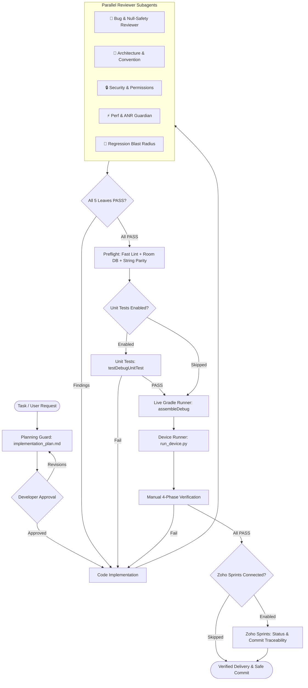

<div align="center">

# 🛡️ Android Agent Harness

**Enterprise Architecture Governance, 5-Leaf Review Gate, and Safety Harness for Android & Kotlin Multiplatform.**

[](https://github.com/rabee-elkholy/android-harness-kit/actions/workflows/ci.yml)
[](https://github.com/rabee-elkholy/android-harness-kit/releases)
[](LICENSE)
[](https://android.com)
[](https://python.org)
[](docs/architecture.md)
[](docs/tool-support.md)
[](CONTRIBUTING.md)

<p align="center">
  <a href="#-overview">Overview</a> •
  <a href="#-quickstart-in-2-minutes">Quickstart</a> •
  <a href="#-architecture-workflow">Workflow</a> •
  <a href="#-the-five-leaf-review-gate">Review Gate</a> •
  <a href="#-supported-ai-tools">Supported Tools</a> •
  <a href="#-documentation">Documentation</a> •
  <a href="CHANGELOG.md">Changelog</a>
</p>

---

</div>

## 🌟 Overview

**Android Agent Harness** transforms AI coding assistants from unconstrained code generators into disciplined, production-grade engineering teammates.

When using tools like **Cursor**, **Google Antigravity**, **Claude Code**, or **GitHub Copilot** on large Android & KMP codebases, AI models often cause silent regressions, introduce unhandled `NullPointerExceptions`, drop Arabic/RTL string translations, or freeze the UI thread with unoptimized recompositions.

**Android Agent Harness** eliminates these risks by installing an automated **Five-Leaf Review Gate**, strict safety hooks, live Gradle execution streams, and Zoho Sprints project sync into your codebase.

---

## ⚡ Quickstart (in 2 Minutes)

Open your AI assistant in your **Android project root directory** and paste:

```markdown
Read and execute the Android Harness Kit installer:
https://raw.githubusercontent.com/rabee-elkholy/android-harness-kit/main/docs/install-prompt.md
```

Follow the interactive setup wizard to configure your project. Once verified (`Total test failures: 0`), your repository is fully protected!

👉 *For detailed setup instructions, see the [Quickstart Guide](docs/quickstart.md).*

---

## 🔄 Architecture Workflow



---

## 🍃 The Five-Leaf Review Gate

Every code change must pass parallel sign-off from all 5 specialized reviewer subagents before Gradle assembly is unlocked:

| Leaf Reviewer | Focus Area | What It Catches |
| :--- | :--- | :--- |
| **🐞 Bug Reviewer** | Memory & Logic | `NullPointerExceptions`, unhandled coroutine cancellations, lifecycle leaks |
| **📐 Convention Reviewer** | Architecture | MVI / Clean Architecture violations, mutable state leakage, improper DI |
| **🔒 Security Reviewer** | Security & Privacy | Exported components without permission, SQL injections, cleartext tokens |
| **⚡ Perf & ANR Guardian** | Performance & UI | Main thread disk/network I/O, heavy recompositions, unbounded loops |
| **🔄 Regression Reviewer** | Blast Radius | Broken dependent screens, missing navigation parameters, contract breaks |

---

## 🛠️ Supported AI Tools

The installer automatically generates native rule adapters tailored to your IDE and assistant:

| Assistant / IDE | Generated Adapter | Capabilities |
| :--- | :--- | :--- |
| **Google Antigravity** | `agents/rules/`, `agents/hooks.json` | Subagent dispatch, blocking hooks, ephemeral reminders |
| **Cursor** | `.cursorrules` | Architecture constraints, review protocol, terminal gates |
| **Claude Code** | `CLAUDE.md` | Terminal safety guards, review flow protocols |
| **GitHub Copilot** | `.github/copilot-instructions.md` | Context instructions, domain conventions |
| **OpenAI Codex CLI** | `AGENTS.md` | Universal agent instructions, execution limits |
| **Windsurf** | `.windsurfrules` | Cascade AI constraints, MVI architecture rules |
| **Cline & Roo Code** | `.clinerules`, `.roomodes` | System prompt enforcement, tool permissions |
| **Continue / Junie / Kilo / Goose** | Native Adapter Files | Full rule compliance across 14+ supported environments |

---

## 📚 Documentation

- [**Quickstart Guide**](docs/quickstart.md) — 2-minute setup instructions
- [**Architecture Guide**](docs/architecture.md) — Deep dive into the governance engine
- [**Tool Support Matrix**](docs/tool-support.md) — Full matrix of 14+ supported AI tools
- [**Installation Prompt**](docs/install-prompt.md) — One-prompt installer script
- [**Upgrade Guide**](docs/update-prompt.md) — How to update an existing installation
- [**Rollback Guide**](docs/rollback-prompt.md) — Clean uninstaller and restore script
- [**Contributing Guidelines**](CONTRIBUTING.md) — How to contribute to the kit
- [**Code of Conduct**](CODE_OF_CONDUCT.md) — Community standards
- [**Security Policy**](SECURITY.md) — Vulnerability reporting

---

## 🤝 Contributing

Contributions are welcome! Whether you want to add adapters for new AI tools, improve subagent prompts, or enhance Python runners, please read our [Contributing Guide](CONTRIBUTING.md) before submitting a Pull Request.

---

## 📄 License

Distributed under the **MIT License**. See [`LICENSE`](LICENSE) for details.

<div align="center">

**Crafted with 💚 for the Android & Kotlin Multiplatform Community.**

[Back to Top ↑](#️-android-agent-harness)

</div>\n