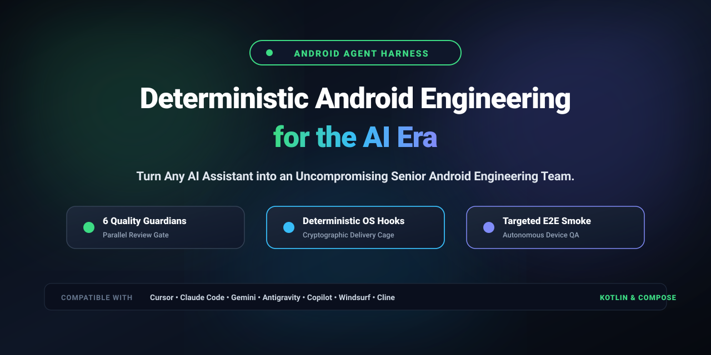
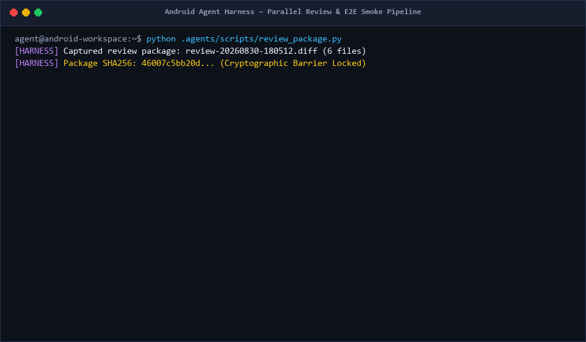

<div align="center">

# Android Agent Harness

### Deterministic Android Engineering for the AI Era
**Turn Any AI Assistant into an Uncompromising Senior Android Engineering Team.**

[](https://github.com/rabee-elkholy/android-harness-kit/actions/workflows/ci.yml)
[](https://github.com/rabee-elkholy/android-harness-kit/releases)
[](LICENSE)
[](https://android.com)
[](https://python.org)
[](docs/architecture.md)
[](docs/tool-support.md)
[](CONTRIBUTING.md)

<br/><br/>


</div>

---

## The Core Revelation: Prompts are Polite Requests. The Harness is an Engineering Cage.

Every developer using AI coding assistants (Cursor, Claude Code, Copilot, Antigravity, Windsurf) eventually discovers the same painful truth:

> **A prompt, `.cursorrules`, or `SKILL.md` file is just advice inside the model's brain. When context grows, the model ignores the advice, declares fake success, and breaks production.**

The **Android Agent Harness** is fundamentally different. It does not plead with the AI to behave; it places **deterministic, cryptographic, and OS-level execution barriers outside the model**:

| Dimension | Prompt / Skill.md / `.cursorrules`<br>*(Soft In-Context Advice)* | Android Agent Harness<br>*(Deterministic OS & Cryptographic Gate)* |
| :--- | :--- | :--- |
| **Review & Verification** | Model judges its own work ("LGTM!"). | **Cryptographic Barrier**: Assembly (`:assembleDebug`) is physically locked until parallel subagents emit matching SHA-256 evidence. |
| **Execution Safety** | Model can execute destructive shell commands (`git commit`, `push --force`, `pm clear`). | **OS Interceptor**: Python `PreToolUse` hook hard-denies git mutations, bare ADB, and `pm clear` before reaching the OS shell. |
| **Attention & Reliability** | Attention fades as conversation context expands (token decay / lost in the middle). | **Zero Token Decay**: Fixed Python engine running outside the model enforces rules identically on turn 1 or turn 1,000. |
| **Offline IDE Commits** | Zero protection when developer commits from Android Studio / terminal. | **Deterministic Git Gate**: Universal staged pre-commit hook (`.githooks/pre-commit`) blocks bad strings, Room, & lint in <5s. |
| **Environment & Diagnostics** | Blind to Android SDK paths, ADB serials, and system health. | **12-Dimension Doctor**: Audits 30 checks with 10s live process streaming heartbeats during Gradle operations. |

---

## See it in Action: Parallel Review Gate & Targeted E2E Smoke

<div align="center">
  
</div>

---

## Universal Android Engineering: Built for ALL Stacks & Architectures

The harness seamlessly adapts to any Android project topology from day one:

* **Architectural Paradigms**: Clean Architecture, MVI (Unidirectional Data Flow), MVVM (StateFlow/SharedFlow), MVP, Multi-Module Layers.
* **Modern & Legacy UI**: Jetpack Compose, XML Views, ViewBinding, DataBinding, Material 3/2 Theming, Dual-Locale RTL (English/Arabic).
* **Persistence & State**: Room Database (automated migration verification), SQLite, DataStore Preferences/Proto, EncryptedSharedPreferences.
* **Concurrency & Async**: Kotlin Coroutines (`runTest`, `StateFlow.update { }`, Main-thread I/O elimination), Flow, RxJava, Java Interop.
* **Dependency Injection & Networking**: Dagger Hilt, Koin, Ktor, Retrofit, OkHttp.
* **Kotlin Multiplatform (KMP)**: Shared domain/data business logic, Compose Multiplatform UI, platform actuals.

---

## The 6 Quality Guardians & 8-Specialist Multi-Agent System

Before any APK assembly or device execution, the Lead Agent coordinates with a specialized squad of AI specialists:

### The 6 Parallel Quality Guardians (Mandatory Gate)
1. **`bug-reviewer-agent`** (`BUG_PASS`): Catches race conditions, Kotlin null-safety violations across Java/Kotlin boundaries, coroutine cancellation leaks, and missing exception handling.
2. **`convention-reviewer-agent`** (`CONVENTION_PASS`): Enforces Clean Architecture layer boundaries, MVI Single-source StateFlow, zero inline FQCNs, and Compose accessibility standards (48dp touch targets, contentDescription).
3. **`security-reviewer-agent`** (`SECURITY_PASS`): Enforces OWASP Mobile Top 10, secures exported components/intents, eliminates Logcat secret leaks, and verifies least-privilege permissions.
4. **`perf-anr-guardian-agent`** (`PERF_PASS`): Eliminates Application Not Responding (ANR) risks, bars Main-thread disk/network I/O, prevents Compose recomposition jank, and stops `DisposableEffect` sensor/listener memory leaks.
5. **`regression-impact-reviewer-agent`** (`REGRESSION_PASS`): Analyzes blast radius, caller graph impacts, breaking API signatures, and shared module side effects.
6. **`test-quality-reviewer-agent`** (`TEST_PASS`): Audits unit and UI test suites (`*Test.kt`), requiring deep state assertions, mocking integrity, and mandatory `runTest` Coroutines dispatchers.

### The 2 Dedicated On-Demand Specialists
7. **`qa-diagnostics-agent`**: Deep Logcat forensics, crash stack trace demangling, and ANR thread dump triage on connected physical devices.
8. **`android-ui-expert-agent`**: Jetpack Compose and XML layout guidance, RTL/Arabic typography, accessibility modifiers, and multi-screen responsiveness.

Every review round produces a machine-readable verdict record at `.agents/state/verdicts/verdict-<pkg12>.json`. Validate any verdict record using `android-harness verify`.

---

## The 7-Layer Defense Architecture

The **Android Agent Harness** places deterministic, machine-enforced barriers **outside the model's brain**:

```
+-------------------------------------------------------------------------+
|                      Developer Prompt / IDE Chat                        |
+-------------------------------------------------------------------------+
                                     |
                                     v
+-------------------------------------------------------------------------+
| 1. PRE-TOOL SAFETY INTERCEPTOR (Python Hook Engine)                     |
|    - Blocks autonomous git commit, push, reset (Human Git Authority)    |
|    - Intercepts bare ADB, pm clear, adb monkey, homoglyphs, base64      |
|    - Anti-polling rate limits & ephemeral conversation state tracking   |
+-------------------------------------------------------------------------+
                                     |
                                     v
+-------------------------------------------------------------------------+
| 2. SHIFT-LEFT TEST PRE-GATE (:app:testDebugUnitTest)                    |
|    - Empirically verifies compiler parity and unit test suite passes    |
|    - Catches signature mismatches before invoking reviewer subagents    |
+-------------------------------------------------------------------------+
                                     |
                                     v
+-------------------------------------------------------------------------+
| 3. SIX-LEAF PARALLEL CRYPTOGRAPHIC REVIEW GATE                          |
|    - Locks :assembleDebug and device execution                          |
|    - Dispatches specialized guardians in ONE call on hashed diff        |
|    - Validates cryptographic SHA-256 evidence footers (EVIDENCE pkg=...) |
|    - Emits Review Round Summary Cards in chat on findings               |
+-------------------------------------------------------------------------+
                                     |
                                     v
+-------------------------------------------------------------------------+
| 4. SPECIALIZED ANDROID PREFLIGHT TRIO (<5s Fast Checks)                 |
|    - Bilingual String Parity: 1-to-1 sync between values/ & values-ar/  |
|    - Room Database Guard: Validates entity hashes & AutoMigrations      |
|    - Fast Kotlin Lint: 48dp touch targets, contentDescription, previews |
+-------------------------------------------------------------------------+
                                     |
                                     v
+-------------------------------------------------------------------------+
| 5. UNIVERSAL PRE-COMMIT QUALITY GATE (.githooks/pre-commit)             |
|    - Runs on staged files before any human commit lands in history      |
|    - Isolated locally via .git/info/exclude and --assume-unchanged      |
+-------------------------------------------------------------------------+
                                     |
                                     v
+-------------------------------------------------------------------------+
| 6. GRADLE BUILD & AUTONOMOUS E2E PHYSICAL DEVICE SMOKE                  |
|    - APK Assembly unlocked only after full evidence verification        |
|    - Live 10-second heartbeat progress streaming to IDE chat            |
|    - Autonomous E2E smoke runner (run_e2e_smoke.py) on physical device  |
|    - Continuous phase pipeline: proceeds autonomously upon success      |
+-------------------------------------------------------------------------+
                                     |
                                     v
+-------------------------------------------------------------------------+
| 7. ENTERPRISE PROJECT TRACKER GOVERNANCE                                |
|    - Modular Zoho Sprints, GitHub Projects, Jira, Linear integrations   |
|    - Zero secret leakage in repo (credentials stored in user configs)   |
|    - Gated behind explicit trigger phrases (e.g. 'update zoho')         |
+-------------------------------------------------------------------------+
```

---

## 60-Second Setup: Get Started Now

### Recommended Path: Via AI Chat (One-Click Prompt)
Open a **new strong-model chat** at your Android repository root and paste:
```markdown
Run the Android Harness Kit Installer or Updater:
https://raw.githubusercontent.com/rabee-elkholy/android-harness-kit/v0.14.20/docs/install-or-update-prompt.md
```

The installer autonomously executes a complete structural port:
* **Deep Stack Introspection**: Detects Gradle modules, launcher activities, DI frameworks (Hilt/Koin/Dagger), UI frameworks (Compose/XML), and locales.
* **Dynamic Domain Discovery**: Deeply scans your features and generates tailored architectural reference files in `.agents/skills/android-harness/references/`.
* **Multi-IDE Adapter Generation**: Creates targeted rule files (`.cursorrules`, `AGENTS.md`, `.windsurfrules`) for your chosen AI tools.
* **Integrity Self-Verification**: Executes all 30 doctor diagnostic checks to ensure 100% operational readiness.

### Alternative Path: Via CLI (Terminal Setup)
```bash
cd /path/to/your/android-project
pipx install git+https://github.com/rabee-elkholy/android-harness-kit.git
android-harness init
```

---

## Multi-IDE AI Tool Support (14 Tools, 3 Tiers)

The harness provides 3 tiers of enforcement across 14 AI coding environments:

| Enforcement Tier | Protection Mechanisms | Supported AI Tools |
| :--- | :--- | :--- |
| **Hook-Enforced** | Deterministic Python pre-tool interceptors, native IDE hook bridges, universal pre-commit gate. | Antigravity, Claude Code, GitHub Copilot (with repository hooks). |
| **Rule-Driven** | Managed IDE configuration rules (`.cursor/rules/`, `.windsurf/`, `.roo/`), slash command packs. | Cursor, Windsurf, Cline, Roo Code, Amazon Q, Continue, Junie, Kilo, Goose, Qwen, Codex. |
| **Prompt-Only** | Standardized `AGENTS.md` repository manifest. | Aider, Zed, Devin, Amp, Factory, Jules, Warp, OpenCode. |

---

## One-Click Prompt Library

Pinned lifecycle prompts with cryptographic tamper-evident headers:

| Operation | Prompt URL | Purpose |
| :--- | :--- | :--- |
| **Install & Update** | [`docs/install-or-update-prompt.md`](https://raw.githubusercontent.com/rabee-elkholy/android-harness-kit/v0.14.20/docs/install-or-update-prompt.md) | Guided installation, module discovery, adapter generation, and version upgrades. |
| **Doctor** | [`docs/diagnostic-prompt.md`](https://raw.githubusercontent.com/rabee-elkholy/android-harness-kit/v0.14.20/docs/diagnostic-prompt.md) | 12-dimension comprehensive system health diagnostics. |
| **Rollback** | [`docs/rollback-prompt.md`](https://raw.githubusercontent.com/rabee-elkholy/android-harness-kit/v0.14.20/docs/rollback-prompt.md) | Instant restoration from timestamped backups. |

---

## Documentation & Deep-Dives

* **[Architecture Guide](docs/architecture.md)**: 7-stage delivery lifecycle, safety interceptor mechanics, and preflight pipeline.
* **[Developer Workflows & Playbooks](docs/workflows.md)**: 10 structured engineering workflows (TDD, forensic triage, ANR audit, preflight, PM sync).
* **[Quickstart & CLI Reference](docs/quickstart.md)**: Complete CLI command matrix and environment setup.
* **[Tool Support Matrix](docs/tool-support.md)**: Adapter templates, slash command packs, and configuration changing.
* **[Threat Model & Security](docs/threat-model.md)**: Detailed analysis of 7 threat vectors and mitigation layers.
* **[Architecture Decision Records (ADRs)](docs/adr/)**: Formal ADRs (001-006) covering review gates, human git authority, and conflict adjudication.
* **[Contributor Recipes](docs/recipes/)**: Step-by-step guides for adding reviewers, policy rules, and tool adapters.
* **[Project Tracker Governance](docs/workflows/pm-integrations.md)**: Zoho Sprints, Jira, Linear, and GitHub Projects integrations.

---

## Contributing & Community

* **Report Bugs**: [GitHub Issue Tracker](https://github.com/rabee-elkholy/android-harness-kit/issues)
* **Contributions**: Please read [CONTRIBUTING.md](CONTRIBUTING.md) and [CODE_OF_CONDUCT.md](CODE_OF_CONDUCT.md)
* **Security Advisories**: See [SECURITY.md](SECURITY.md)

---

## License

Distributed under the **MIT License**. See [LICENSE](LICENSE) for details.
