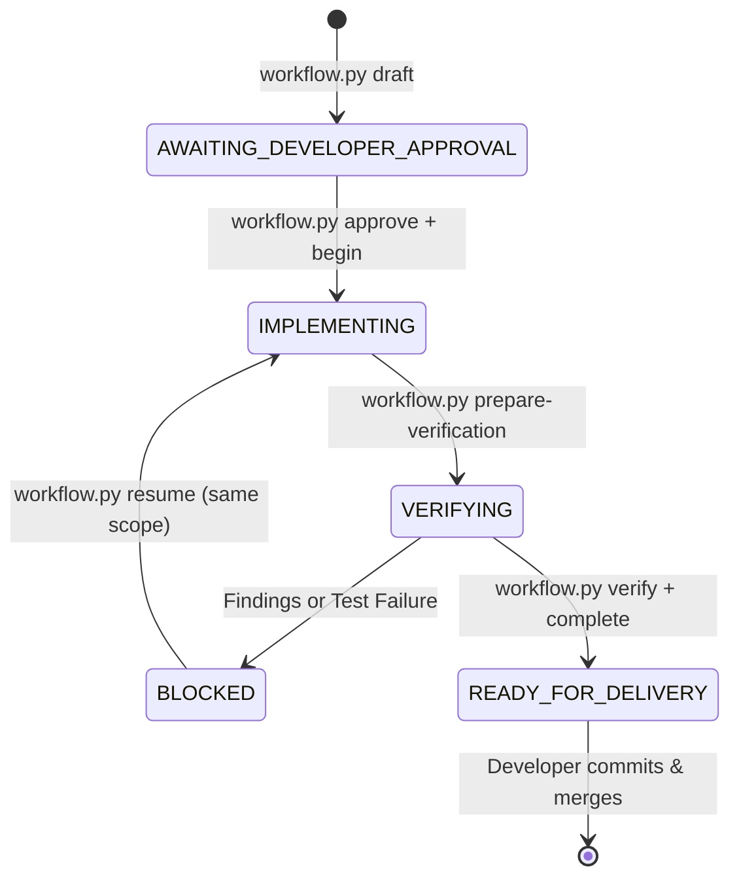

<div align="center">

# Android Agent Harness

### Deterministic Android Engineering for the AI Era

<p align="center">
  <b>Turn AI coding assistants into an uncompromising senior Android engineering team.</b><br>
  Deterministic local governance &bull; Tamper-evident verification &bull; Zero external dependencies
</p>

[](https://github.com/rabee-elkholy/android-agent-harness/releases)
[](https://www.python.org/downloads/)
[](LICENSE)
[-success.svg)](#zero-dependencies)
[](#prerequisites)
[](#verification--selftest)

<p align="center">
  <a href="#core-guarantees">Guarantees</a> &bull;
  <a href="#why-this-exists-the-problem-with-raw-ai-agents">Why This Exists</a> &bull;
  <a href="#architecture--how-it-works">Architecture</a> &bull;
  <a href="#deterministic-android-quality-guardians">Android Guardians</a> &bull;
  <a href="#quickstart">Quickstart</a> &bull;
  <a href="#task-lifecycle--workflows">Workflows</a> &bull;
  <a href="#supported-ai-hosts--enforcement-tiers">Supported Hosts</a> &bull;
  <a href="#cli-reference">CLI Reference</a>
</p>

</div>

---

## Core Guarantees

1. **Deterministic Human Authority**: AI agents are strictly restricted to *read-only* discovery and planning. Implementation cannot begin without explicit developer approval recorded in `plan.json`.
2. **Zero Autonomous Git Mutations**: In client Android applications, the agent **never** stages, commits, resets, or pushes code. All modifications remain unstaged for the developer to inspect and commit.
3. **Deterministic Multi-Label Surface Classification**: Inspects Git diffs across 15+ Android-specific surfaces (`ROOM_SCHEMA`, `COMPOSE_UI`, `XML_UI`, `NAVIGATION`, `BILLING`, `AUTH`, `CRYPTO`, `BUILD_CONFIG`, `MANIFEST_PERMISSION`, etc.). Unclassified delivery-relevant changes are tagged `UNKNOWN` to prevent masking.
4. **Proportional Adaptive Review & Token Protection**: Eliminates runaway LLM costs. Micro-changes (simple docs, localized strings) bypass semantic reviewers. High and critical changes trigger up to five specialist reviewer agents within a strict caller budget.
5. **Cryptographically Bound Evidence Store**: Build results, test executions, and reviews produce append-only, tamper-evident evidence bound to the exact `delivery_snapshot_sha256`, repository identity, run ID, and Git branch.
6. **Unified APK Artifact-Set Integrity**: Multi-APK and split-APK builds are verified as a single cohesive artifact set. The exact hash is enforced across assemble, install, and device launch.
7. **Attributed Test Execution**: Separates newly introduced regressions from pre-existing baseline test failures, preventing false-positive gate failures.
8. **Zero Dependencies**: 100% Python standard-library (`pathlib`, `json`, `hashlib`, `subprocess`, `argparse`). No `pip install`, no third-party supply chain risks, and seamless operation across Windows, macOS, and Linux.

---

## Why This Exists: The Problem with Raw AI Agents

AI coding assistants (Claude Code, Gemini CLI, Cursor, Windsurf, Roo Code) are powerful, but when let loose on production Android codebases, they present recurring failure modes:

| Failure Mode in Raw AI Agents | How Android Agent Harness Solves It |
| :--- | :--- |
| **Silent Database Corruption**<br>Agents modify Room entity fields without declaring migrations or testing schema compatibility. | **Deterministic Room Guard** recursively parses `@Database`, entities, and `@Embedded` classes across files, blocking delivery unless valid migration paths are proven. |
| **Masked Regressions via Mixed Diffs**<br>An agent touches a critical class and a doc file simultaneously, tricking naive classifiers into treating the change as low-risk. | **Full-Coverage Classifier** inspects every delivery-relevant file. Any unclassified file is tagged `UNKNOWN`, forcing human decision rather than auto-approval. |
| **Runaway Token Costs**<br>Dispatching 5+ reviewer agents on a trivial one-line string update wastes millions of tokens. | **Adaptive Policy Matrix** dynamically selects reviewers based on actual change severity (Micro, Low, Medium, High, Critical). |
| **Git History Destruction**<br>Agents perform unexpected `git reset`, create untracked commits, or rebase active branches. | **Host Enforcement Hooks** block autonomous `git add`, `git commit`, `git push`, and `git reset` commands in client applications. |
| **Stale / Cross-Run Evidence Forgery**<br>An agent re-uses previous test output or verifies code on branch A that was built on branch B. | **Immutable Evidence Store** ties all evidence to repository identity, snapshot SHA-256, active branch, and single-use nonces. |
| **Device & Emulator Inconsistencies**<br>Agents install an APK to one device/user and launch on another, or launch outdated builds. | **Device Chain Verifier** ensures exact matching of artifact SHA-256, device serial SHA-256, and numeric Android user ID. |

---

## Architecture & How It Works

The harness operates as a deterministic finite state machine governing the interaction between the developer and the AI agent.



### 1. Planning Phase (Read-Only)
The agent analyzes the codebase and generates an implementation plan (`plan.json`). The plan specifies the exact expected surfaces, modules, risks, and rollback steps. No file-writing tools or mutation scripts are authorized during this phase.

### 2. Approval & Transition
The developer reviews the plan. Once approved (`workflow.py approve`), a single-use cryptographic nonce is generated. `workflow.py begin` consumes the nonce and unlocks implementation authority.

### 3. Change Classification & Policy Selection
Upon completing code changes, `change_classifier.py` computes the Git diff and categorizes modifications across 15+ specialized Android surfaces:

- **Critical**: `BILLING`, `AUTH`, `SECURITY`, `SENSITIVE_DATA`, `CRYPTO`
- **High**: `ROOM_SCHEMA`, `MANIFEST_PERMISSION`, `BUILD_CONFIG`, `PUBLIC_API`, `NATIVE_CODE`
- **Medium**: `COMPOSE_UI`, `XML_UI`, `NAVIGATION`, `DEVICE_API`, `BUSINESS_LOGIC`, `NETWORK`, `COROUTINES`, `PERSISTENCE`
- **Low / Micro**: `DOCS`, `LOCALIZATION`, `RESOURCE_UI`, `TEST_ONLY`

`review_policy.py` derives the exact required verification gates and reviewer agents. If an unknown file is encountered, the policy fails closed to `USER_DECISION_REQUIRED`.

### 4. Specialist Reviewer Squad
When required by policy, isolated specialist subagents are dispatched:
- **`bug-reviewer-agent`**: Logic errors, edge cases, nullability, and lifecycle pitfalls.
- **`security-reviewer-agent`**: Data leakage, exported components, auth flaws, and cryptographic misuse.
- **`perf-anr-guardian-agent`**: Main-thread blocking, coroutine dispatchers, memory leaks, and recomposition loops.
- **`regression-impact-reviewer-agent`**: Behavioral regressions and API contract breakage.
- **`test-quality-reviewer-agent`**: Meaningful assertions, test independence, and mutation coverage.
- **`convention-reviewer-agent`**: Android & Kotlin clean architecture idioms.

### 5. Final Read-Only Verification
`final_verifier.py` recalculates the active delivery snapshot, repository identity, and Git branch. It independently verifies that all required evidence records are present, valid, untampered, and passing. The verifier is strictly read-only: it can confirm or reject delivery, but cannot write success state itself.

---

## Deterministic Android Quality Guardians

Beyond LLM reviews, the harness equips your workflow with purpose-built, deterministic static analyzers, hardware bridges, and diagnostics specifically engineered for Android development:

### 1. Adaptive Localization & String Guard (`check_strings.py`)
- **Diff-Scoped Resource Inspection**: Analyzes touched string resources across all locale directories (`values/strings.xml`, `values-ar/`, `values-es/`, etc.).
- **Placeholder Parity**: Catches subtle format-string mismatches (e.g., base defines `Hello %s (%d)` while a translated string has `%d (%s)`), preventing runtime `UnknownFormatConversionException` crashes.
- **Key Synchronization & Plural Parity**: Detects missing translated keys and plural quantity mismatches (`zero`, `one`, `two`, `few`, `many`, `other`).
- **Hardcoded String Detection**: Flags raw unextracted strings introduced in layout XML or Compose UI.

### 2. Room Database & Schema Migration Guard (`room_guard.py`)
- **Deep Recursive Schema Traversal**: Parses `@Database` declarations and resolves all entity classes, relations, and nested `@Embedded` data classes across separate files.
- **Strict Migration Enforcement**: When entities change, verifies that an explicit `Migration(start, end)` or `AutoMigration` path is declared and registered in `addMigrations()`.
- **Destructive Migration Shield**: Blocks silent data wipes caused by accidental `fallbackToDestructiveMigration()` calls in production code.

### 3. Smart Test Regression Isolation (`baseline_capture.py` & `run_tests_gate.py`)
- **Baseline vs. Regression Disambiguation**: In real-world enterprise codebases, some legacy tests may already be broken. The harness captures a pre-task baseline of existing failures.
- **Zero-Block Progress**: The gate fails **only** if the AI agent's changes introduce a *new* test regression or compilation error, preventing legacy technical debt from paralyzing modern agentic development.

### 4. Performance & ANR Risk Analyzer (`perf_guard.py`)
- **Main-Thread I/O Detection**: Scans modified code for synchronous disk access, SQLite operations, SharedPreferences commits, or network calls executing on the UI thread.
- **Dispatcher Governance**: Enforces structured concurrency guidelines (`Dispatchers.IO`, `Dispatchers.Default`) and catches unconfined or global `CoroutineScope` antipatterns.
- **Compose Recomposition Safeguards**: Identifies unstable parameters, un-remembered state allocations, and infinite recomposition loops.

### 5. Intelligent Compiler Diagnostics (`gradle_error_parser.py`)
- **Actionable Diagnostic Extraction**: Filters hundreds of lines of Gradle and Kotlin daemon noise to pinpoint the exact failure: file path, line number, and error message.
- **Annotation Processor & KSP Awareness**: Accurately parses complex Dagger/Hilt missing dependency injection bindings and Room KSP schema generation failures into clear guidance for the AI agent.

### 6. Hardware Observability & Visual Evidence (`capture_screen.py` & `logcat_doctor.py`)
- **Automated Visual UI Snapshots**: Automatically captures screenshots from physical devices or emulators upon task completion and saves them as review artifacts.
- **Live Crash & ANR Capture**: Monitors Android Logcat during app launch and device testing, extracting fatal exception stack traces, uncaught exceptions, and native tombstone traces directly into the verification report.
- **Physical Device Priority**: Automatically resolves connected hardware, prioritizing physical test devices over emulators to validate real-world Android performance.

### 7. Universal Multi-Module Project Graph (`project_graph.py`)
- **Topology-Aware Scoping**: Discovers module dependencies across modern multi-module architectures (`:core:network`, `:feature:auth`, `:app`).
- **Targeted Build Execution**: Directs Gradle to compile and test only the modules affected by the current change, saving minutes of build time on large projects.

### 8. Native Slash Command Packs (`.agents/command-packs/`)
- Pre-installed prompt commands for all major AI coding hosts (Claude Code, OpenAI Codex, GitHub Copilot, and Gemini CLI):
  - `/deliver` — End-to-end implementation with verification.
  - `/debug` — Hypothesis-driven defect reproduction and fix.
  - `/doctor` — Instant environment and toolchain diagnosis.
  - `/preflight` — Rapid static lint, strings, and Room check.
  - `/perf-audit` — Dedicated ANR and memory leak inspection.

### 9. Project Management & Issue Tracker Governance (`pm_policy.py`)
- **Zoho Sprints & GitHub Projects Integration**: Provides agents with structured, read-only context on active tasks and sprints.
- **Zero Rogue Mutations**: Ticket status updates, comments, and time-logging mutations are locked behind explicit `--external-write` authorization and human confirmation.

---

## Quickstart

### Prerequisites
- Python 3.10 or newer (standard library only).
- Android project managed by Git with a root Gradle Wrapper (`gradlew` or `gradlew.bat`).
- Android SDK and JDK (only when build or test gates are executed).

### Chat installation (recommended)
Open your Android project in your AI coding agent (Antigravity, Gemini CLI, Claude Code, Cursor, Windsurf, or Roo Code), and paste:

```text
Read https://raw.githubusercontent.com/rabee-elkholy/android-agent-harness/v1.0.19/docs/install-or-update-prompt.md and follow all instructions.
```

The agent will:
1. Discover your project structure in read-only mode.
2. Ask interactive configuration questions in chat.
3. Present a non-interference installation plan.
4. Wait for your approval, then provision the pinned kit into `~/.android-harness/kit`.
5. Run `doctor` to confirm that zero project source files were altered.

### Terminal installation (alternative)
Run directly from your command line:

```bash
# Clone the pinned harness release
git clone --depth 1 --branch v1.0.19 --single-branch https://github.com/rabee-elkholy/android-agent-harness.git ~/.android-harness/kit

# Initialize inside your Android project
python ~/.android-harness/kit/harness_cli.py init --repo /path/to/android-project --kit ~/.android-harness/kit

# Verify configuration and environment health
python ~/.android-harness/kit/harness_cli.py doctor --repo /path/to/android-project
```

The installer configures `.agents` in your project and registers `.git/info/exclude` so that harness state never pollutes your repository's Git tracking.

---

## Task Lifecycle & Workflows

A standard task follows an explicit workflow:

```bash
# 1. Draft a task plan (Read-Only)
python .agents/scripts/workflow.py draft --repo . --task-id TASK-101 \
  --outcome "Implement user biometric authentication" \
  --expected-surfaces AUTH,CRYPTO,UI \
  --expected-modules :app

# 2. Developer approves the plan
python .agents/scripts/workflow.py approve --repo . --task-id TASK-101 \
  --source conversation --proof-reference MSG-4892 --enforcement-tier RULE_ENFORCED

# 3. Consume approval nonce and begin implementation
python .agents/scripts/workflow.py begin --repo . --task-id TASK-101

# ... AI agent implements code changes ...

# 4. Prepare verification (freezes delivery snapshot and policy)
python .agents/scripts/workflow.py prepare-verification --repo . --task-id TASK-101

# 5. For sensitive surfaces (auth/crypto/billing), developer confirms final snapshot
python .agents/scripts/workflow.py approve-sensitive --repo . --task-id TASK-101 \
  --source conversation --proof-reference CONFIRM-8391 --enforcement-tier RULE_ENFORCED

# 6. Execute gates and reviewers dictated by current-run.json
# e.g., run assemble, unit tests, room schema checks, or specialist reviews

# 7. Final read-only verification
python .agents/scripts/workflow.py verify --repo . --task-id TASK-101

# 8. Mark ready for delivery
python .agents/scripts/workflow.py complete --repo . --task-id TASK-101
```

Once marked `READY_FOR_DELIVERY`, the developer reviews the unstaged changes using standard Git tools (`git diff`, `git status`) and commits the work.

---

## Supported AI Hosts & Enforcement Tiers

The harness is host-agnostic and adapts to the security model of your coding environment:

| AI Host | Integration Mechanism | Enforcement Level | Protection Capabilities |
| :--- | :--- | :---: | :--- |
| **Google Antigravity / Gemini CLI** | Native `agents/hooks.json` | **Hard Enforced** | Pre-command execution interceptor blocks unauthorized commands, raw Gradle/ADB, and Git mutations. |
| **Claude Code** | Custom Tool Hooks & Settings | **Hard Enforced** | Native pre-tool execution hooks intercept file modifications and bash commands before execution. |
| **GitHub Copilot** | `.github/prompts` & PreToolUse bridge | **Hard Enforced** (where hook supported) | Native prompt command packs with pre-tool mutation guards. |
| **OpenAI Codex** | `AGENTS.md`, `CODEX.md`, `.codex/prompts` | **Rule Enforced** | Native slash-command prompt packs and instruction-enforced boundaries blocking unauthorized mutations and raw Gradle. |
| **Cursor & Windsurf** | System Rules (`.cursorrules` / `.windsurfrules`) | **Rule Enforced** | Behavioral policy constraints prevent unauthorized mutations; verified at final delivery gate. |
| **Roo Code / Cline** | Custom Modes & Instructions | **Rule Enforced** | Constrained persona workflows with policy gate enforcement. |
| **Terminal / CI** | Native Python CLI | **Deterministic** | Full deterministic command-line validation and policy verification. |

---

## CLI Reference

`harness_cli.py` manages the harness engine lifecycle across target repositories:

```bash
# Initialize harness into an Android project
python harness_cli.py init --repo /path/to/project --kit /path/to/kit

# Atomically upgrade an existing project to a newer kit version
python harness_cli.py update --repo /path/to/project --kit /path/to/new-kit

# Run diagnostic health check
python harness_cli.py doctor --repo /path/to/project --json

# Dry-run harness uninstallation
python harness_cli.py uninstall --repo /path/to/project

# Apply clean uninstallation (restores pre-install files safely)
python harness_cli.py uninstall --repo /path/to/project --apply

# Run the complete deterministic selftest suite
python harness_cli.py selftest --kit .
```

---

## Project Philosophy

> **Stricter proof, not heavier workflow.**
>
> Real Android production value > complexity + token cost + workflow friction + regression risk.
>
> **Stability first.**

- **No Vanity Metrics**: We do not assign arbitrary scores or bloat workflows with bureaucratic checkpoints.
- **Fail-Closed Safety**: If a device serial cannot be confirmed, a migration path cannot be verified, or an unknown surface is touched, the system halts and asks the developer.
- **Respect the Repository**: Your application code and Git tree belong to you. The harness never commits without permission and never touches files outside its designated boundaries.

---

## Verification & Selftest

Every commit and release is validated by a 154-test deterministic suite running on pure Python standard library:

```bash
# Run full deterministic test suite
python harness_cli.py selftest

# Run critical safety selftest suite
python agents/scripts/_critical_safety_selftest.py

# Validate release checksums and metadata
python scripts_dev/validate_release.py
```

---

## Contributing & Community

Contributions that preserve the stability-first principles, zero-dependency runtime, and deterministic verification model are welcome.

1. Review [Architecture Guidelines](docs/architecture.md) and [Threat Model](docs/threat-model.md).
2. Ensure runtime code remains **Python standard-library only**.
3. Verify that all 154 tests pass via `python harness_cli.py selftest`.
4. Open a pull request with clear rationale and regression coverage.

---

## License

This project is licensed under the [MIT License](LICENSE).
Copyright © 2026 Rabee Elkholy.
