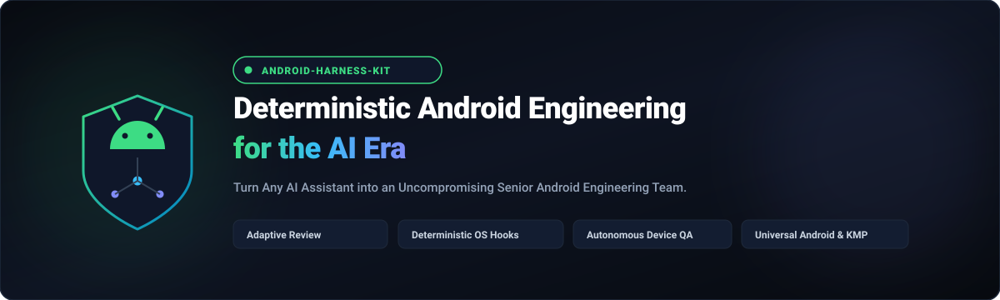
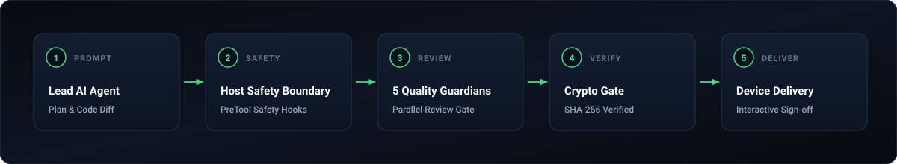

<div align="center">

# android-agent-harness

### Deterministic Android Engineering for the AI Era
**Turn Any AI Assistant into an Uncompromising Senior Android Engineering Team.**

[](https://github.com/rabee-elkholy/android-agent-harness/actions/workflows/ci.yml)
[](https://github.com/rabee-elkholy/android-agent-harness/releases)
[](LICENSE)
[](https://android.com)
[](https://python.org)
[](docs/architecture.md)
[](docs/tool-support.md)
[](CONTRIBUTING.md)

<br/><br/>


</div>

---

## Quickstart: Get Started in 60 Seconds

### Path A: Via AI Chat (Recommended)
Open a **new chat session** in your AI assistant (Antigravity, Claude Code, Cursor, Copilot, Windsurf) at your project root and paste:

```text
Read https://raw.githubusercontent.com/rabee-elkholy/android-agent-harness/v0.25.7/docs/install-or-update-prompt.md and follow all its instructions.
```

The installer autonomously inspects your project topology (Gradle modules, DI, UI framework, Room, Locales), creates target adapters, and executes self-diagnostic checks.

### Path B: Via Terminal CLI
```bash
cd /path/to/your/android-project
pipx install git+https://github.com/rabee-elkholy/android-agent-harness.git
android-harness init
```

---

## The Daily Developer Loop: From Task to Verified Device Delivery

<div align="center">
  
</div>

```text
[1] INGESTION & IMPACT ANALYSIS
    Reads ticket / prompt -> Analyzes multi-module dependencies & caller graph
    |
    v
[2] IMPLEMENTATION PLAN & DEVELOPER ALIGNMENT
    Drafts architectural plan (implementation_plan.md) with open questions
    -> Developer reviews & approves before a single line of code changes
    |
    v
[3] SHIFT-LEFT TDD (RED -> GREEN)
    Writes failing unit test -> Applies surgical fix -> Empirically verifies pass
    |
    v
[4] ANDROID PREFLIGHT TRIO (<5s Fast Checks)
    Validates Room schema migrations, Bilingual string parity (values-ar), & Lint
    |
    v
[5] SIX-GUARDIAN PARALLEL REVIEW GATE
    6 specialized AI reviewers audit the diff simultaneously with cryptographic evidence:
    (Bug, Security, Convention, Perf/ANR, Regression, Test Quality)
    |
    v
[6] AUTONOMOUS DEVICE E2E SMOKE
    Builds :app:assembleDebug -> Installs on physical device via ADB
    -> Runs live UI smoke test & audits Logcat for runtime exceptions
    |
    v
[7] PM TRACKER SYNC & HUMAN GIT SIGN-OFF
    Updates Zoho Sprints / Jira -> Drafts verified Conventional Commit
    -> Leaves final commit & push to developer authority
```

---

## The Core Revelation: Prompts are Polite Requests. The Harness is an Engineering Cage.

Every developer using AI coding assistants eventually discovers the same painful truth: **A prompt, `.cursorrules`, or `SKILL.md` file is just soft advice inside the model's brain. When context grows, the model ignores the advice, declares fake success, and breaks production.**

The **Android Agent Harness** places **deterministic, cryptographic, and OS-level execution barriers outside the model**:

| Dimension | Standard AI Coding Assistant<br>*(Soft In-Context Advice)* | Android Agent Harness<br>*(Deterministic OS & Cryptographic Gate)* |
| :--- | :--- | :--- |
| **Bug Reproduction** | Model guesses fixes without verifying; misses edge cases. | **Shift-Left TDD**: Requires writing failing unit tests first (`RED`), then confirming surgical fix (`GREEN`). |
| **Code Review & Verification** | Model judges its own work ("LGTM!"). | **Cryptographic Barrier**: Assembly (`:assembleDebug`) is physically locked until 6 parallel subagents emit matching SHA-256 evidence. |
| **Execution Safety** | Model can execute destructive shell commands (`git commit`, `push --force`, `pm clear`). | **OS Interceptor**: Python `PreToolUse` hook hard-denies destructive commands, bare ADB, and unauthorized mutations before reaching the shell. |
| **Device & Runtime QA** | Blind to actual runtime; developer manually builds, deploys, and debugs crashes. | **Autonomous Device Runner**: Builds APK, installs on connected USB device/emulator, runs smoke tests, and triages Logcat. |
| **Attention & Reliability** | Attention fades as conversation expands (token decay / lost in the middle). | **Zero Token Decay**: Fixed external Python engine enforces rules identically on turn 1 or turn 1,000. |
| **Git Governance** | Model pollutes git history or pushes unreviewed code to remote. | **Strict Human Git Authority**: Zero autonomous commits/pushes; emits verified, clean Conventional Commits for developer sign-off. |
| **Environment Health** | Blind to Android SDK paths, ADB serials, and system health. | **12-Dimension Doctor**: Audits 30 diagnostic checks with live process streaming heartbeats during Gradle operations. |

---

## Universal Android Engineering: Built for ALL Stacks & Architectures

The harness seamlessly adapts to any Android project topology from day one:

* **Architectural Paradigms**: Clean Architecture, MVI (Unidirectional Data Flow), MVVM (StateFlow/SharedFlow), MVP, Multi-Module Layers.
* **Modern & Legacy UI**: Jetpack Compose, XML Views, ViewBinding, DataBinding, Material 3/2 Theming, Dual-Locale RTL (English/Arabic).
* **Persistence & State**: Room Database (automated migration verification), SQLite, DataStore Preferences/Proto, EncryptedSharedPreferences.
* **Concurrency & Async**: Kotlin Coroutines (`runTest`, `StateFlow.update { }`, Main-thread I/O elimination), Flow, RxJava, Java Interop.
* **Dependency Injection & Networking**: Dagger Hilt, Koin, Ktor, Retrofit, OkHttp.
* **Kotlin Multiplatform (KMP)**: Shared domain/data business logic, Compose Multiplatform UI, platform actuals.

---

## The 5 Quality Guardians & 8-Specialist Multi-Agent System

Before any APK assembly or device execution, the Lead Agent coordinates with a specialized squad of AI specialists:

### The 5 Parallel Quality Guardians (Mandatory Gate)
1. **`bug-reviewer-agent`** (`BUG_PASS`): Catches race conditions, Kotlin null-safety violations across Java/Kotlin boundaries, coroutine cancellation leaks, and missing exception handling.
2. **`convention-reviewer-agent`** (`CONVENTION_PASS`): Enforces Clean Architecture layer boundaries, MVI Single-source StateFlow, zero inline FQCNs, and Compose accessibility standards (48dp touch targets, contentDescription).
3. **`security-reviewer-agent`** (`SECURITY_PASS`): Enforces OWASP Mobile Top 10, secures exported components/intents, eliminates Logcat secret leaks, and verifies least-privilege permissions.
4. **`perf-anr-guardian-agent`** (`PERF_PASS`): Eliminates Application Not Responding (ANR) risks, bars Main-thread disk/network I/O, prevents Compose recomposition jank, and stops `DisposableEffect` sensor/listener memory leaks.
5. **`regression-impact-reviewer-agent`** (`REGRESSION_PASS`): Analyzes blast radius, caller graph impacts, breaking API signatures, and shared module side effects.

`test-quality-reviewer-agent` (`TEST_PASS`) is a **Stage 0.5 pre-gate** for test diffs: it audits unit and UI test suites (`*Test.kt`) before the 5-leaf round, requiring deep state assertions, mocking integrity, and mandatory `runTest` Coroutines dispatchers.

### The 2 Dedicated On-Demand Specialists
7. **`qa-diagnostics-agent`**: Deep Logcat forensics, crash stack trace demangling, and ANR thread dump triage on connected physical devices.
8. **`android-ui-expert-agent`**: Jetpack Compose and XML layout guidance, RTL/Arabic typography, accessibility modifiers, and multi-screen responsiveness.

Every review round produces a machine-readable verdict record at `.agents/state/verdicts/verdict-<pkg12>.json`. Validate any verdict record using `android-harness verify`.

---

## Multi-IDE AI Tool Support (14 Tools, 3 Tiers)

The harness provides 3 tiers of enforcement across 14 AI coding environments:

| Enforcement Tier | Protection Mechanisms | Supported AI Tools |
| :--- | :--- | :--- |
| **Hook-Enforced** | Deterministic Python pre-tool interceptors, native IDE hook bridges, universal pre-commit gate. | Antigravity, Claude Code, GitHub Copilot (with repository hooks). |
| **Rule-Driven** | Managed IDE configuration rules (`.cursor/rules/`, `.windsurf/`, `.roo/`), slash command packs. | Cursor, Windsurf, Cline, Roo Code, Amazon Q, Continue, Junie, Kilo, Goose, Qwen, Codex. |
| **Prompt-Only** | Standardized `AGENTS.md` repository manifest. | Aider, Zed, Devin, Amp, Factory, Jules, Warp, OpenCode. |

---

## One-Click Prompt Library

Pinned lifecycle prompts with cryptographic tamper-evident headers:

| Operation | Prompt URL | Purpose |
| :--- | :--- | :--- |
| **Install & Update** | [`docs/install-or-update-prompt.md`](https://raw.githubusercontent.com/rabee-elkholy/android-agent-harness/v0.25.7/docs/install-or-update-prompt.md) | Guided installation, module discovery, adapter generation, and version upgrades. |
| **Doctor** | [`docs/diagnostic-prompt.md`](https://raw.githubusercontent.com/rabee-elkholy/android-agent-harness/v0.25.7/docs/diagnostic-prompt.md) | 12-dimension comprehensive system health diagnostics. |
| **Rollback** | [`docs/rollback-prompt.md`](https://raw.githubusercontent.com/rabee-elkholy/android-agent-harness/v0.25.7/docs/rollback-prompt.md) | Instant restoration from timestamped backups. |

---

## Documentation & Deep-Dives

* **[Architecture Guide](docs/architecture.md)**: 7-stage delivery lifecycle, safety interceptor mechanics, and preflight pipeline.
* **[Developer Workflows & Playbooks](docs/workflows.md)**: 10 structured engineering workflows (TDD, forensic triage, ANR audit, preflight, PM sync).
* **[Quickstart & CLI Reference](docs/quickstart.md)**: Complete CLI command matrix and environment setup.
* **[Tool Support Matrix](docs/tool-support.md)**: Adapter templates, slash command packs, and configuration changing.
* **[Threat Model & Security](docs/threat-model.md)**: Detailed analysis of 7 threat vectors and mitigation layers.
* **[Architecture Decision Records (ADRs)](docs/adr/)**: Formal ADRs (001-006) covering review gates, human git authority, and conflict adjudication.
* **[Contributor Recipes](docs/recipes/)**: Step-by-step guides for adding reviewers, policy rules, and tool adapters.
* **[Project Tracker Governance](docs/workflows/pm-integrations.md)**: Zoho Sprints, Jira, Linear, and GitHub Projects integrations.

---

## Contributing & Community

* **Report Bugs**: [GitHub Issue Tracker](https://github.com/rabee-elkholy/android-agent-harness/issues)
* **Contributions**: Please read [CONTRIBUTING.md](CONTRIBUTING.md) and [CODE_OF_CONDUCT.md](CODE_OF_CONDUCT.md)
* **Security Advisories**: See [SECURITY.md](SECURITY.md)

---

## License

Distributed under the **MIT License**. See [LICENSE](LICENSE) for details.
