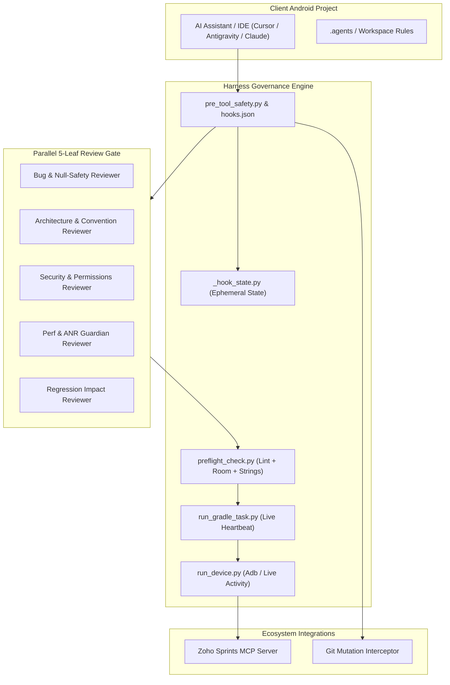

# Android Agent Harness: Architecture Guide

The **Android Agent Harness** is an enterprise-grade delivery gate and governance system designed to transform AI coding assistants from unconstrained code generators into disciplined, architecture-compliant engineering teammates.

---

## System Topology

---

## Core Pillars

### 1. The Five-Leaf Review Gate
Unlike traditional code assistants that produce code and instantly declare completion, the Harness intercepts tool execution until **5 specialized reviewer subagents** evaluate the exact package diff in parallel:

1. **`bug-reviewer-agent`**: Detects memory leaks, unchecked `NullPointerExceptions`, unhandled coroutine cancellations, and lifecycle issues.
2. **`convention-reviewer-agent`**: Enforces strict MVI / Clean Architecture, single source of truth StateFlows, and unidirectional data flow.
3. **`security-reviewer-agent`**: Inspects exported components, permission checks, SQL injection in raw queries, and sensitive data logging.
4. **`perf-anr-guardian-agent`**: Prevents main-thread blocking operations, unoptimized recompositions in Jetpack Compose, and unbounded loops.
5. **`regression-impact-reviewer-agent`**: Maps the exact blast radius of changes to ensure dependent screens and ViewModels remain unbroken.

---

### 2. Safety Interceptors & Git Mutation Protection
The harness intercepts destructive commands before they execute:
- **`git commit` / `git push`**: Hard blocked from autonomous execution. Developers retain sole authority over repository history (unless explicitly authorized via `I.3`).
- **`adb monkey` / `pm clear`**: Blocked to protect developer device state and prevent data wiping.
- **Anti-Polling Guardrails**: Limits tool poll loops (`>2` polls) to prevent infinite agent spin and enforce event-driven reactive wakeups.

---

### 3. Live Gradle Streaming (`run_gradle_task.py`)
AI assistants frequently get stuck or timeout when running long Gradle builds. `run_gradle_task.py` executes Gradle with a **10-second heartbeat monitor**, streaming build output and capturing structured diagnostics if compilation fails.

---

### 4. Zoho Sprints MCP Integration
Provides bidirectional synchronization with Zoho Sprints:
- Automatically reads bug descriptions, steps to reproduce, and attachments.
- Creates hierarchical tasks and subtasks.
- Posts Arabic/English QA testing handoff comments with the exact Git commit hash for complete audit traceability.\n