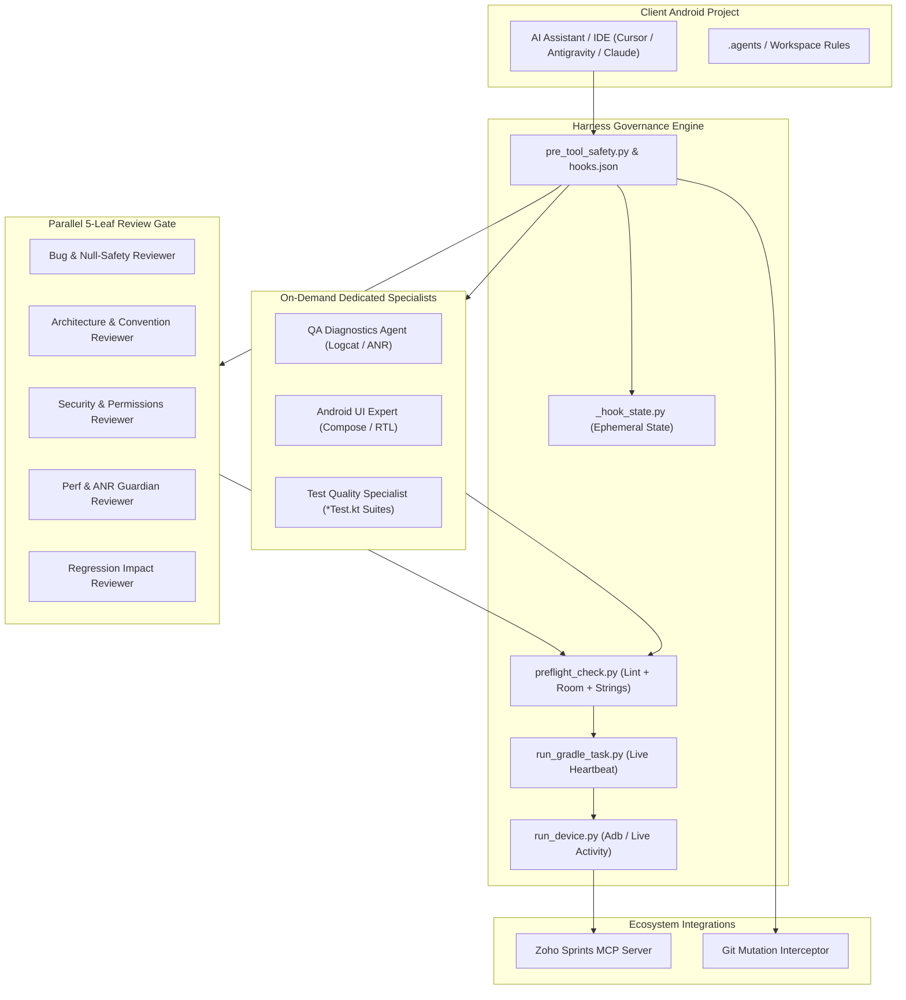

# Android Agent Harness: Architecture Guide

The **Android Agent Harness** is an enterprise-grade delivery gate and governance system designed to transform AI coding assistants from unconstrained code generators into disciplined, architecture-compliant engineering teammates.

---

## System Topology

---

## Core Pillars

### 1. Shift-Left Proactive Quality Invariants
The Harness enforces proactive quality standards before any code is written, ensuring the Primary Lead Agent achieves first-pass approval from reviewers:
- **Null-Safety & Network Resiliency**: Coroutine exception handling (`IOException`, `SocketTimeoutException`), no `!!`, safe error propagation.
- **Clean Architecture**: MVI StateFlow as single source of truth, zero inline FQCNs, explicit top-level imports.
- **Accessibility & Compose**: Mandatory `contentDescription` on non-decorative images/icons, touch targets >= 48dp, dual-locale `@Preview` (en/ar).
- **Performance & Battery**: Zero I/O on `Dispatchers.Main`, sensor unregistration in `onPause()`/`DisposableEffect.onDispose`, Android 14 foreground service rules.
- **Database Migrations**: Mandatory version bump and explicit `Migration(old, new)` on any `@Entity` schema modification.

---

### 2. The Five-Leaf Review Gate
Unlike traditional assistants that output unreviewed code, the Harness intercepts tool execution until **5 specialized reviewer subagents** evaluate the review package in parallel:

1. **`bug-reviewer-agent`**: Detects memory leaks, unchecked `NullPointerExceptions`, coroutine race conditions, uncaught network/I/O timeouts, and missing error state propagation.
2. **`convention-reviewer-agent`**: Enforces strict MVI / Clean Architecture, single source of truth StateFlows, accessibility standards (`contentDescription`, 48dp touch targets), and KMP commonMain cleanliness.
3. **`security-reviewer-agent`**: Inspects exported components, permission declarations, SQL injection, and secret leakage.
4. **`perf-anr-guardian-agent`**: Prevents main-thread blocking operations, unoptimized recompositions, unreleased WakeLocks, sensor listener leaks, and Android 14 foreground service violations.
5. **`regression-impact-reviewer-agent`**: Maps the exact blast radius of changes to ensure dependent screens and ViewModels remain unbroken.

---

### 3. Dedicated On-Demand Specialists
Specialists dispatched only when specific forensic, UI, or test quality tasks are needed:
- **`qa-diagnostics-agent`**: Physical device Logcat forensic analysis and ANR root-cause investigation.
- **`android-ui-expert-agent`**: Jetpack Compose and legacy XML UI layout, theming, RTL, and responsiveness.
- **`test-quality-reviewer-agent`**: Audits unit and UI test suites (`*Test.kt`), verifying assertion depth, mocking integrity, and Coroutine `runTest` dispatchers:
  - Verifies non-vacuous assertions and full MVI state transition coverage (`Loading` -> `Success` / `Error`).
  - Enforces `StandardTestDispatcher` injection over hardcoded `Dispatchers.IO` / `Dispatchers.Main`.
  - Verifies Turbine sequential assertions for reactive `StateFlow` and `SharedFlow` streams.
  - Audits in-memory Room database DAO tests and `MigrationTestHelper` assertions.

---

### 4. Safety Interceptors & Git Mutation Protection
The harness intercepts destructive commands before they execute:
- **`git commit` / `git push`**: Hard blocked from autonomous execution. Developers retain sole authority over repository history (unless explicitly authorized via `I.3`).
- **`adb monkey` / `pm clear`**: Blocked to protect developer device state and prevent data wiping.
- **Anti-Polling Guardrails**: Limits tool poll loops (`>2` polls) to prevent infinite agent spin and enforce event-driven reactive wakeups.

---

### 5. Live Gradle Streaming (`run_gradle_task.py`)
AI assistants frequently get stuck or timeout when running long Gradle builds. `run_gradle_task.py` executes Gradle with a **10-second heartbeat monitor**, streaming build output and capturing structured diagnostics if compilation fails.

---

### 6. Zoho Sprints MCP Integration
Provides bidirectional synchronization with Zoho Sprints:
- Automatically reads bug descriptions, steps to reproduce, and attached screenshots/logs (`attachments`).
- Creates hierarchical tasks and subtasks.
- Generates **QA-Centric Handoff Descriptions & Comments**: Strictly eliminates low-level internal code jargon (XML tags, Kotlin classes, `dp` values) in favor of functional, user-facing explanations.
- Enforces mandatory structure across all items (Bugs, Features/Stories, Tasks/Improvements):
  1. Mandatory `Commit: <hash>` on the first line.
  2. Functional Root Cause / Objective.
  3. Solution / Implementation Summary.
  4. Explicit **Impact Area (Blast Radius)** for regression testing.
  5. Structured **Test Cases & Verification Steps** (positive, negative, and edge scenarios).
- Includes dynamic dual-language workflow mapping resolving English and Arabic headers per `ZOHO_LANGUAGE` in `_product.py`.

---

### 7. 12-Dimension System Doctor (`harness_doctor.py`)
Provides deterministic, end-to-end verification of repository health across 12 operational dimensions (automatically executed after install/update):
- Host & environment (Python runtime, Gradle wrapper, Android SDK path, Git status, **`.gitignore` security & transient state audit**, **Git working tree status & commit reminders**).
- File topology & version alignment (`.agents/VERSION`, `harness-rules.md`, 27 core scripts).
- Complete subagent roster (all 8 subagents with active security fingerprints).
- Product configuration (`_product.py`, package prefix, application ID, source root, assemble task, and install-answers consistency: device policy vs `ALLOW_EMULATOR`, assemble parity, selected adapter presence).
- Template leakage check (verifying zero un-replaced `{{...}}` tokens in `.agents/`).
- Domain skills & workflow playbooks (10 workflow playbooks, foundation references integrity, automated project domain coverage discovery, and 100% reference indexing in `daily-scenarios.md`).
- Multi-IDE tool adapter parity (`AGENTS.md` and tool-specific rule configuration).
- Safety hooks & atomic state locking (cross-platform atomic `state_lock()`, zero selftest failures).
- Process streaming & heartbeat (line-buffered standard I/O and process tree lifecycle termination).
- Preflight verification pipeline (string parity & hardcoded UI text, Room migration graph, fast Kotlin lint).
- Zoho Sprints MCP security boundaries (zero token leakage in repository).
- Connected devices & ADB hardware diagnostics (querying physical devices, emulators, and Android API levels).

---

### 8. CLI Dispatcher & Cross-Tool Hard Enforcement
- **Standalone CLI Dispatcher (`harness_cli.py`)**: Zero-dependency executable (`android-harness` via `pipx install git+https://github.com/rabee-elkholy/android-harness-kit.git`, or direct `python harness_cli.py`) providing unified `init`, `update`, `doctor`, `preflight`, `selftest`, and `version` subcommands with automatic kit discovery and remote clone fallback.
- **11 Native Slash Command Packs (`agents/command-packs/`)**: Standardized command packs generating native slash shortcuts for Claude Code (`.claude/commands/`), GitHub Copilot (`.github/prompts/*.prompt.md`), and OpenAI Codex (`.codex/prompts/`) with automatic pruning.
- **Staged Pre-Commit Quality Gate (`pre_commit_gate.py`, `--git-gate`)**: Deterministic, stdlib-only Git hook (`.githooks/pre-commit`) running bilingual string parity, Room database migrations, and fast Kotlin lint against staged changes in <5s before commit.
- **Claude Code PreToolUse Safety Bridge (`cc_pre_tool_safety.py`, `--cc-hooks`)**: Intercepts terminal tool execution in Claude Code sessions via `.claude/settings.json` `PreToolUse` hook, enforcing strict Git mutation and ADB safety boundaries outside Antigravity.
