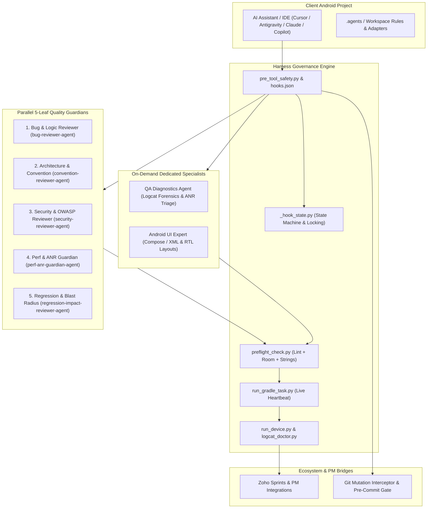
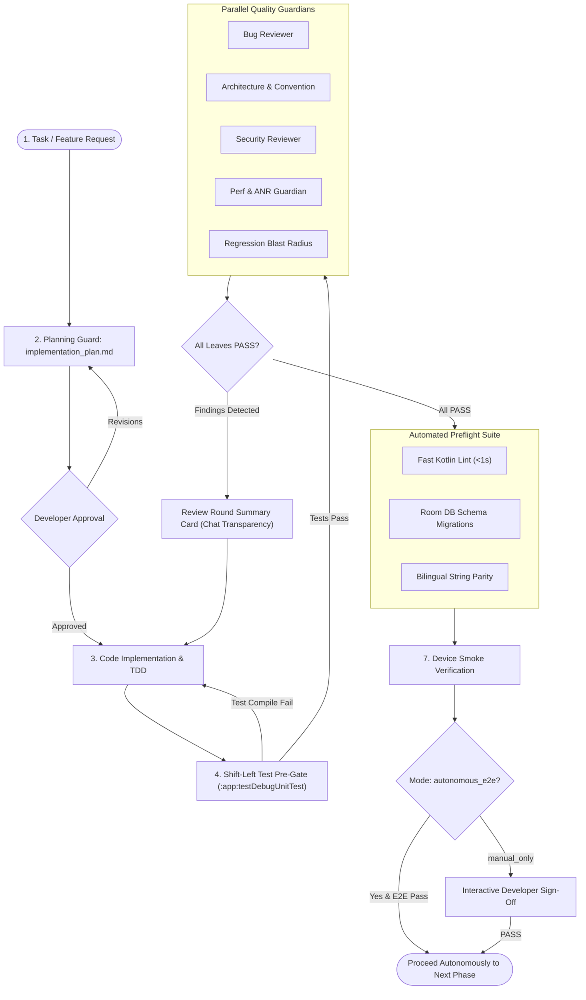

# Android Agent Harness: Architecture Guide

> **Deterministic Android Engineering for the AI Era**  
> *Turn Any AI Assistant into an Uncompromising Senior Android Engineering Team.*

---

## System Topology



---

## Delivery Workflow (Seven Deterministic Stages)

The harness enforces a deterministic, 7-stage quality delivery lifecycle:



---

## Core Pillars

### 1. Shift-Left Proactive Quality Invariants
The Harness enforces proactive quality standards before any code is written, ensuring the Primary Lead Agent achieves first-pass approval from reviewers:
- **Null-Safety & Network Resiliency**: Coroutine exception handling (`IOException`, `SocketTimeoutException`), no `!!`, safe error propagation.
- **Clean Architecture**: MVI StateFlow as single source of truth, zero inline FQCNs, explicit top-level imports.
- **Accessibility & Compose**: Mandatory `contentDescription` on non-decorative images/icons, touch targets >= 48dp, dual-locale `@Preview` (en/ar).
- **Performance & Battery**: Zero I/O on `Dispatchers.Main`, sensor unregistration in `onPause()`/`DisposableEffect.onDispose`, Android 14 foreground service rules.
- **Database Migrations**: Mandatory version bump and explicit `Migration(old, new)` on any `@Entity` schema modification.

---

### 2. The Five-Leaf Review Gate
Before any Gradle build or device installation can proceed, the AI assistant must dispatch **5 specialized reviewer subagents** in parallel (exactly one `invoke_subagent`). Every subagent inspects the exact package diff and outputs a structured pass token plus a mandatory evidence footer (`EVIDENCE pkg=<sha256_12> cites=<n>` matching the dispatched package hash — forged or missing footers keep the barrier up):

```
[BUG_PASS]         -- Verified by Bug & Network Resiliency Reviewer
[CONVENTION_PASS]  -- Verified by Architecture, Accessibility & KMP Reviewer
[SECURITY_PASS]    -- Verified by Security & Privacy Reviewer
[PERF_PASS]        -- Verified by Performance, Battery & ANR Guardian
[REGRESSION_PASS]  -- Verified by Regression Blast Radius Reviewer
```

1. **Bug & Network Resiliency Reviewer (`bug-reviewer-agent`)**
   - **Focus**: Logical correctness, null safety, lifecycle, and network error recovery.
   - **Catches**: Unhandled `NullPointerException` risks, uncaught coroutine cancellations, improper `StateFlow` collection without `repeatOnLifecycle`, uncaught `SocketTimeoutException`/`IOException` in API flows, missing error UI states, and infinite retry storms without exponential backoff.
2. **Convention, Accessibility & KMP Reviewer (`convention-reviewer-agent`)**
   - **Focus**: Structural cleanliness, MVI/Clean Architecture, accessibility compliance, and KMP code purity.
   - **Catches**: Mutable state exposed outside ViewModels, missing `contentDescription` on Compose icons/images, clickable components with touch targets < 48dp, `android.*` framework imports leaking into KMP `commonMain`, and missing dual-locale `@Preview` annotations (en/ar).
3. **Security & Privacy Reviewer (`security-reviewer-agent`)**
   - **Focus**: Android component security, permission boundaries, and data storage.
   - **Catches**: Exported Activities/Receivers without explicit intent filters or permissions, plaintext credentials/API keys, SQL injection in raw Room queries, and sensitive data printed to production Logcat.
4. **Performance, Battery & ANR Guardian (`perf-anr-guardian-agent`)**
   - **Focus**: UI fluidity (60/120 FPS), main thread responsiveness, sensor lifecycles, and battery footprint.
   - **Catches**: Disk or network I/O executed on `Dispatchers.Main`, heavy allocations during Jetpack Compose recomposition phases, unreleased WakeLocks, active `SensorEventListener` (pedometer/accelerometer) leaks during background/pause, and Android 14+ foreground service type violations.
5. **Regression Blast Radius Reviewer (`regression-impact-reviewer-agent`)**
   - **Focus**: Cross-feature dependency graphs and change impact radius.
   - **Catches**: Renamed ViewModel functions breaking secondary screens, altered data models breaking JSON serialization, modified navigation arguments breaking deep links, and shared database migrations.

Every completed round is recorded as a machine-verifiable artifact
(`state/verdicts/verdict-<pkg12>.json`) that `android-harness verify`
re-checks against the working tree.

---

### 3. Dedicated On-Demand Specialists
Specialists dispatched only when specific forensic, UI, or test quality tasks are needed:
- **`qa-diagnostics-agent`**: Physical device Logcat forensic analysis and ANR root-cause investigation.
- **`android-ui-expert-agent`**: Jetpack Compose and legacy XML UI layout, theming, RTL, and responsiveness.
- **`test-quality-reviewer-agent`**: Audits unit and UI test suites (`*Test.kt`), verifying assertion depth, mocking integrity, and Coroutine `runTest` dispatchers:
  - Verifies non-vacuous assertions and full MVI state transition coverage (`Loading` -> `Success` / `Error`).
  - Enforces `StandardTestDispatcher` injection over hardcoded `Dispatchers.IO` / `Dispatchers.Main`.
  - Verifies Turbine sequential assertions for reactive `StateFlow` and `SharedFlow` streams.
  - Audits in-memory Room database DAO tests and `MigrationTestHelper` assertions.
  - **Reference**: [Test Quality Guidelines](../agents/skills/android-harness/references/test-quality-guidelines.md) and the `/test-quality-audit` workflow.

---

### 4. Safety Interceptors & Git Mutation Protection
The harness incorporates a Python-driven safety interception layer (`pre_tool_safety.py` + `policy_vocab.py`, registered via `hooks.json`) that monitors all AI tool invocations in real time.

**Strict Git Mutation Protection** — AI models frequently attempt to cover mistakes by making unauthorized commits or force-pushing branches. The harness intercepts:
- `git commit` / `git push` / `git reset --hard` and every other mutating verb.
- PowerShell and bash subshell bypasses (`sh -c "git commit"`, `cmd.exe /c git commit`).
- Executable paths (`git.exe commit`), chained segments (`git status && git push`), config-option wrapping (`git -c k=v commit`), and homoglyph/zero-width laundering.

Developers retain sole authority over repository history.

**Deterministic Staged Pre-Commit Quality Gate** — a standalone, stdlib-only Git hook (`.githooks/pre-commit`, installed by default; `--no-git-gate` opts out) running against staged files in <5 seconds:
- Bilingual string parity and hardcoded UI string detection.
- Fast Kotlin syntax and import lint.
- Room database working-tree schema and migration invariant checks.
- Blocks commits containing regressions without interfering with the developer's commit authority. Universal across all tools via Git.

**Claude Code PreToolUse Safety Bridge** (`agents/scripts/cc_pre_tool_safety.py`, installed via `--cc-hooks`) — bridges Claude Code's native `PreToolUse` hook protocol in `.claude/settings.json` to the harness safety engine; denies forbidden Git mutations and unauthorized ADB actions with a deterministic `permissionDecision: "deny"`.

**GitHub Copilot preToolUse Safety Bridge** (`agents/scripts/copilot_pre_tool_safety.py`, installed with `--copilot-hooks`) — registers the documented Copilot repository hook at `.github/hooks/android-harness-pre-tool-use.json`; accepts Copilot's camelCase and VS Code-compatible snake_case `preToolUse` payloads; reuses the same engine as Antigravity and Claude Code.

**Device & Package-Manager Safety** — `adb monkey` and `pm clear` are blocked to protect developer device state and prevent data wiping (`cmd package clear|uninstall` variants included); device-bound adb verbs require an explicit `-d`/`-s <serial>` binding; emulator tooling is denied when the project is configured physical-only.

**Anti-Polling Guardrails** — to prevent models from getting stuck in infinite polling loops (>2 calls to `manage_task` or `manage_subagents`), the hook enforces event-driven reactive wakeups and denies redundant poll requests.

**Ephemeral State Machine** — `_hook_state.py` tracks the review lifecycle per conversation:
- Packages are hashed to ensure reviewers inspect the exact active changes.
- Automatically unlocks re-dispatching if missing subagent templates are defined (`re_dispatch_allowed`).
- Clears review tokens when new code modifications are detected; pending rounds expire after a TTL (`HARNESS_BARRIER_TTL`, default 6h).

---

### 5. Live Gradle Streaming (`run_gradle_task.py`)
Executing Gradle builds directly through AI tool interfaces often causes timeouts, silent freezes, or lost output. `run_gradle_task.py` provides:
- **10-Second Live Heartbeat**: Continuously streams stdout/stderr to prevent assistant timeout.
- **Review Staleness Advisory**: Deterministic warning when Kotlin/XML code changed after the last `review_package.py` generation (works in every tool, not just Antigravity).
- **Intelligent Error Parser (`gradle_error_parser.py`)**: Filters thousands of lines of Gradle output to extract the exact compiler error, file path, and line number.
- **Build Isolation**: Executes safely with project-specific daemon configurations.

```bash
python .agents/scripts/run_gradle_task.py :app:assembleDebug
```

### 5b. Physical Device Runner & Logcat Doctor

The harness prioritizes **real-world physical hardware testing** over emulators:

```bash
python .agents/scripts/run_device.py install-start --package com.example.app --activity .MainActivity
```

- **Auto-Discovery**: Automatically identifies connected physical Android devices over ADB USB / Wi-Fi.
- **Logcat Doctor (`logcat_doctor.py`)**: Captures real-time stack traces, uncaught exceptions, and ANR traces specifically filtered to your application ID.
- **Screen Capture (`capture_screen.py`)**: Automatically captures UI screenshots for visual sign-off.

### 5c. Preflight Verification Pipeline

Before compiling the application with Gradle, `preflight_check.py` runs three rapid static verification checks in under 2 seconds:

**Fast Kotlin Lint (`fast_kt_lint.py`)**
- Verifies package declarations, import hygiene, and Kotlin syntax.
- Enforces Jetpack Compose `@Preview` tags for both LTR (English) and RTL (Arabic) locales.
- Whitelists standard Android SDK symbols (`Build.VERSION.SDK_INT`, `UUID`, `@androidx.annotation.*`, `@file:OptIn`).
- Ignores `abstract class` definitions to prevent false `@AndroidEntryPoint` annotations that crash the Hilt compiler.
- Dynamically scans lookback annotations for Compose `@Immutable` and `@Stable` state data classes.

**Room Database Migration Guard (`room_guard.py`)**
- Scans `@Database` and `@Entity` declarations for schema modifications.
- Recursively discovers nested `@Embedded` entity data classes to prevent undetected SQLite schema mismatches.
- Fully supports modern Room 2.4+ `AutoMigration(from = X, to = Y)` annotations.
- Implements BFS graph traversal to validate transitive multi-step migration paths (e.g. 1 -> 2 -> 3).

**Bilingual String Parity Check (`check_strings.py`)**
- Analyzes `res/values/strings.xml` and `res/values-ar/strings.xml` for complete 1-to-1 key parity.
- Matches multiline Jetpack Compose `Text(...)` parameters and arbitrary argument positions.
- Strips `stringResource(...)` calls before regex matching to prevent string concatenation bypasses.
- Supports Kotlin Multiplatform `composeResources` fallback paths.

---

### 6. Project Tracker Integrations
Provides provider-agnostic synchronization with the selected project tracker:
- Zoho Sprints uses the built-in MCP server.
- GitHub Projects uses the official `gh` CLI adapter.
- Jira and Linear use their official upstream MCP registration playbooks.
- `none` keeps delivery local-only.

All providers share the same policy engine, status mapping, explicit mutation
trigger, QA-centric handoff contract, and credential isolation boundary.
The built-in Zoho implementation provides:
- Automatically reads bug descriptions, steps to reproduce, and attached screenshots/logs (`attachments`).
- Creates hierarchical tasks and subtasks.
- Generates **QA-Centric Handoff Descriptions & Comments**: Strictly eliminates low-level internal code jargon (XML tags, Kotlin classes, `dp` values) in favor of functional, user-facing explanations.
- Enforces mandatory structure across all items (Bugs, Features/Stories, Tasks/Improvements):
  1. Mandatory `Commit: <hash>` on the first line.
  2. Functional Root Cause / Objective.
  3. Solution / Implementation Summary.
  4. Explicit **Impact Area (Blast Radius)** for regression testing.
  5. Structured **Test Cases & Verification Steps** (positive, negative, and edge scenarios).
- Includes dynamic dual-language workflow mapping resolving English and Arabic headers per `ZOHO_LANGUAGE` in `_product.py`.

---

### 7. 12-Dimension System Doctor (`harness_doctor.py`)
Provides deterministic, end-to-end verification of repository health across 12 operational dimensions (automatically executed after install/update):
- Host & environment (Python runtime, Gradle wrapper, Android SDK path, Git status, **`.gitignore` security & transient state audit**, **Git working tree status & commit reminders**).
- File topology & version alignment (`.agents/VERSION`, `harness-rules.md`, 34 core scripts).
- Complete subagent roster (all 8 subagents with active security fingerprints).
- Product configuration (`_product.py`, package prefix, application ID, source root, assemble task, and install-answers consistency: device policy, assemble task, flavor, git gate, and selected adapter presence).
- Template leakage check (verifying zero un-replaced `{{...}}` tokens in `.agents/`).
- Domain skills & workflow playbooks (10 workflow playbooks, foundation references integrity, automated project domain coverage discovery, and 100% reference indexing in `daily-scenarios.md`).
- Multi-IDE tool adapter parity (`AGENTS.md` and tool-specific rule configuration).
- Safety hooks & atomic state locking (cross-platform atomic `state_lock()`, append-only audit log, strict evidence barrier, zero selftest failures).
- Process streaming & heartbeat (line-buffered standard I/O and process tree lifecycle termination).
- Preflight verification pipeline (string parity & hardcoded UI text, Room migration graph, fast Kotlin lint).
- Zoho Sprints MCP security boundaries (zero token leakage in repository).
- Connected devices & ADB hardware diagnostics (querying physical devices, emulators, and Android API levels).

```bash
# Run full automated diagnostic (automatically executed post-setup and post-update)
python .agents/scripts/harness_doctor.py

# Run with hardware ADB check and JSON output
python .agents/scripts/harness_doctor.py --device --json
```

---

### 8. CLI Dispatcher & Cross-Tool Hard Enforcement
- **Standalone CLI Dispatcher (`harness_cli.py`)**: Zero-dependency executable (`android-harness` via `pipx install git+https://github.com/rabee-elkholy/android-agent-harness.git`, or direct `python harness_cli.py`) providing unified `init`, `update`, `explain`, `doctor`, `preflight`, `selftest`, and `version` subcommands with automatic kit discovery and pin-to-tag remote provisioning (never `main`).
- **11 Native Slash Command Packs (`agents/command-packs/`)**: Standardized command packs generating native slash shortcuts for Claude Code (`.claude/commands/`), GitHub Copilot (`.github/prompts/*.prompt.md`), and OpenAI Codex (`.codex/prompts/`) with automatic pruning.
- **Staged Pre-Commit Quality Gate (`pre_commit_gate.py`, on by default; `--no-git-gate` opts out)**: Deterministic, stdlib-only Git hook (`.githooks/pre-commit`) running bilingual string parity, Room database migrations, and fast Kotlin lint against staged changes in <5s before commit.
- **Claude Code PreToolUse Safety Bridge (`cc_pre_tool_safety.py`, `--cc-hooks`)**: Intercepts terminal tool execution in Claude Code sessions via `.claude/settings.json` `PreToolUse` hook, enforcing strict Git mutation and ADB safety boundaries outside Antigravity.
- **GitHub Copilot preToolUse Safety Bridge (`copilot_pre_tool_safety.py`, `--copilot-hooks`)**: Registers `.github/hooks/android-harness-pre-tool-use.json` and maps Copilot's documented camelCase or VS Code-compatible snake_case payload into the same safety engine.

---

### 9. Complete Skills Catalog (8 Modular Skills)
- **`android-harness`**: Core architecture governance, platform invariants, and daily checkout facts.
- **`brainstorming`**: Interactive requirements exploration, constraint probing, and 2–3 architectural options evaluation before plan drafting.
- **`test-driven-development`**: Strict **RED-GREEN-REFACTOR** test-first methodology with empirical failure proof.
- **`systematic-debugging`**: Root-cause hypothesis isolation, stack trace forensics, and producer-level fixes.
- **`compose-inspector`**: Jetpack Compose recomposition stability, state hoisting, Lazy list keys, and RTL localization.
- **`kotlin-coroutines-expert`**: Structured concurrency, Flow lifecycles, and dispatcher thread-safety.
- **`gradle-build-optimizer`**: Gradle daemon acceleration, configuration caching, and compile speed tuning.
- **`git-pr-automator`**: Conventional commit message generation and PR branch safety.
