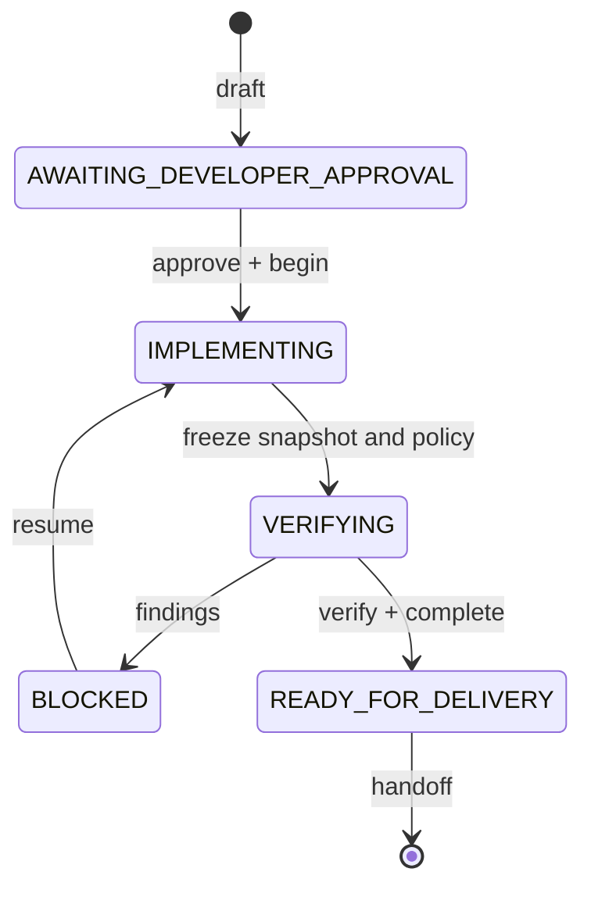

# v1 architecture

The system has three external phases—analysis, planning, and execution—and a stricter internal task state machine. Analysis and plan drafting cannot authorize mutation.

The approval hash includes plan identity, requested outcome, scope, tests, device strategy, risks, rollback, skills, repository identity, and base snapshot. `begin` consumes a single-use nonce. New surfaces or modules require a revised plan and fresh approval.

## Delivery identity

The canonical manifest covers tracked, staged, unstaged, untracked, deleted, and renamed Android delivery files. It uses Git blob identities so committing identical content does not invalidate evidence. Ignored build inputs such as `local.properties` are included by redacted hash, alongside toolchain identity.

Each immutable evidence record contains:

- delivery snapshot hash;
- change-set hash;
- task run id;
- producer and harness version;
- status and sanitized details;
- an integrity hash.

The final verifier recomputes the current manifest and classification, validates policy and skill hashes, checks only selected gates, verifies required reviewer coverage, and validates the assemble/install/launch APK-set chain. It never writes success state.

## Adaptive policy

Low-risk localization/resource edits can skip semantic reviewers. Business logic normally selects correctness and regression review. UI adds convention coverage. Coroutine/network/native changes add performance or security as appropriate. Billing, auth, cryptography, security, and sensitive-data changes select all five specialist roles plus a separate developer approval bound to the frozen final snapshot. The initial plan approval cannot satisfy that final approval. Tests add the test-quality reviewer.

Device verification is selected only for user-facing, device, permission, database, billing, or auth surfaces. Missing device/tooling is `ENV_BLOCKED`, not success.

## Enforcement boundary

The compact host hook protects harness scripts/state, requires an active approved plan for mutations, blocks raw Gradle/ADB, agent-driven Git mutations, live network probes, shell indirection, and unplanned tracker writes. Hosts without executable hook support receive the same policy as instructions and are honestly reported as `RULE_ENFORCED`.
