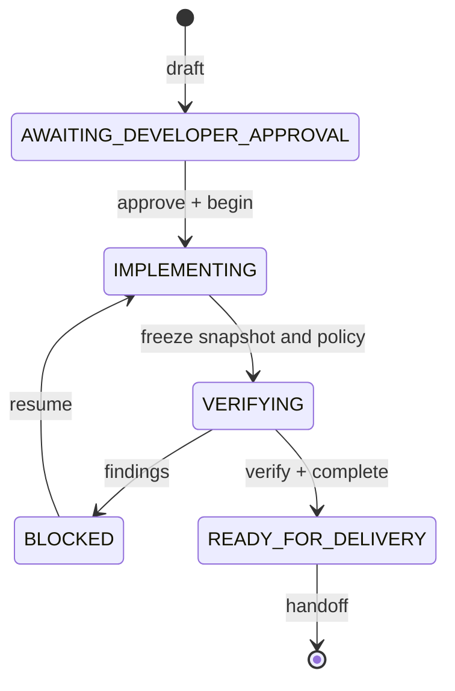

# v1 architecture

The system has three external phases—analysis, planning, and execution—and a stricter internal task state machine. Analysis and plan drafting cannot authorize mutation.

```mermaid
stateDiagram-v2
    [*] --> AWAITING_DEVELOPER_APPROVAL: draft
    AWAITING_DEVELOPER_APPROVAL --> IMPLEMENTING: approve + begin
    IMPLEMENTING --> VERIFYING: freeze snapshot and policy
    VERIFYING --> BLOCKED: findings
    BLOCKED --> IMPLEMENTING: resume
    VERIFYING --> READY_FOR_DELIVERY: verify + complete
    READY_FOR_DELIVERY --> [*]: handoff
```

The approval hash includes plan identity, requested outcome, scope, tests, device strategy, risks, rollback, skills, repository identity, and base snapshot. `begin` consumes a single-use nonce. New surfaces or modules require a revised plan and fresh approval.

`draft` and `revise` render `PLAN_SUMMARY` from the registered approval payload: the reviewable fields (outcome, approach, files, tests, device strategy, risks, rollback, external writes, phases) and a link to `plan.md`. `plan.md` is generated next to `plan.json` on every draft and revise; it adds clickable file links, the gates and reviewers that will run, what needs the developer, a "what changed" section after a revise, and the full redacted approval payload (architecture contract, phase authority, repository binding). The plan hash covers the whole payload. Display redaction does not modify the plan or its approval hash. Secret-shaped assignments, including compound names such as `access_token` and `client_secret`, are redacted; use credential references rather than putting credentials in a plan. Redaction is not a general-purpose secret detector.

## Delivery identity

The canonical manifest covers tracked, staged, unstaged, untracked, deleted, and renamed Android delivery files. It uses Git blob identities and file modes so committing an identical delivery tree preserves its snapshot identity. Ignored build inputs such as `local.properties` are included by redacted hash, alongside toolchain identity.

Delivery inputs include Protocol Buffers, SQLDelight schemas/migrations, GraphQL, YAML configuration, build scripts, and native build definitions. Managed harness directories and build outputs remain excluded. Git modes are bound alongside content; when staged and working-tree modes differ, both are recorded. Git's `core.filemode` behavior is respected, including on Windows. Changing either recorded mode invalidates the snapshot even when content is unchanged.

Task classification includes changes in accepted WIP checkpoints, relative to the original task baseline. A declared baseline that is missing, unreadable, or invalid blocks verification instead of falling back to a clean working tree. Legacy tasks that never declared a baseline retain their full-worktree compatibility path.

Each immutable evidence record contains:

- delivery snapshot hash;
- change-set hash;
- task run id;
- producer and harness version;
- status and sanitized details;
- an integrity hash.

Gate reruns append numbered, hash-linked attempts under the same snapshot/run; previous records are never overwritten. Readers validate the chain and use its last valid attempt, so a later `FAIL`, `ENV`, `BLOCKED`, or `STALE` cannot retain an earlier `PASS`. A broken chain or unreadable attempt directory blocks reading; readers do not skip a bad attempt or fall back to the first record. Mutable result files are diagnostic mirrors, not delivery authority. Failure to discover an active run or persist authoritative evidence is an error, not a successful diagnostic fallback. An explicit `HARNESS_RUN_ID` must match an active verification run; it cannot redirect evidence to a different run. Explicit standalone runs remain supported when no verification task is active.

Verification preparation saves the lifecycle transition after the frozen run artifacts. If publication stops before the plan save, retry uses the completed run named by the persisted plan and its frozen manifest/policy to retain the previous review round. It does not reset review findings or require another approval for unchanged scope.

The final verifier recomputes the current manifest and classification, validates policy and skill hashes, checks only selected gates, verifies required reviewer coverage, and validates the assemble/install/launch APK-set chain. It never writes success state.

## Adaptive policy

Low-risk localization/resource edits can skip semantic reviewers. Business logic normally selects correctness and regression review. UI adds convention coverage. Room schema changes use a focused DATA lane with the Room gate, tests, correctness review, and regression review. Coroutine/network/native changes add performance or security as appropriate. Billing, auth, cryptography, security, and sensitive-data changes select all five specialist roles plus a separate developer approval bound to the frozen final snapshot. The initial plan approval cannot satisfy that final approval. Tests add the test-quality reviewer.

Device verification is selected only for user-facing, device, permission, database, billing, or auth surfaces. Missing device/tooling is `ENV_BLOCKED`, not success.

## Project Intelligence

Project Intelligence has two deliberately separate layers. `project-facts.json` remains the authoritative schema-v2 architecture snapshot used by existing policy. Its optional `advisory_knowledge` block contains deterministic, repository-relative local profiles and convention evidence; it cannot select architecture, approve a plan, or mutate application code.

`task-context` combines a non-persisting incremental graph sync with targeted live-source checks. Resolution prefers an exact repository path, then a unique FQN, then module/source-set-qualified identity, then a unique short symbol. Duplicate identities are retained and reported as `AMBIGUOUS`, never resolved by first-match ordering. Results are bounded to the direct graph neighborhood, directly relevant tests, and at most three matching local profiles.

Graph, Room type, classifier, and setup discovery use reusable single-pass indexes. Default JSON context preview is a bounded summary; `--full` is an explicit diagnostic escape hatch. Performance tests protect deterministic work/inventory invariants and publish timings only as observations, not brittle pass/fail deadlines.

Persistent context refresh uses a bounded stable-snapshot retry, stages rendered views and facts together, and replaces `project-facts.json` last. A failed pre-commit replacement restores the previous rendered views. Old schema-v2 snapshots without advisory knowledge remain valid; Doctor reports the missing optional layer as a warning.

## Enforcement boundary

The compact host hook protects harness scripts/state, requires an active approved plan for mutations, blocks raw Gradle/ADB, agent-driven Git mutations, live network probes, shell indirection, and unplanned tracker writes. Hosts without executable hook support receive the same policy as instructions and are honestly reported as `RULE_ENFORCED`.
