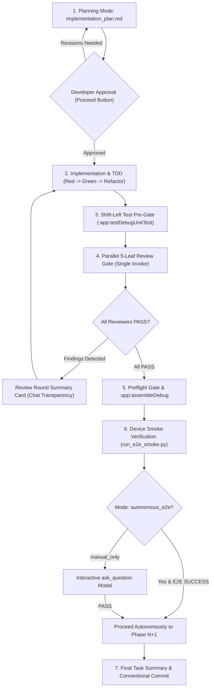

# Android Agent Harness: Workflows & Playbooks Guide

> **Deterministic Android Engineering for the AI Era**  
> *Turn Any AI Assistant into an Uncompromising Senior Android Engineering Team.*

---

## Overview

The **Android Agent Harness** equips your AI assistant with deterministic, specialized engineering workflows designed specifically for Android development. Instead of unstructured prompting, developers and AI agents collaborate through disciplined, repeatable engineering playbooks.

---

## Workflow Playbooks Directory

| # | Playbook | Slash Command / Trigger | Primary Goal | Specialist Subagent |
|---|---|---|---|---|
| 1 | **Feature Delivery Lifecycle** | `/deliver` | Atomic planning, TDD, 5-leaf review, assemble, and device verification | 5 Quality Guardians |
| 2 | **New Feature Planning** | `/new-feature` | Multi-phase architecture breakdown, boundary isolation, and Proceed approval | Lead Agent |
| 3 | **Systematic Debugging** | `/debug` | 3-hypothesis root-cause tracing, producer fix, and regression proof | Lead Agent |
| 4 | **Forensic Crash & ANR Triage** | `/crash-triage` | Live Logcat capture, stacktrace demangling, and ANR thread dump triage | `qa-diagnostics-agent` |
| 5 | **Test Quality Audit** | `/test-quality-audit` | Assertion depth inspection, mocking integrity, and `runTest` verification | `test-quality-reviewer-agent` |
| 6 | **Performance & Memory Audit** | `/perf-audit` | Main-thread I/O audit, Compose recomposition jank, and memory leaks | `perf-anr-guardian-agent` |
| 7 | **Localization & String Parity** | `/check-strings` | Dual-locale parity, hardcoded UI text detection, and RTL layout audit | Lead Agent |
| 8 | **Preflight Gate** | `/preflight` | Triple pre-build gate (Strings + Room schema migration + Fast Kotlin lint) | Preflight Engine |
| 9 | **Conventional Commit Drafting** | `/commit-msg` | Structured Git commit messages tailored for Android Studio | Lead Agent |
| 10 | **Project Tracker Governance** | `/zoho-sprints` | Automated task status transitions, time logging, and bilingual updates | Zoho / PM MCP Bridge |

---

## 1. Feature Delivery Lifecycle (`/deliver`)

The primary workflow for implementing production features and significant refactors.



### Key Rules:
* **Atomic Phase Isolation**: Multi-phase tasks execute strictly one phase at a time. The agent is forbidden from touching Phase N+1 files until Phase N passes reviews and device verification.
* **Review Round Summary Cards**: If a review round produces findings, the agent outputs a structured card in chat detailing the issues and fixes before launching the next round.
* **Zero Timers / Zero Polling**: The agent never calls `schedule` or sleeps in terminal; it relies 100% on reactive wakeups.

---

## 2. Systematic Debugging (`/debug`)

A disciplined, evidence-based debugging workflow for complex bugs and logic errors.

### Protocol:
1. **Reproduce First**: Formulate an automated test case or minimal reproduction step that proves the bug.
2. **Three Competing Hypotheses**: Formulate 2 to 3 distinct hypotheses regarding the root cause before editing code.
3. **Trace to the Producer**: Trace data backwards to the origin (API parser, Room entity, StateFlow emitter). Never apply band-aid fixes at the UI consumer.
4. **Zero Dummy Fallbacks**: No empty `try-catch` blocks, no swallowing `CancellationException`, and no fake success defaults (`null` / `0`).
5. **Verify with Regression Review**: Dispatch `bug-reviewer-agent` and `regression-impact-reviewer-agent` to ensure no side effects.

---

## 3. Forensic Crash & ANR Triage (`/crash-triage`)

Specialized forensics for application crashes, uncaught exceptions, and ANR (Application Not Responding) events.

### Protocol:
1. Run `python .agents/scripts/logcat_doctor.py` or dispatch `qa-diagnostics-agent`.
2. Filter Logcat by application package ID to isolate fatal exception stacktraces and fatal signals.
3. Analyze thread dumps for Main-thread contention, synchronized deadlocks, or long-running database/network operations.
4. Provide a root-cause autopsy in chat with exact file and line references.
5. Apply the fix, verify compilation, and execute `python .agents/scripts/run_device.py install-start` to prove runtime stability.

---

## 4. Test Quality Audit (`/test-quality-audit`)

Audits the integrity and rigor of unit and UI tests (`*Test.kt`).

### Quality Invariants:
* **Mandatory `runTest`**: Strictly forbid `runBlocking` in unit tests; all Coroutine test scopes must use `runTest` with `StandardTestDispatcher` or `UnconfinedTestDispatcher`.
* **Assertion Depth**: Reject trivial assertions (e.g. `assertNotNull(result)` alone). Tests must assert specific field values, state transitions, and error states.
* **Mocking Integrity**: Forbid excessive mocking of data models. Prefer real in-memory fakes for repositories and DataStores over brittle mock chains.
* **Dual-Locale Compose Previews**: Verify that all `@Composable` components include dual-locale (English and Arabic) previews with `showBackground = true`.

---

## 5. Performance, Battery & ANR Audit (`/perf-audit`)

Proactive performance analysis to maintain a 60/120 FPS UI and zero Main-thread stalls.

### Audit Dimensions:
1. **Threading & Dispatchers**: Verify that all Room database queries, DataStore writes, file I/O, and JSON serialization run strictly on `Dispatchers.IO` or dedicated background executors.
2. **Jetpack Compose Stability**: Audit `@Composable` functions for unstable parameters causing excessive recompositions. Ensure lambdas use `remember` and immutable collections where appropriate.
3. **Memory Leaks & Lifecycles**: Ensure Coroutine scopes cancel properly with `viewModelScope` or `lifecycleScope`. Verify that static singletons do not hold `Activity` or `Context` references.
4. **Sensor & Battery Usage**: Ensure location updates, sensors, and wakelocks release immediately when the app enters the background.

---

## 6. Localization & String Parity (`/check-strings`)

Guarantees full translation parity across all supported locales (e.g. English `values/strings.xml` and Arabic `values-ar/strings.xml`).

### Automated Verifications:
* **Key Parity**: Asserts that every string key defined in `values/strings.xml` exists in `values-ar/strings.xml`.
* **Placeholder Integrity**: Asserts matching format specifiers (`%s`, `%d`, `%1$s`) across all language variants to prevent runtime `FormatFlagsConversionMismatchException`.
* **Hardcoded UI Text Detection**: Fast linter flags hardcoded string literals inside Compose `Text("...")` or XML `android:text="..."` without `@StringRes` usage.
* **RTL & Text Direction**: Verifies that layouts render correctly in Right-to-Left (RTL) mode without hardcoded `left`/`right` margins.

---

## 7. Deterministic Preflight Gate (`/preflight`)

The triple pre-build gate executed automatically before `:assembleDebug` and during git pre-commit:

```bash
python .agents/scripts/preflight_check.py
```

1. **String Parity Guard**: Verifies localization integrity and placeholder matching.
2. **Room Database Guard**: Verifies `@Database` version increments and schema migration paths for modified `@Entity` classes.
3. **Fast Kotlin Linter**: Scans modified files in <1 second for forbidden patterns (inline FQCNs, `TODO()`, `!!`, `runBlocking`, hardcoded colors).

---

## 8. Project Tracker Governance (`/zoho-sprints`)

Bi-directional synchronization with project management systems (Zoho Sprints, GitHub Projects, Jira, Linear).

### Governance Rules:
* **Read-Only by Default**: The agent inspects ticket details, acceptance criteria, and sprint goals read-only.
* **Explicit Mutation Consent**: The agent modifies ticket status, adds comments, or logs work only when the developer explicitly prompts (e.g. `"update zoho"`).
* **Allowed Statuses**: `In progress` when work begins; `Ready To ReTest` when verified on device. The agent is strictly forbidden from marking tickets as `Done` or `Solved`.
* **Language Policy**: Respects configured `zoho_language` settings (e.g. English titles with Arabic descriptions for bilingual teams).
