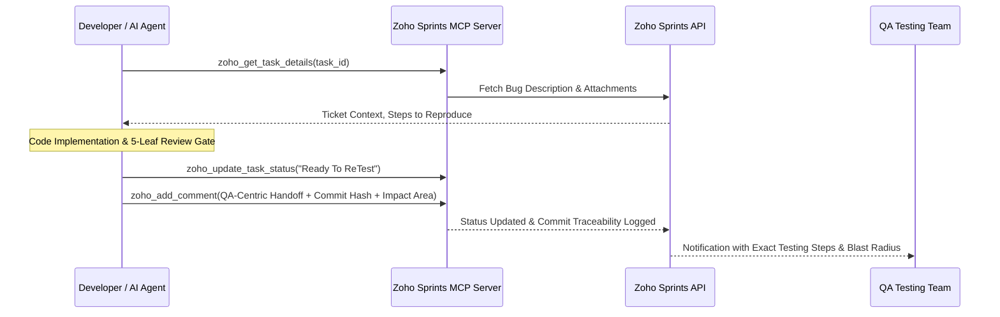

# Project Tracker Integrations Playbook

Generalizes the Zoho Sprints policy (rules section 5) to GitHub Projects,
Jira, and Linear without changing any default behavior. Canonical engine
files: `agents/scripts/pm_policy.py` (policy), `agents/scripts/pm_github.py`
(GitHub adapter), `agents/pm/mcp_registration.jira.md` and
`agents/pm/mcp_registration.linear.md` (upstream MCP registration).

## Overview

Zoho Sprints remains the flagship, built-in integration:



The built-in Zoho implementation provides:
- **Bi-Directional Sync**: Reads tasks, subtasks, bug reports, and attachments directly.
- **Hierarchical Items**: Creates hierarchical tasks and subtasks.
- **QA-First Handoff Standards**: Eliminates internal code dumps and XML/Kotlin jargon in favor of functional explanations, mandatory `Commit: <hash>` traceability, explicit **Impact Area (Blast Radius)**, and structured test cases.
- **Dual-Language Mapping**: Dynamic translation matrix supporting English titles with Arabic descriptions/comments (`en_titles_ar_comments`), full English (`all_en`), or full Arabic (`all_ar`) per `_product.py`.

## Provider selection

Set during setup (wizard question I.20) or by editing `PM_PROVIDER` in
`.agents/scripts/_product.py`:

| `PM_PROVIDER` | Tracker | Transport | Trigger phrase |
|---|---|---|---|
| `zoho_sprints` (default; also when the field is absent) | Zoho Sprints | Built-in MCP server (`agents/mcp/zoho_sprints/server.py`) | `update zoho` |
| `github_projects` | GitHub Projects & Issues | `gh` CLI via `pm_github.py` | `update github` |
| `jira_mcp` | Jira | Official upstream MCP server | `update jira` |
| `linear_mcp` | Linear | Official upstream MCP server | `update linear` |
| `none` | None | No tracker mutations possible | (none) |

Unknown values fail closed: the doctor reports an invalid `PM_PROVIDER`, and
policy helpers raise with the accepted options listed.

## Status map (kit canonical -> provider label)

Kit work only ever moves between two canonical states:

| Kit canonical | Zoho Sprints | GitHub Projects | Jira | Linear |
|---|---|---|---|---|
| `in_progress` | `In progress` | `In Progress` | `In Progress` | `In Progress` |
| `ready_to_retest` | `Ready To ReTest` | `In Review` | `Ready for Testing` | `In Review` |

Denied Done-class labels per provider (never set, never declared in a
handoff): Zoho `Done`/`Solved`; GitHub `Done`/`Shipped`; Jira `Done`/
`Resolved`/`Closed`; Linear `Done`/`Canceled`/`Cancelled`.

## Handoff contract (all providers)

Identical to rules section 5 and `.agents/workflows/zoho-sprints.md`:

1. First line MUST be `Commit: <hash>` (retrieved via
   `git log -1 --format=%h`; never invented).
2. Mandatory sections per the documented bilingual header table:
   Root Cause/Objective, Solution/What Changed, Impact Area (Blast Radius),
   Test Cases & Verification Steps.
3. Language follows `_product.py ZOHO_LANGUAGE`
   (`en_titles_ar_comments` | `all_en` | `all_ar`) for descriptions and
   comments on every tracker.
4. QA-centric tone: functional, user-facing wording; no code internals;
   no emoji.
5. Validate offline before posting:

```bash
python -c "import sys; sys.path.insert(0, '.agents/scripts'); import pm_policy; print(pm_policy.validate_handoff(open('handoff.txt', encoding='utf-8').read(), 'all_en', 'github_projects'))"
```

Empty output list means the handoff is valid.

## GitHub Projects quick start

```bash
gh auth login
python .agents/scripts/pm_github.py check
python .agents/scripts/pm_github.py --repo OWNER/REPO list
python .agents/scripts/pm_github.py --repo OWNER/REPO view 42
python .agents/scripts/pm_github.py --repo OWNER/REPO comment 42 --body-file handoff.txt
python .agents/scripts/pm_github.py --repo OWNER/REPO status 42 ready_to_retest
```

Every call is timeout-bounded and fail-closed; a missing `gh` binary or a
failed command exits non-zero with an actionable message. Authentication is
owned by gh itself; the harness never handles tokens. For GitHub Projects V2
board columns, use `set_project_item_status` (wraps `gh project item-edit`).

## Jira / Linear quick start

Follow the registration playbook, then use the registered MCP tools with the
same ingest/mutate discipline as Zoho:

- Ingest (read-only): fetch the ticket, check attachments, explain in chat,
  plan before implementing.
- Mutate: only on the explicit trigger phrase from the table above.
- If MCP tools are missing in a session, do not invent ticket fields; ask the
  developer to paste the ticket and continue locally.

## Credential isolation

Secrets stay in user-level files under `~/.android-harness/`
(`zoho_sprints.json`, `jira.json`, `linear.json`; GitHub uses gh host auth).
Never copy tokens into the repository. `harness_doctor.py` Dimension 11 fails
any checkout containing `<provider>.json` secret files.

## Backward compatibility

With `PM_PROVIDER=zoho_sprints` or the field absent, every existing message,
flow, reminder, and validation outcome matches previous releases exactly:
`update zoho` remains the only Zoho trigger, statuses stay
`In progress` / `Ready To ReTest`, and handoff templates are unchanged.
